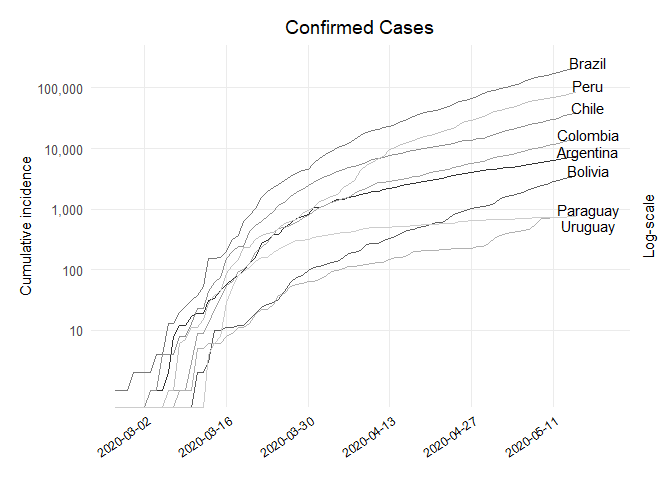
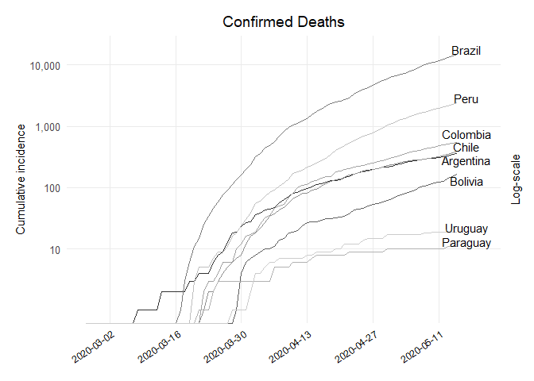
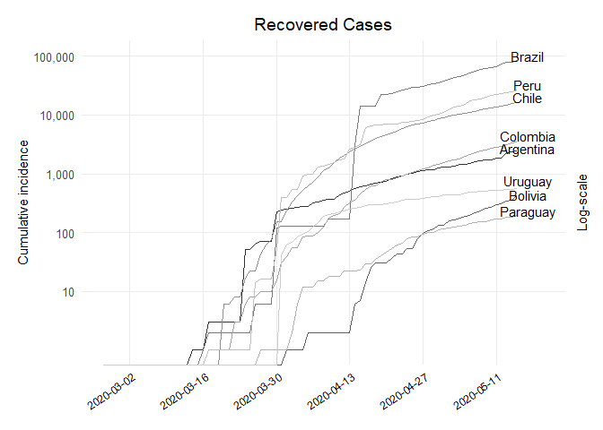
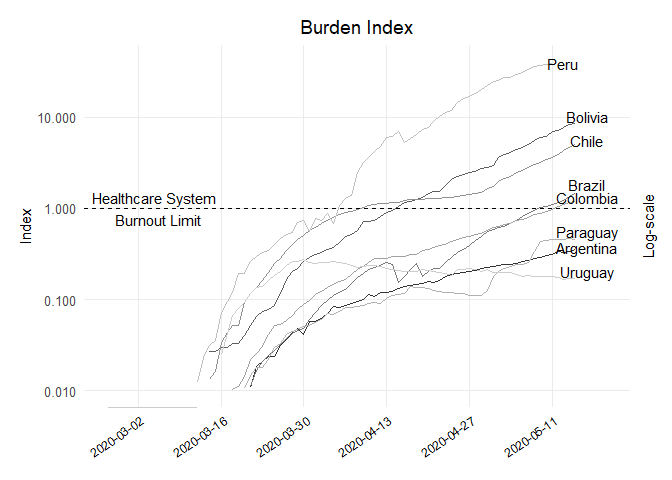

Descriptive Analysis Code
================
Bastián González-Bustamante

  - [Precoding](#precoding)
  - [Descriptive Analysis](#descriptive-analysis)

### Precoding

``` r
## Packages
library(EpiEstim)
library(incidence)
library(ggplot2)
library(scales)
library(shadowtext)
library(dplyr)
library(epitrix)
library(distcrete)
library(projections)
library(earlyR)
library(broom)
library(lubridate) ## PS-Note 2020-08-30: It had already been loaded.
library(grid)
library(cowplot)
library(tidyverse) ## PS-Note 2020-08-30: It had already been loaded.
library(lubridate) ## PS-Note 2020-08-30: It had already been loaded.

## Incidence
covid19 <- confirmed_covid19
names(covid19)[1] = "dates"

## Correction URY 12 April (2.87%)
covid19[47, 9] <- 0

## Deaths
names(deaths_covid19)[1] = "dates"

## Recovered
names(recovered_covid19)[1] = "dates"

## ICU Beds
icu_arg <- 8444 
icu_bol <- 220 
icu_bra <- 55101 
icu_chl <- 2724 
icu_col <- 5354 
icu_ecu <- 1183 
icu_pry <- 734 
icu_per <- 721 
icu_ury <- 700 

## Country Names
arg_name <- "Argentina"
bol_name <- "Bolivia"
bra_name <- "Brazil"
chl_name <- "Chile"
col_name <- "Colombia"
pry_name <- "Paraguay"
per_name <- "Peru"
ury_name <- "Uruguay"
```

## Descriptive Analysis

``` r
## Dataframe Confirmed
df_confirmed <- data.frame(dates = c(rep(as.Date(covid19$dates), 8)),
                           value = c(cumulate(covid19$ARG), 
                                     cumulate(covid19$BOL),
                                     cumulate(covid19$BRA),
                                     cumulate(covid19$CHL),
                                     cumulate(covid19$COL),
                                     cumulate(covid19$PRY),
                                     cumulate(covid19$PER),
                                     cumulate(covid19$URY)),
                           country = c(rep(arg_name, length(covid19$dates)),
                                       rep(bol_name, length(covid19$dates)),
                                       rep(bra_name, length(covid19$dates)),
                                       rep(chl_name, length(covid19$dates)),
                                       rep(col_name, length(covid19$dates)),
                                       rep(pry_name, length(covid19$dates)),
                                       rep(per_name, length(covid19$dates)),
                                       rep(ury_name, length(covid19$dates))))

## Plot Confirmed
ggplot(df_confirmed, aes(x = dates, y = value, colour = country)) + 
  geom_line() + scale_colour_grey() + theme_minimal(base_size = 12) + 
  theme(legend.position = "none") + theme(panel.grid.minor = element_blank()) +
  theme(axis.text.x = element_text(angle = 35, hjust = 1, color = "black",  size = 9)) +
  labs(x = NULL, y = "Cumulative incidence", title = "Confirmed Cases", subtitle = NULL, 
       colour = NULL) + theme(plot.margin = unit(c(0.5,0.5,0.5,0.5), "cm")) +
  scale_x_date(date_breaks = "2 weeks", date_minor_breaks = "2 weeks", 
               date_labels = "%Y-%m-%d", limits = c(as.Date("2020-02-26"), 
                                                    as.Date("2020-05-20"))) +
  scale_y_log10(breaks = 10**(1:10), labels = comma(10**(1:10)),
                sec.axis = sec_axis(~ ., labels = NULL, name = "Log-scale")) +
  theme(axis.title.y.right = element_text(angle = 90, size = 11),
        axis.title.y.left = element_text(size = 11),
        plot.caption = element_text(size = 9),
        plot.title = element_text(hjust = 0.5)) +
  annotate("text", y = df_confirmed$value[which(df_confirmed$date == "2020-05-15" 
                                                & df_confirmed$country == "Argentina")] 
           * 1.2, x = as.Date("2020-05-17"), label = "Argentina") +
  annotate("text", y = df_confirmed$value[which(df_confirmed$date == "2020-05-15" 
                                                & df_confirmed$country == "Bolivia")] 
           * 1.2, x = as.Date("2020-05-17"), label = "Bolivia") +
  annotate("text", y = df_confirmed$value[which(df_confirmed$date == "2020-05-15" 
                                                & df_confirmed$country == "Brazil")] 
           * 1.2, x = as.Date("2020-05-17"), label = "Brazil") +
  annotate("text", y = df_confirmed$value[which(df_confirmed$date == "2020-05-15" 
                                                & df_confirmed$country == "Chile")] 
           * 1.2, x = as.Date("2020-05-17"), label = "Chile") +
  annotate("text", y = df_confirmed$value[which(df_confirmed$date == "2020-05-15" 
                                                & df_confirmed$country == "Colombia")] 
           * 1.2, x = as.Date("2020-05-17"), label = "Colombia") +
  annotate("text", y = df_confirmed$value[which(df_confirmed$date == "2020-05-15" 
                                                & df_confirmed$country == "Paraguay")] 
           * 1.3, x = as.Date("2020-05-17"), label = "Paraguay") +
  annotate("text", y = df_confirmed$value[which(df_confirmed$date == "2020-05-15" 
                                                & df_confirmed$country == "Peru")] 
           * 1.3, x = as.Date("2020-05-17"), label = "Peru") +
  annotate("text", y = df_confirmed$value[which(df_confirmed$date == "2020-05-15" 
                                                & df_confirmed$country == "Uruguay")] 
           * 0.7, x = as.Date("2020-05-17"), label = "Uruguay")
```

<!-- -->

``` r

## Dataframe Deaths
df_deaths <- data.frame(dates = c(rep(as.Date(deaths_covid19$dates), 8)),
                           value = c(cumulate(deaths_covid19$ARG), 
                                     cumulate(deaths_covid19$BOL),
                                     cumulate(deaths_covid19$BRA),
                                     cumulate(deaths_covid19$CHL),
                                     cumulate(deaths_covid19$COL),
                                     cumulate(deaths_covid19$PRY),
                                     cumulate(deaths_covid19$PER),
                                     cumulate(deaths_covid19$URY)),
                           country = c(rep(arg_name, length(deaths_covid19$dates)),
                                       rep(bol_name, length(deaths_covid19$dates)),
                                       rep(bra_name, length(deaths_covid19$dates)),
                                       rep(chl_name, length(deaths_covid19$dates)),
                                       rep(col_name, length(deaths_covid19$dates)),
                                       rep(pry_name, length(deaths_covid19$dates)),
                                       rep(per_name, length(deaths_covid19$dates)),
                                       rep(ury_name, length(deaths_covid19$dates))))

## Plot Deaths
ggplot(df_deaths, aes(x = dates, y = value, colour = country)) + 
  geom_line() + scale_colour_grey() +  theme_minimal(base_size = 12) + 
  theme(legend.position = "none") + theme(panel.grid.minor = element_blank()) +
  theme(axis.text.x = element_text(angle = 35, hjust = 1, color = "black",  size = 9)) +
  labs(x = NULL, y = "Cumulative incidence", title = "Confirmed Deaths", subtitle = NULL, 
       colour = NULL) + theme(plot.margin = unit(c(0.5,0.5,0.5,0.5), "cm")) +
  scale_x_date(date_breaks = "2 weeks", date_minor_breaks = "2 weeks",
               date_labels = "%Y-%m-%d", limits = c(as.Date("2020-02-26"), 
                                                    as.Date("2020-05-20"))) +
  scale_y_log10(breaks = 10**(1:10), labels = comma(10**(1:10)),
                sec.axis = sec_axis(~ ., labels = NULL, name = "Log-scale")) + 
  theme(axis.title.y.right = element_text(angle = 90, size = 11),
        axis.title.y.left = element_text(size = 11),
        plot.caption = element_text(size = 9),
        plot.title = element_text(hjust = 0.5)) +
  annotate("text", y = df_deaths$value[which(df_deaths$date == "2020-05-15" 
                                             & df_deaths$country == "Argentina")] * 0.8, 
           x = as.Date("2020-05-17"), label = "Argentina") +
  annotate("text", y = df_deaths$value[which(df_deaths$date == "2020-05-15" 
                                             & df_deaths$country == "Bolivia")] * 0.8, 
           x = as.Date("2020-05-17"), label = "Bolivia") +
  annotate("text", y = df_deaths$value[which(df_deaths$date == "2020-05-15" 
                                             & df_deaths$country == "Brazil")] * 1.2, 
           x = as.Date("2020-05-17"), label = "Brazil") +
  annotate("text", y = df_deaths$value[which(df_deaths$date == "2020-05-15" 
                                             & df_deaths$country == "Chile")] * 1.2, 
           x = as.Date("2020-05-17"), label = "Chile") +
  annotate("text", y = df_deaths$value[which(df_deaths$date == "2020-05-15" 
                                             & df_deaths$country == "Colombia")] * 1.4, 
           x = as.Date("2020-05-17"), label = "Colombia") +
  annotate("text", y = df_deaths$value[which(df_deaths$date == "2020-05-15" 
                                             & df_deaths$country == "Paraguay")] * 1.2, 
           x = as.Date("2020-05-17"), label = "Paraguay") +
  annotate("text", y = df_deaths$value[which(df_deaths$date == "2020-05-15" 
                                             & df_deaths$country == "Peru")] * 1.2, 
           x = as.Date("2020-05-17"), label = "Peru") +
  annotate("text", y = df_deaths$value[which(df_deaths$date == "2020-05-15" 
                                             & df_deaths$country == "Uruguay")] * 1.2, 
           x = as.Date("2020-05-17"), label = "Uruguay")
```

<!-- -->

``` r

## Dataframe Recovered
df_recovered <- data.frame(dates = c(rep(as.Date(recovered_covid19$dates), 8)),
                           value = c(cumulate(recovered_covid19$ARG), 
                                     cumulate(recovered_covid19$BOL),
                                     cumulate(recovered_covid19$BRA),
                                     cumulate(recovered_covid19$CHL),
                                     cumulate(recovered_covid19$COL),
                                     cumulate(recovered_covid19$PRY),
                                     cumulate(recovered_covid19$PER),
                                     cumulate(recovered_covid19$URY)),
                        country = c(rep(arg_name, length(recovered_covid19$dates)),
                                    rep(bol_name, length(recovered_covid19$dates)),
                                    rep(bra_name, length(recovered_covid19$dates)),
                                    rep(chl_name, length(recovered_covid19$dates)),
                                    rep(col_name, length(recovered_covid19$dates)),
                                    rep(pry_name, length(recovered_covid19$dates)),
                                    rep(per_name, length(recovered_covid19$dates)),
                                    rep(ury_name, length(recovered_covid19$dates))))

## Plot Recovered
ggplot(df_recovered, aes(x = dates, y = value, colour = country)) + 
  geom_line() + scale_colour_grey() + theme_minimal(base_size = 12) + 
  theme(legend.position = "none") + theme(panel.grid.minor = element_blank()) +
  theme(axis.text.x = element_text(angle = 35, hjust = 1, color = "black",  size = 9)) +
  labs(x = NULL, y = "Cumulative incidence", title = "Recovered Cases", subtitle = NULL, 
       colour = NULL) + theme(plot.margin = unit(c(0.5,0.5,0.5,0.5), "cm")) +
  scale_x_date(date_breaks = "2 weeks", date_minor_breaks = "2 weeks",
               date_labels = "%Y-%m-%d", limits = c(as.Date("2020-02-26"), 
                                                    as.Date("2020-05-20"))) +
  scale_y_log10(breaks = 10**(1:10), labels = comma(10**(1:10)),
                sec.axis = sec_axis(~ ., labels = NULL, name = "Log-scale")) +
  theme(axis.title.y.right = element_text(angle = 90, size = 11),
        axis.title.y.left = element_text(size = 11),
        plot.caption = element_text(size = 9),
        plot.title = element_text(hjust = 0.5)) +
  annotate("text", y = df_recovered$value[which(df_recovered$date == "2020-05-15" 
                                             & df_recovered$country == "Argentina")] 
           * 1.1, x = as.Date("2020-05-17"), label = "Argentina") +
  annotate("text", y = df_recovered$value[which(df_recovered$date == "2020-05-15" 
                                             & df_recovered$country == "Bolivia")] * 1, 
           x = as.Date("2020-05-17"), label = "Bolivia") +
  annotate("text", y = df_recovered$value[which(df_recovered$date == "2020-05-15" 
                                             & df_recovered$country == "Brazil")] * 1.2, 
           x = as.Date("2020-05-17"), label = "Brazil") +
  annotate("text", y = df_recovered$value[which(df_recovered$date == "2020-05-15" 
                                             & df_recovered$country == "Chile")] * 1.2, 
           x = as.Date("2020-05-17"), label = "Chile") +
  annotate("text", y = df_recovered$value[which(df_recovered$date == "2020-05-15" 
                                             & df_recovered$country == "Colombia")] * 1.3, 
           x = as.Date("2020-05-17"), label = "Colombia") +
  annotate("text", y = df_recovered$value[which(df_recovered$date == "2020-05-15" 
                                             & df_recovered$country == "Paraguay")] * 1.2, 
           x = as.Date("2020-05-17"), label = "Paraguay") +
  annotate("text", y = df_recovered$value[which(df_recovered$date == "2020-05-15" 
                                             & df_recovered$country == "Peru")] * 1.2, 
           x = as.Date("2020-05-17"), label = "Peru") +
  annotate("text", y = df_recovered$value[which(df_recovered$date == "2020-05-15" 
                                             & df_recovered$country == "Uruguay")] * 1.4, 
           x = as.Date("2020-05-17"), label = "Uruguay")
```

<!-- -->

``` r

## Dataframe Burden Index (since 26 Feb to 15 may)
df_burden <- data.frame(dates = c(rep(as.Date(covid19$dates), 8)),
                        value = c(
                          (((cumulate(covid19$ARG) - cumulate(recovered_covid19$ARG))
                            * 0.15)/(icu_arg * 0.25)),
                          (((cumulate(covid19$BOL) - cumulate(recovered_covid19$BOL)) 
                            * 0.15)/(icu_bol * 0.25)),
                          (((cumulate(covid19$BRA) - cumulate(recovered_covid19$BRA)) 
                            * 0.15)/(icu_bra * 0.25)),
                          (((cumulate(covid19$CHL) - cumulate(recovered_covid19$CHL))
                            * 0.15)/(icu_chl * 0.25)),
                          (((cumulate(covid19$COL) - cumulate(recovered_covid19$COL))
                            * 0.15)/(icu_col * 0.25)),
                          (((cumulate(covid19$PRY) - cumulate(recovered_covid19$PRY))
                            * 0.15)/(icu_pry * 0.25)),
                          (((cumulate(covid19$PER) - cumulate(recovered_covid19$PER))
                            * 0.15)/(icu_per * 0.25)),
                          (((cumulate(covid19$URY) - cumulate(recovered_covid19$URY))
                            * 0.15)/(icu_ury * 0.25))
                                  ),
                           country = c(rep(arg_name, length(covid19$dates)),
                                       rep(bol_name, length(covid19$dates)),
                                       rep(bra_name, length(covid19$dates)),
                                       rep(chl_name, length(covid19$dates)),
                                       rep(col_name, length(covid19$dates)),
                                       rep(pry_name, length(covid19$dates)),
                                       rep(per_name, length(covid19$dates)),
                                       rep(ury_name, length(covid19$dates))))

## Plot Burden Index
ggplot(df_burden, aes(x = dates, y = value, colour = country)) + 
  geom_line() + scale_colour_grey() + 
  geom_hline(yintercept = 1, col = "black", lty = 2) +
  theme_minimal(base_size = 12) + theme(legend.position = "none") +
  theme(panel.grid.minor = element_blank()) +
  theme(axis.text.x = element_text(angle = 35, hjust = 1, color = "black",  size = 9)) +
  labs(x = NULL, y = "Index", title = "Burden Index", subtitle = NULL, colour = NULL) + 
  theme(plot.margin = unit(c(0.5,0.5,0.5,0.5), "cm")) +
  scale_x_date(date_breaks = "2 weeks", date_minor_breaks = "2 weeks",
               date_labels = "%Y-%m-%d", limits = c(as.Date("2020-02-26"), 
                                                    as.Date("2020-05-20"))) +
  scale_y_log10(limits = c(1e-2,4e1), labels = scales::comma, 
                sec.axis = sec_axis(~ ., labels = NULL, name = "Log-scale")) + 
  theme(axis.title.y.right = element_text(angle = 90, size = 11),
        axis.title.y.left = element_text(size = 11),
        plot.caption = element_text(size = 9),
        plot.title = element_text(hjust = 0.5)) +
  annotate("text", y = df_burden$value[which(df_burden$date == "2020-05-15" 
                                             & df_burden$country == "Argentina")] * 1.05, 
           x = as.Date("2020-05-17"), label = "Argentina") +
  annotate("text", y = df_burden$value[which(df_burden$date == "2020-05-15" 
                                             & df_burden$country == "Bolivia")] * 1.2, 
           x = as.Date("2020-05-17"), label = "Bolivia") +
  annotate("text", y = df_burden$value[which(df_burden$date == "2020-05-15" 
                                             & df_burden$country == "Brazil")] * 1.25, 
           x = as.Date("2020-05-17"), label = "Brazil") +
  annotate("text", y = df_burden$value[which(df_burden$date == "2020-05-15" 
                                             & df_burden$country == "Chile")] * 1.1, 
           x = as.Date("2020-05-17"), label = "Chile") +
  annotate("text", y = df_burden$value[which(df_burden$date == "2020-05-15" 
                                             & df_burden$country == "Colombia")] * 1.1, 
           x = as.Date("2020-05-17"), label = "Colombia") +
  annotate("text", y = df_burden$value[which(df_burden$date == "2020-05-15" 
                                             & df_burden$country == "Paraguay")] * 1.2, 
           x = as.Date("2020-05-17"), label = "Paraguay") +
  annotate("text", y = df_burden$value[which(df_burden$date == "2020-05-11" 
                                             & df_burden$country == "Peru")] * 1, 
           x = as.Date("2020-05-13"), label = "Peru") +
  annotate("text", y = df_burden$value[which(df_burden$date == "2020-05-15" 
                                             & df_burden$country == "Uruguay")] * 1.2, 
           x = as.Date("2020-05-17"), label = "Uruguay") +
  annotate("text", y = 1, x = as.Date("2020-03-05"), 
           label = "Healthcare System \n Burnout Limit") 
```

<!-- -->
