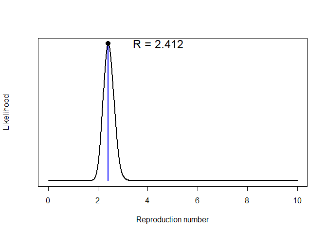
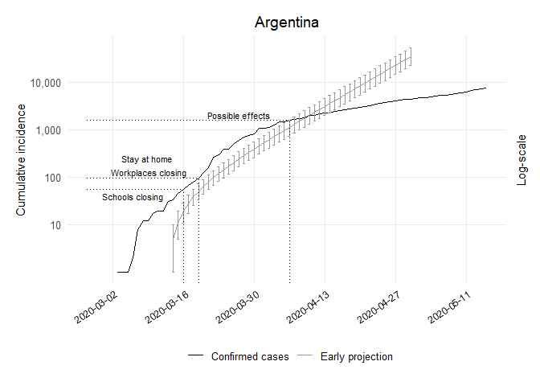

Early Projections Argentina Code
================
[Bastián González-Bustamante](http://users.ox.ac.uk/~shil5311/)

``` r
## Early Projections
res_arg <- get_R(past.i.arg, si_mean = mu, si_sd = sigma)
plot(res_arg)
```

<!-- -->

``` r

## Range
arg_range <- 1:(which(get_dates(i.arg) == third_week) - pred_days)

## Simulation of Future Epicurves
set.seed(20200225)
R_val_arg <- sample_R(res_arg, 1000)
future_i_arg <- project(i.arg[arg_range], R = R_val_arg, n_sim = 1000, 
                        si = res_arg$si, n_days = (pred_days + 41))

## Cumulative Conversion
future_i_arg <- cumulate(future_i_arg) 

## Dataframe CI 95%
df_future_i_arg <- as.data.frame(future_i_arg, long = TRUE)

## Lower CI
arg1_lo <- quantile((slice(df_future_i_arg, which(df_future_i_arg$date == "2020-03-14")))
                    $incidence, 0.025)[[1]]
arg2_lo <- quantile((slice(df_future_i_arg, which(df_future_i_arg$date == "2020-03-15")))
                    $incidence, 0.025)[[1]]
arg3_lo <- quantile((slice(df_future_i_arg, which(df_future_i_arg$date == "2020-03-16")))
                    $incidence, 0.025)[[1]]
arg4_lo <- quantile((slice(df_future_i_arg, which(df_future_i_arg$date == "2020-03-17")))
                    $incidence, 0.025)[[1]]
arg5_lo <- quantile((slice(df_future_i_arg, which(df_future_i_arg$date == "2020-03-18")))
                    $incidence, 0.025)[[1]]
arg6_lo <- quantile((slice(df_future_i_arg, which(df_future_i_arg$date == "2020-03-19")))
                    $incidence, 0.025)[[1]]
arg7_lo <- quantile((slice(df_future_i_arg, which(df_future_i_arg$date == "2020-03-20")))
                    $incidence, 0.025)[[1]]
arg8_lo <- quantile((slice(df_future_i_arg, which(df_future_i_arg$date == "2020-03-21")))
                    $incidence, 0.025)[[1]]
arg9_lo <- quantile((slice(df_future_i_arg, which(df_future_i_arg$date == "2020-03-22")))
                    $incidence, 0.025)[[1]]
arg10_lo <- quantile((slice(df_future_i_arg, which(df_future_i_arg$date == "2020-03-23")))
                     $incidence, 0.025)[[1]]
arg11_lo <- quantile((slice(df_future_i_arg, which(df_future_i_arg$date == "2020-03-24")))
                     $incidence, 0.025)[[1]]
arg12_lo <- quantile((slice(df_future_i_arg, which(df_future_i_arg$date == "2020-03-25")))
                     $incidence, 0.025)[[1]]
arg13_lo <- quantile((slice(df_future_i_arg, which(df_future_i_arg$date == "2020-03-26")))
                     $incidence, 0.025)[[1]]
arg14_lo <- quantile((slice(df_future_i_arg, which(df_future_i_arg$date == "2020-03-27")))
                     $incidence, 0.025)[[1]]
arg15_lo <- quantile((slice(df_future_i_arg, which(df_future_i_arg$date == "2020-03-28")))
                     $incidence, 0.025)[[1]]
arg16_lo <- quantile((slice(df_future_i_arg, which(df_future_i_arg$date == "2020-03-29")))
                     $incidence, 0.025)[[1]]
arg17_lo <- quantile((slice(df_future_i_arg, which(df_future_i_arg$date == "2020-03-30")))
                     $incidence, 0.025)[[1]]
arg18_lo <- quantile((slice(df_future_i_arg, which(df_future_i_arg$date == "2020-03-31")))
                     $incidence, 0.025)[[1]]
arg19_lo <- quantile((slice(df_future_i_arg, which(df_future_i_arg$date == "2020-04-01")))
                     $incidence, 0.025)[[1]]
arg20_lo <- quantile((slice(df_future_i_arg, which(df_future_i_arg$date == "2020-04-02")))
                     $incidence, 0.025)[[1]]
arg21_lo <- quantile((slice(df_future_i_arg, which(df_future_i_arg$date == "2020-04-03")))
                     $incidence, 0.025)[[1]]
arg22_lo <- quantile((slice(df_future_i_arg, which(df_future_i_arg$date == "2020-04-04")))
                     $incidence, 0.025)[[1]]
arg23_lo <- quantile((slice(df_future_i_arg, which(df_future_i_arg$date == "2020-04-05")))
                     $incidence, 0.025)[[1]]
arg24_lo <- quantile((slice(df_future_i_arg, which(df_future_i_arg$date == "2020-04-06")))
                     $incidence, 0.025)[[1]]
arg25_lo <- quantile((slice(df_future_i_arg, which(df_future_i_arg$date == "2020-04-07")))
                     $incidence, 0.025)[[1]]
arg26_lo <- quantile((slice(df_future_i_arg, which(df_future_i_arg$date == "2020-04-08")))
                     $incidence, 0.025)[[1]]
arg27_lo <- quantile((slice(df_future_i_arg, which(df_future_i_arg$date == "2020-04-09")))
                     $incidence, 0.025)[[1]]
arg28_lo <- quantile((slice(df_future_i_arg, which(df_future_i_arg$date == "2020-04-10")))
                     $incidence, 0.025)[[1]]
arg29_lo <- quantile((slice(df_future_i_arg, which(df_future_i_arg$date == "2020-04-11")))
                     $incidence, 0.025)[[1]]
arg30_lo <- quantile((slice(df_future_i_arg, which(df_future_i_arg$date == "2020-04-12")))
                     $incidence, 0.025)[[1]]
arg31_lo <- quantile((slice(df_future_i_arg, which(df_future_i_arg$date == "2020-04-13")))
                     $incidence, 0.025)[[1]]
arg32_lo <- quantile((slice(df_future_i_arg, which(df_future_i_arg$date == "2020-04-14")))
                     $incidence, 0.025)[[1]]
arg33_lo <- quantile((slice(df_future_i_arg, which(df_future_i_arg$date == "2020-04-15")))
                     $incidence, 0.025)[[1]]
arg34_lo <- quantile((slice(df_future_i_arg, which(df_future_i_arg$date == "2020-04-16")))
                     $incidence, 0.025)[[1]]
arg35_lo <- quantile((slice(df_future_i_arg, which(df_future_i_arg$date == "2020-04-17")))
                     $incidence, 0.025)[[1]]
arg36_lo <- quantile((slice(df_future_i_arg, which(df_future_i_arg$date == "2020-04-18")))
                     $incidence, 0.025)[[1]]
arg37_lo <- quantile((slice(df_future_i_arg, which(df_future_i_arg$date == "2020-04-19")))
                     $incidence, 0.025)[[1]]
arg38_lo <- quantile((slice(df_future_i_arg, which(df_future_i_arg$date == "2020-04-20")))
                     $incidence, 0.025)[[1]]
arg39_lo <- quantile((slice(df_future_i_arg, which(df_future_i_arg$date == "2020-04-21")))
                     $incidence, 0.025)[[1]]
arg40_lo <- quantile((slice(df_future_i_arg, which(df_future_i_arg$date == "2020-04-22")))
                     $incidence, 0.025)[[1]]
arg41_lo <- quantile((slice(df_future_i_arg, which(df_future_i_arg$date == "2020-04-23")))
                     $incidence, 0.025)[[1]]
arg42_lo <- quantile((slice(df_future_i_arg, which(df_future_i_arg$date == "2020-04-24")))
                     $incidence, 0.025)[[1]]
arg43_lo <- quantile((slice(df_future_i_arg, which(df_future_i_arg$date == "2020-04-25")))
                     $incidence, 0.025)[[1]]
arg44_lo <- quantile((slice(df_future_i_arg, which(df_future_i_arg$date == "2020-04-26")))
                     $incidence, 0.025)[[1]]
arg45_lo <- quantile((slice(df_future_i_arg, which(df_future_i_arg$date == "2020-04-27")))
                     $incidence, 0.025)[[1]]
arg46_lo <- quantile((slice(df_future_i_arg, which(df_future_i_arg$date == "2020-04-28")))
                     $incidence, 0.025)[[1]]
arg47_lo <- quantile((slice(df_future_i_arg, which(df_future_i_arg$date == "2020-04-29")))
                     $incidence, 0.025)[[1]]
arg48_lo <- quantile((slice(df_future_i_arg, which(df_future_i_arg$date == "2020-04-30")))
                     $incidence, 0.025)[[1]]

## Upper CI
arg1_up <- quantile((slice(df_future_i_arg, which(df_future_i_arg$date == "2020-03-14")))
                    $incidence, 0.975)[[1]]
arg2_up <- quantile((slice(df_future_i_arg, which(df_future_i_arg$date == "2020-03-15")))
                    $incidence, 0.975)[[1]]
arg3_up <- quantile((slice(df_future_i_arg, which(df_future_i_arg$date == "2020-03-16")))
                    $incidence, 0.975)[[1]]
arg4_up <- quantile((slice(df_future_i_arg, which(df_future_i_arg$date == "2020-03-17")))
                    $incidence, 0.975)[[1]]
arg5_up <- quantile((slice(df_future_i_arg, which(df_future_i_arg$date == "2020-03-18")))
                    $incidence, 0.975)[[1]]
arg6_up <- quantile((slice(df_future_i_arg, which(df_future_i_arg$date == "2020-03-19")))
                    $incidence, 0.975)[[1]]
arg7_up <- quantile((slice(df_future_i_arg, which(df_future_i_arg$date == "2020-03-20")))
                    $incidence, 0.975)[[1]]
arg8_up <- quantile((slice(df_future_i_arg, which(df_future_i_arg$date == "2020-03-21")))
                    $incidence, 0.975)[[1]]
arg9_up <- quantile((slice(df_future_i_arg, which(df_future_i_arg$date == "2020-03-22")))
                    $incidence, 0.975)[[1]]
arg10_up <- quantile((slice(df_future_i_arg, which(df_future_i_arg$date == "2020-03-23")))
                     $incidence, 0.975)[[1]]
arg11_up <- quantile((slice(df_future_i_arg, which(df_future_i_arg$date == "2020-03-24")))
                     $incidence, 0.975)[[1]]
arg12_up <- quantile((slice(df_future_i_arg, which(df_future_i_arg$date == "2020-03-25")))
                     $incidence, 0.975)[[1]]
arg13_up <- quantile((slice(df_future_i_arg, which(df_future_i_arg$date == "2020-03-26")))
                     $incidence, 0.975)[[1]]
arg14_up <- quantile((slice(df_future_i_arg, which(df_future_i_arg$date == "2020-03-27")))
                     $incidence, 0.975)[[1]]
arg15_up <- quantile((slice(df_future_i_arg, which(df_future_i_arg$date == "2020-03-28")))
                     $incidence, 0.975)[[1]]
arg16_up <- quantile((slice(df_future_i_arg, which(df_future_i_arg$date == "2020-03-29")))
                     $incidence, 0.975)[[1]]
arg17_up <- quantile((slice(df_future_i_arg, which(df_future_i_arg$date == "2020-03-30")))
                     $incidence, 0.975)[[1]]
arg18_up <- quantile((slice(df_future_i_arg, which(df_future_i_arg$date == "2020-03-31")))
                     $incidence, 0.975)[[1]]
arg19_up <- quantile((slice(df_future_i_arg, which(df_future_i_arg$date == "2020-04-01")))
                     $incidence, 0.975)[[1]]
arg20_up <- quantile((slice(df_future_i_arg, which(df_future_i_arg$date == "2020-04-02")))
                     $incidence, 0.975)[[1]]
arg21_up <- quantile((slice(df_future_i_arg, which(df_future_i_arg$date == "2020-04-03")))
                     $incidence, 0.975)[[1]]
arg22_up <- quantile((slice(df_future_i_arg, which(df_future_i_arg$date == "2020-04-04")))
                     $incidence, 0.975)[[1]]
arg23_up <- quantile((slice(df_future_i_arg, which(df_future_i_arg$date == "2020-04-05")))
                     $incidence, 0.975)[[1]]
arg24_up <- quantile((slice(df_future_i_arg, which(df_future_i_arg$date == "2020-04-06")))
                     $incidence, 0.975)[[1]]
arg25_up <- quantile((slice(df_future_i_arg, which(df_future_i_arg$date == "2020-04-07")))
                     $incidence, 0.975)[[1]]
arg26_up <- quantile((slice(df_future_i_arg, which(df_future_i_arg$date == "2020-04-08")))
                     $incidence, 0.975)[[1]]
arg27_up <- quantile((slice(df_future_i_arg, which(df_future_i_arg$date == "2020-04-09")))
                     $incidence, 0.975)[[1]]
arg28_up <- quantile((slice(df_future_i_arg, which(df_future_i_arg$date == "2020-04-10")))
                     $incidence, 0.975)[[1]]
arg29_up <- quantile((slice(df_future_i_arg, which(df_future_i_arg$date == "2020-04-11")))
                     $incidence, 0.975)[[1]]
arg30_up <- quantile((slice(df_future_i_arg, which(df_future_i_arg$date == "2020-04-12")))
                     $incidence, 0.975)[[1]]
arg31_up <- quantile((slice(df_future_i_arg, which(df_future_i_arg$date == "2020-04-13")))
                     $incidence, 0.975)[[1]]
arg32_up <- quantile((slice(df_future_i_arg, which(df_future_i_arg$date == "2020-04-14")))
                     $incidence, 0.975)[[1]]
arg33_up <- quantile((slice(df_future_i_arg, which(df_future_i_arg$date == "2020-04-15")))
                     $incidence, 0.975)[[1]]
arg34_up <- quantile((slice(df_future_i_arg, which(df_future_i_arg$date == "2020-04-16")))
                     $incidence, 0.975)[[1]]
arg35_up <- quantile((slice(df_future_i_arg, which(df_future_i_arg$date == "2020-04-17")))
                     $incidence, 0.975)[[1]]
arg36_up <- quantile((slice(df_future_i_arg, which(df_future_i_arg$date == "2020-04-18")))
                     $incidence, 0.975)[[1]]
arg37_up <- quantile((slice(df_future_i_arg, which(df_future_i_arg$date == "2020-04-19")))
                     $incidence, 0.975)[[1]]
arg38_up <- quantile((slice(df_future_i_arg, which(df_future_i_arg$date == "2020-04-20")))
                     $incidence, 0.975)[[1]]
arg39_up <- quantile((slice(df_future_i_arg, which(df_future_i_arg$date == "2020-04-21")))
                     $incidence, 0.975)[[1]]
arg40_up <- quantile((slice(df_future_i_arg, which(df_future_i_arg$date == "2020-04-22")))
                     $incidence, 0.975)[[1]]
arg41_up <- quantile((slice(df_future_i_arg, which(df_future_i_arg$date == "2020-04-23")))
                     $incidence, 0.975)[[1]]
arg42_up <- quantile((slice(df_future_i_arg, which(df_future_i_arg$date == "2020-04-24")))
                     $incidence, 0.975)[[1]]
arg43_up <- quantile((slice(df_future_i_arg, which(df_future_i_arg$date == "2020-04-25")))
                     $incidence, 0.975)[[1]]
arg44_up <- quantile((slice(df_future_i_arg, which(df_future_i_arg$date == "2020-04-26")))
                     $incidence, 0.975)[[1]]
arg45_up <- quantile((slice(df_future_i_arg, which(df_future_i_arg$date == "2020-04-27")))
                     $incidence, 0.975)[[1]]
arg46_up <- quantile((slice(df_future_i_arg, which(df_future_i_arg$date == "2020-04-28")))
                     $incidence, 0.975)[[1]]
arg47_up <- quantile((slice(df_future_i_arg, which(df_future_i_arg$date == "2020-04-29")))
                     $incidence, 0.975)[[1]]
arg48_up <- quantile((slice(df_future_i_arg, which(df_future_i_arg$date == "2020-04-30")))
                     $incidence, 0.975)[[1]]

## Dataframe
arg_pred_growth_median_counts <- future_i_arg %>% as.data.frame() %>% 
  pivot_longer(-dates, names_to = "simulation", values_to = "incidence") %>% 
  group_by(dates) %>% summarise(incident_cases = as.integer(median(incidence))) %>% 
  mutate(data_type = "Early projection")

## Dataframe
arg_proj <- arg_pred_growth_median_counts %>% 
  bind_rows(tibble(dates = get_dates(i.arg), 
                   incident_cases = cumulate(get_counts(i.arg)), data_type 
                   = "Confirmed cases"))

## Plot of Early Projections
ggplot(arg_proj, aes(x = dates, y = incident_cases, colour = data_type)) + 
  geom_line() + scale_color_manual(values=c("black", "grey60")) +
  geom_errorbar(data = subset(arg_proj, dates == "2020-03-14" & data_type 
                              == "Early projection"), 
                aes(ymin = arg1_lo, ymax = arg1_up), width = .5) +
  geom_errorbar(data = subset(arg_proj, dates == "2020-03-15" & data_type 
                              == "Early projection"), 
                aes(ymin = arg2_lo, ymax = arg2_up), width = .5) +
  geom_errorbar(data = subset(arg_proj, dates == "2020-03-16" & data_type 
                              == "Early projection"), 
                aes(ymin = arg3_lo, ymax = arg3_up), width = .5) +
  geom_errorbar(data = subset(arg_proj, dates == "2020-03-17" & data_type 
                              == "Early projection"), 
                aes(ymin = arg4_lo, ymax = arg4_up), width = .5) +
  geom_errorbar(data = subset(arg_proj, dates == "2020-03-18" & data_type 
                              == "Early projection"), 
                aes(ymin = arg5_lo, ymax = arg5_up), width = .5) +
  geom_errorbar(data = subset(arg_proj, dates == "2020-03-19" & data_type 
                              == "Early projection"), 
                aes(ymin = arg6_lo, ymax = arg6_up), width = .5) +
  geom_errorbar(data = subset(arg_proj, dates == "2020-03-20" & data_type 
                              == "Early projection"), 
                aes(ymin = arg7_lo, ymax = arg7_up), width = .5) +
  geom_errorbar(data = subset(arg_proj, dates == "2020-03-21" & data_type 
                              == "Early projection"), 
                aes(ymin = arg8_lo, ymax = arg8_up), width = .5) +
  geom_errorbar(data = subset(arg_proj, dates == "2020-03-22" & data_type 
                              == "Early projection"), 
                aes(ymin = arg9_lo, ymax = arg9_up), width = .5) +
  geom_errorbar(data = subset(arg_proj, dates == "2020-03-23" & data_type 
                              == "Early projection"), 
                aes(ymin = arg10_lo, ymax = arg10_up), width = .5) +
  geom_errorbar(data = subset(arg_proj, dates == "2020-03-24" & data_type 
                              == "Early projection"), 
                aes(ymin = arg11_lo, ymax = arg11_up), width = .5) +
  geom_errorbar(data = subset(arg_proj, dates == "2020-03-25" & data_type 
                              == "Early projection"), 
                aes(ymin = arg12_lo, ymax = arg12_up), width = .5) +
  geom_errorbar(data = subset(arg_proj, dates == "2020-03-26" & data_type 
                              == "Early projection"), 
                aes(ymin = arg13_lo, ymax = arg13_up), width = .5) +
  geom_errorbar(data = subset(arg_proj, dates == "2020-03-27" & data_type 
                              == "Early projection"), 
                aes(ymin = arg14_lo, ymax = arg14_up), width = .5) +
  geom_errorbar(data = subset(arg_proj, dates == "2020-03-28" & data_type 
                              == "Early projection"), 
                aes(ymin = arg15_lo, ymax = arg15_up), width = .5) +
  geom_errorbar(data = subset(arg_proj, dates == "2020-03-29" & data_type 
                              == "Early projection"), 
                aes(ymin = arg16_lo, ymax = arg16_up), width = .5) +
  geom_errorbar(data = subset(arg_proj, dates == "2020-03-30" & data_type 
                              == "Early projection"), 
                aes(ymin = arg17_lo, ymax = arg17_up), width = .5) +
  geom_errorbar(data = subset(arg_proj, dates == "2020-03-31" & data_type 
                              == "Early projection"), 
                aes(ymin = arg18_lo, ymax = arg18_up), width = .5) +
  geom_errorbar(data = subset(arg_proj, dates == "2020-04-01" & data_type 
                              == "Early projection"), 
                aes(ymin = arg19_lo, ymax = arg19_up), width = .5) +
  geom_errorbar(data = subset(arg_proj, dates == "2020-04-02" & data_type 
                              == "Early projection"), 
                aes(ymin = arg20_lo, ymax = arg20_up), width = .5) +
  geom_errorbar(data = subset(arg_proj, dates == "2020-04-03" & data_type 
                              == "Early projection"), 
                aes(ymin = arg21_lo, ymax = arg21_up), width = .5) +
  geom_errorbar(data = subset(arg_proj, dates == "2020-04-04" & data_type 
                              == "Early projection"), 
                aes(ymin = arg22_lo, ymax = arg22_up), width = .5) +
  geom_errorbar(data = subset(arg_proj, dates == "2020-04-05" & data_type 
                              == "Early projection"), 
                aes(ymin = arg23_lo, ymax = arg23_up), width = .5) +
  geom_errorbar(data = subset(arg_proj, dates == "2020-04-06" & data_type 
                              == "Early projection"), 
                aes(ymin = arg24_lo, ymax = arg24_up), width = .5) +
  geom_errorbar(data = subset(arg_proj, dates == "2020-04-07" & data_type 
                              == "Early projection"), 
                aes(ymin = arg25_lo, ymax = arg25_up), width = .5) +  
  geom_errorbar(data = subset(arg_proj, dates == "2020-04-08" & data_type 
                              == "Early projection"), 
                aes(ymin = arg26_lo, ymax = arg26_up), width = .5) +  
  geom_errorbar(data = subset(arg_proj, dates == "2020-04-09" & data_type 
                              == "Early projection"), 
                aes(ymin = arg27_lo, ymax = arg27_up), width = .5) +  
  geom_errorbar(data = subset(arg_proj, dates == "2020-04-10" & data_type 
                              == "Early projection"), 
                aes(ymin = arg28_lo, ymax = arg28_up), width = .5) +  
  geom_errorbar(data = subset(arg_proj, dates == "2020-04-11" & data_type 
                              == "Early projection"), 
                aes(ymin = arg29_lo, ymax = arg29_up), width = .5) +  
  geom_errorbar(data = subset(arg_proj, dates == "2020-04-12" & data_type 
                              == "Early projection"), 
                aes(ymin = arg30_lo, ymax = arg30_up), width = .5) +  
  geom_errorbar(data = subset(arg_proj, dates == "2020-04-13" & data_type 
                              == "Early projection"), 
                aes(ymin = arg31_lo, ymax = arg31_up), width = .5) +  
  geom_errorbar(data = subset(arg_proj, dates == "2020-04-14" & data_type 
                              == "Early projection"), 
                aes(ymin = arg32_lo, ymax = arg32_up), width = .5) +  
  geom_errorbar(data = subset(arg_proj, dates == "2020-04-15" & data_type 
                              == "Early projection"), 
                aes(ymin = arg33_lo, ymax = arg33_up), width = .5) +  
  geom_errorbar(data = subset(arg_proj, dates == "2020-04-16" & data_type 
                              == "Early projection"), 
                aes(ymin = arg34_lo, ymax = arg34_up), width = .5) +
  geom_errorbar(data = subset(arg_proj, dates == "2020-04-17" & data_type 
                              == "Early projection"), 
                aes(ymin = arg35_lo, ymax = arg35_up), width = .5) +  
  geom_errorbar(data = subset(arg_proj, dates == "2020-04-18" & data_type 
                              == "Early projection"), 
                aes(ymin = arg36_lo, ymax = arg36_up), width = .5) +  
  geom_errorbar(data = subset(arg_proj, dates == "2020-04-19" & data_type 
                              == "Early projection"), 
                aes(ymin = arg37_lo, ymax = arg37_up), width = .5) +  
  geom_errorbar(data = subset(arg_proj, dates == "2020-04-20" & data_type 
                              == "Early projection"), 
                aes(ymin = arg38_lo, ymax = arg38_up), width = .5) +  
  geom_errorbar(data = subset(arg_proj, dates == "2020-04-21" & data_type 
                              == "Early projection"), 
                aes(ymin = arg39_lo, ymax = arg39_up), width = .5) +  
  geom_errorbar(data = subset(arg_proj, dates == "2020-04-22" & data_type 
                              == "Early projection"), 
                aes(ymin = arg40_lo, ymax = arg40_up), width = .5) +  
  geom_errorbar(data = subset(arg_proj, dates == "2020-04-23" & data_type 
                              == "Early projection"), 
                aes(ymin = arg41_lo, ymax = arg41_up), width = .5) +  
  geom_errorbar(data = subset(arg_proj, dates == "2020-04-24" & data_type 
                              == "Early projection"), 
                aes(ymin = arg42_lo, ymax = arg42_up), width = .5) +  
  geom_errorbar(data = subset(arg_proj, dates == "2020-04-25" & data_type 
                              == "Early projection"), 
                aes(ymin = arg43_lo, ymax = arg43_up), width = .5) +  
  geom_errorbar(data = subset(arg_proj, dates == "2020-04-26" & data_type 
                              == "Early projection"), 
                aes(ymin = arg44_lo, ymax = arg44_up), width = .5) +  
  geom_errorbar(data = subset(arg_proj, dates == "2020-04-27" & data_type 
                              == "Early projection"), 
                aes(ymin = arg45_lo, ymax = arg45_up), width = .5) +  
  geom_errorbar(data = subset(arg_proj, dates == "2020-04-28" & data_type 
                              == "Early projection"), 
                aes(ymin = arg46_lo, ymax = arg46_up), width = .5) +  
  geom_errorbar(data = subset(arg_proj, dates == "2020-04-29" & data_type 
                              == "Early projection"), 
                aes(ymin = arg47_lo, ymax = arg47_up), width = .5) +  
  geom_errorbar(data = subset(arg_proj, dates == "2020-04-30" & data_type 
                              == "Early projection"), 
                aes(ymin = arg48_lo, ymax = arg48_up), width = .5) + 
  theme_minimal(base_size = 12) + theme(legend.position = "bottom") +
  theme(panel.grid.minor = element_blank()) +
  theme(axis.text.x = element_text(angle = 35, hjust = 1, color = "black",  size = 9)) +
  labs(x = NULL, y = "Cumulative incidence", title = "Argentina",subtitle = NULL, 
       colour = NULL) + 
  theme(plot.margin = unit(c(0.5,0.5,0.5,0.5), "cm")) +
  scale_x_date(date_breaks = "2 weeks", date_minor_breaks = "2 weeks", 
               date_labels = "%Y-%m-%d") +
  scale_y_log10(breaks = 10**(1:10), labels = comma(10**(1:10)),
                sec.axis = sec_axis(~ ., labels = NULL, name = "Log-scale")) + 
  theme(axis.title.y.right = element_text(angle = 90, size = 11),
        axis.title.y.left = element_text(size = 11),
        plot.caption = element_text(size = 9),
        plot.title = element_text(hjust = 0.5)) +
  ## School Closing
  geom_segment(aes(x = as.Date(arg_resp$dates[which(arg_resp$c1_schoolclosing 
               == 3 & arg_resp$c1_flag == 1, arr.ind = TRUE)[1]]), xend 
               = as.Date(arg_resp$dates[which(arg_resp$c1_schoolclosing 
               == 3 & arg_resp$c1_flag == 1, arr.ind = TRUE)[1]]), y = 0, yend 
               = arg_proj$incident_cases[which(arg_proj$data_type
               == "Confirmed cases" & arg_proj$dates 
               == as.Date(arg_resp$dates[which(arg_resp$c1_schoolclosing == 3 
               & arg_resp$c1_flag == 1, arr.ind = TRUE)[1]]))]), linetype = "dotted") + 
  geom_segment(aes(x = as.Date("2020-02-26"), xend = as.Date(arg_resp$dates[which(arg_resp
               $c1_schoolclosing == 3 & arg_resp$c1_flag == 1, arr.ind = TRUE)[1]]), y 
               = arg_proj$incident_cases[which(arg_proj$data_type == "Confirmed cases" 
               & arg_proj$dates ==as.Date(arg_resp$dates[which(arg_resp
               $c1_schoolclosing == 3 & arg_resp$c1_flag == 1, arr.ind = TRUE)[1]]))], 
               yend = arg_proj$incident_cases[which(arg_proj$data_type 
               == "Confirmed cases" & arg_proj$dates == as.Date(arg_resp$dates[which
              (arg_resp$c1_schoolclosing == 3 & arg_resp$c1_flag == 1, 
               arr.ind = TRUE)[1]]))]), linetype = "dotted") +
  annotate("text", y = 0.7 * arg_proj$incident_cases[which(arg_proj$data_type 
           == "Confirmed cases" & arg_proj$dates == as.Date(arg_resp$dates[which
          (arg_resp$c1_schoolclosing == 3 & arg_resp$c1_flag == 1, arr.ind = TRUE)
          [1]]))], x =  as.Date(arg_resp$dates[which(arg_resp$c1_schoolclosing == 3 
           & arg_resp$c1_flag == 1, arr.ind = TRUE)[1]]) - 10, label = "Schools closing", 
           size = 3) +
  ## Workplace Closing + Stay atHhome
  geom_segment(aes(x = as.Date(arg_resp$dates[which(arg_resp$c2_workplaceclosing 
               == 3 & arg_resp$c1_flag == 1, arr.ind = TRUE)[1]]), xend = as.Date
               (arg_resp$dates[which(arg_resp$c2_workplaceclosing == 3 
               & arg_resp$c1_flag == 1, arr.ind = TRUE)[1]]), y = 0, yend 
               = arg_proj$incident_cases[which(arg_proj$data_type == "Confirmed cases" 
               & arg_proj$dates == as.Date(arg_resp$dates[which(arg_resp
               $c2_workplaceclosing == 3 & arg_resp$c1_flag == 1, 
               arr.ind = TRUE)[1]]))]), linetype = "dotted") + 
  geom_segment(aes(x = as.Date("2020-02-26"), xend = as.Date(arg_resp$dates[which
              (arg_resp$c2_workplaceclosing == 3 & arg_resp$c1_flag == 1, 
               arr.ind = TRUE)[1]]), y = arg_proj$incident_cases[which(arg_proj
               $data_type == "Confirmed cases" & arg_proj$dates ==  as.Date
              (arg_resp$dates[which(arg_resp$c2_workplaceclosing == 3 
               & arg_resp$c1_flag == 1, arr.ind = TRUE)[1]]))], yend = arg_proj
               $incident_cases[which(arg_proj$data_type == "Confirmed cases"
               & arg_proj$dates == as.Date(arg_resp$dates[which(arg_resp
               $c2_workplaceclosing == 3 & arg_resp$c1_flag == 1, 
               arr.ind = TRUE)[1]]))]), linetype = "dotted") +
  annotate("text", y = 1.85 * arg_proj$incident_cases[which(arg_proj
           $data_type == "Confirmed cases" & arg_proj$dates ==  as.Date(arg_resp
           $dates[which(arg_resp$c2_workplaceclosing == 3 & arg_resp$c1_flag 
           == 1, arr.ind = TRUE)[1]]))], x = as.Date(arg_resp$dates[which(arg_resp
           $c2_workplaceclosing == 3 & arg_resp$c1_flag == 1, arr.ind = TRUE)[1]]) 
           - 10, label = "Stay at home \n Workplaces closing", size = 3) +
  ## Effects
  geom_segment(aes(x = 21 + as.Date(arg_resp$dates[which(arg_resp$c1_schoolclosing 
               == 3 & arg_resp$c1_flag == 1, arr.ind = TRUE)[1]]), xend = 21 
               + as.Date(arg_resp$dates[which(arg_resp$c1_schoolclosing == 3 
               & arg_resp$c1_flag == 1, arr.ind = TRUE)[1]]), y = 0, yend = arg_proj
               $incident_cases[which(arg_proj$data_type == "Confirmed cases" 
               & arg_proj$dates == 21 + as.Date(arg_resp$dates[which(arg_resp
               $c1_schoolclosing == 3 & arg_resp$c1_flag == 1, 
               arr.ind = TRUE)[1]]))]), linetype = "dotted") + 
  geom_segment(aes(x = as.Date("2020-02-26"), xend = 21 + as.Date(arg_resp
               $dates[which(arg_resp$c1_schoolclosing == 3 & arg_resp$c1_flag 
               == 1, arr.ind = TRUE)[1]]), y = arg_proj$incident_cases[which
               (arg_proj$data_type == "Confirmed cases" & arg_proj$dates 
               == 21 + as.Date(arg_resp$dates[which(arg_resp$c1_schoolclosing 
               == 3 & arg_resp$c1_flag == 1, arr.ind = TRUE)[1]]))], yend 
               = arg_proj$incident_cases[which(arg_proj$data_type 
               == "Confirmed cases" & arg_proj$dates == 21 +
               as.Date(arg_resp$dates[which(arg_resp$c1_schoolclosing == 3 
               & arg_resp$c1_flag == 1, arr.ind = TRUE)[1]]))]), 
               linetype = "dotted") +
  annotate("text", y = 1.3 * (arg_proj$incident_cases[which(arg_proj$data_type 
           == "Confirmed cases" & arg_proj$dates == 21 + as.Date(arg_resp
           $dates[which(arg_resp$c1_schoolclosing == 3 & arg_resp$c1_flag 
           == 1, arr.ind = TRUE)[1]]))]), x =  as.Date(arg_resp$dates[which
           (arg_resp$c1_schoolclosing == 3 & arg_resp$c1_flag == 1, 
           arr.ind = TRUE)[1]]) - 10 + 21, label = "Possible effects", size = 3) 
```

<!-- -->
