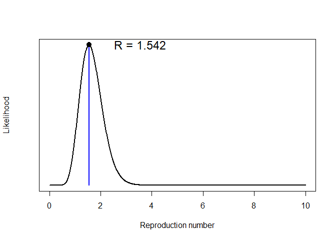
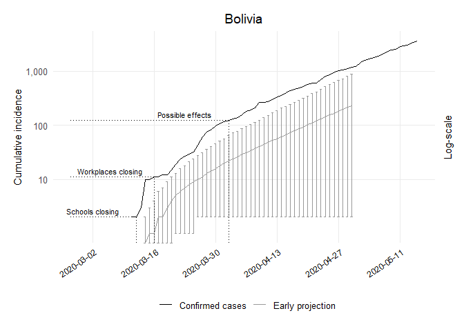

Early Projections Bolivia Code
================
[Bastián González-Bustamante](http://users.ox.ac.uk/~shil5311/)

``` r
## Early Projections
res_bol <- get_R(past.i.bol, si_mean = mu, si_sd = sigma)
plot(res_bol)
```

<!-- -->

``` r

## Range
bol_range <- 1:(which(get_dates(i.bol) == third_week) - pred_days)

## Simulation of Future Epicurves
set.seed(20200225)
R_val_bol <- sample_R(res_bol, 1000)
future_i_bol <- project(i.bol[bol_range], R = R_val_bol, n_sim = 1000, 
                        si = res_bol$si, n_days = (pred_days + 41))

## Cumulative Conversion
future_i_bol <- cumulate(future_i_bol) 

## Dataframe CI 95%
df_future_i_bol <- as.data.frame(future_i_bol, long = TRUE)

## Lower CI
bol1_lo <- quantile((slice(df_future_i_bol, which(df_future_i_bol$date == "2020-03-14")))
                    $incidence, 0.025)[[1]]
bol2_lo <- quantile((slice(df_future_i_bol, which(df_future_i_bol$date == "2020-03-15")))
                    $incidence, 0.025)[[1]]
bol3_lo <- quantile((slice(df_future_i_bol, which(df_future_i_bol$date == "2020-03-16")))
                    $incidence, 0.025)[[1]]
bol4_lo <- quantile((slice(df_future_i_bol, which(df_future_i_bol$date == "2020-03-17")))
                    $incidence, 0.025)[[1]]
bol5_lo <- quantile((slice(df_future_i_bol, which(df_future_i_bol$date == "2020-03-18")))
                    $incidence, 0.025)[[1]]
bol6_lo <- quantile((slice(df_future_i_bol, which(df_future_i_bol$date == "2020-03-19")))
                    $incidence, 0.025)[[1]]
bol7_lo <- quantile((slice(df_future_i_bol, which(df_future_i_bol$date == "2020-03-20")))
                    $incidence, 0.025)[[1]]
bol8_lo <- quantile((slice(df_future_i_bol, which(df_future_i_bol$date == "2020-03-21")))
                    $incidence, 0.025)[[1]]
bol9_lo <- quantile((slice(df_future_i_bol, which(df_future_i_bol$date == "2020-03-22")))
                    $incidence, 0.025)[[1]]
bol10_lo <- quantile((slice(df_future_i_bol, which(df_future_i_bol$date == "2020-03-23")))
                     $incidence, 0.025)[[1]]
bol11_lo <- quantile((slice(df_future_i_bol, which(df_future_i_bol$date == "2020-03-24")))
                     $incidence, 0.025)[[1]]
bol12_lo <- quantile((slice(df_future_i_bol, which(df_future_i_bol$date == "2020-03-25")))
                     $incidence, 0.025)[[1]]
bol13_lo <- quantile((slice(df_future_i_bol, which(df_future_i_bol$date == "2020-03-26")))
                     $incidence, 0.025)[[1]]
bol14_lo <- quantile((slice(df_future_i_bol, which(df_future_i_bol$date == "2020-03-27")))
                     $incidence, 0.025)[[1]]
bol15_lo <- quantile((slice(df_future_i_bol, which(df_future_i_bol$date == "2020-03-28")))
                     $incidence, 0.025)[[1]]
bol16_lo <- quantile((slice(df_future_i_bol, which(df_future_i_bol$date == "2020-03-29")))
                     $incidence, 0.025)[[1]]
bol17_lo <- quantile((slice(df_future_i_bol, which(df_future_i_bol$date == "2020-03-30")))
                     $incidence, 0.025)[[1]]
bol18_lo <- quantile((slice(df_future_i_bol, which(df_future_i_bol$date == "2020-03-31")))
                     $incidence, 0.025)[[1]]
bol19_lo <- quantile((slice(df_future_i_bol, which(df_future_i_bol$date == "2020-04-01")))
                     $incidence, 0.025)[[1]]
bol20_lo <- quantile((slice(df_future_i_bol, which(df_future_i_bol$date == "2020-04-02")))
                     $incidence, 0.025)[[1]]
bol21_lo <- quantile((slice(df_future_i_bol, which(df_future_i_bol$date == "2020-04-03")))
                     $incidence, 0.025)[[1]]
bol22_lo <- quantile((slice(df_future_i_bol, which(df_future_i_bol$date == "2020-04-04")))
                     $incidence, 0.025)[[1]]
bol23_lo <- quantile((slice(df_future_i_bol, which(df_future_i_bol$date == "2020-04-05")))
                     $incidence, 0.025)[[1]]
bol24_lo <- quantile((slice(df_future_i_bol, which(df_future_i_bol$date == "2020-04-06")))
                     $incidence, 0.025)[[1]]
bol25_lo <- quantile((slice(df_future_i_bol, which(df_future_i_bol$date == "2020-04-07")))
                     $incidence, 0.025)[[1]]
bol26_lo <- quantile((slice(df_future_i_bol, which(df_future_i_bol$date == "2020-04-08")))
                     $incidence, 0.025)[[1]]
bol27_lo <- quantile((slice(df_future_i_bol, which(df_future_i_bol$date == "2020-04-09")))
                     $incidence, 0.025)[[1]]
bol28_lo <- quantile((slice(df_future_i_bol, which(df_future_i_bol$date == "2020-04-10")))
                     $incidence, 0.025)[[1]]
bol29_lo <- quantile((slice(df_future_i_bol, which(df_future_i_bol$date == "2020-04-11")))
                     $incidence, 0.025)[[1]]
bol30_lo <- quantile((slice(df_future_i_bol, which(df_future_i_bol$date == "2020-04-12")))
                     $incidence, 0.025)[[1]]
bol31_lo <- quantile((slice(df_future_i_bol, which(df_future_i_bol$date == "2020-04-13")))
                     $incidence, 0.025)[[1]]
bol32_lo <- quantile((slice(df_future_i_bol, which(df_future_i_bol$date == "2020-04-14")))
                     $incidence, 0.025)[[1]]
bol33_lo <- quantile((slice(df_future_i_bol, which(df_future_i_bol$date == "2020-04-15")))
                     $incidence, 0.025)[[1]]
bol34_lo <- quantile((slice(df_future_i_bol, which(df_future_i_bol$date == "2020-04-16")))
                     $incidence, 0.025)[[1]]
bol35_lo <- quantile((slice(df_future_i_bol, which(df_future_i_bol$date == "2020-04-17")))
                     $incidence, 0.025)[[1]]
bol36_lo <- quantile((slice(df_future_i_bol, which(df_future_i_bol$date == "2020-04-18")))
                     $incidence, 0.025)[[1]]
bol37_lo <- quantile((slice(df_future_i_bol, which(df_future_i_bol$date == "2020-04-19")))
                     $incidence, 0.025)[[1]]
bol38_lo <- quantile((slice(df_future_i_bol, which(df_future_i_bol$date == "2020-04-20")))
                     $incidence, 0.025)[[1]]
bol39_lo <- quantile((slice(df_future_i_bol, which(df_future_i_bol$date == "2020-04-21")))
                     $incidence, 0.025)[[1]]
bol40_lo <- quantile((slice(df_future_i_bol, which(df_future_i_bol$date == "2020-04-22")))
                     $incidence, 0.025)[[1]]
bol41_lo <- quantile((slice(df_future_i_bol, which(df_future_i_bol$date == "2020-04-23")))
                     $incidence, 0.025)[[1]]
bol42_lo <- quantile((slice(df_future_i_bol, which(df_future_i_bol$date == "2020-04-24")))
                     $incidence, 0.025)[[1]]
bol43_lo <- quantile((slice(df_future_i_bol, which(df_future_i_bol$date == "2020-04-25")))
                     $incidence, 0.025)[[1]]
bol44_lo <- quantile((slice(df_future_i_bol, which(df_future_i_bol$date == "2020-04-26")))
                     $incidence, 0.025)[[1]]
bol45_lo <- quantile((slice(df_future_i_bol, which(df_future_i_bol$date == "2020-04-27")))
                     $incidence, 0.025)[[1]]
bol46_lo <- quantile((slice(df_future_i_bol, which(df_future_i_bol$date == "2020-04-28")))
                     $incidence, 0.025)[[1]]
bol47_lo <- quantile((slice(df_future_i_bol, which(df_future_i_bol$date == "2020-04-29")))
                     $incidence, 0.025)[[1]]
bol48_lo <- quantile((slice(df_future_i_bol, which(df_future_i_bol$date == "2020-04-30")))
                     $incidence, 0.025)[[1]]

## Upper CI
bol1_up <- quantile((slice(df_future_i_bol, which(df_future_i_bol$date == "2020-03-14")))
                    $incidence, 0.975)[[1]]
bol2_up <- quantile((slice(df_future_i_bol, which(df_future_i_bol$date == "2020-03-15")))
                    $incidence, 0.975)[[1]]
bol3_up <- quantile((slice(df_future_i_bol, which(df_future_i_bol$date == "2020-03-16")))
                    $incidence, 0.975)[[1]]
bol4_up <- quantile((slice(df_future_i_bol, which(df_future_i_bol$date == "2020-03-17")))
                    $incidence, 0.975)[[1]]
bol5_up <- quantile((slice(df_future_i_bol, which(df_future_i_bol$date == "2020-03-18")))
                    $incidence, 0.975)[[1]]
bol6_up <- quantile((slice(df_future_i_bol, which(df_future_i_bol$date == "2020-03-19")))
                    $incidence, 0.975)[[1]]
bol7_up <- quantile((slice(df_future_i_bol, which(df_future_i_bol$date == "2020-03-20")))
                    $incidence, 0.975)[[1]]
bol8_up <- quantile((slice(df_future_i_bol, which(df_future_i_bol$date == "2020-03-21")))
                    $incidence, 0.975)[[1]]
bol9_up <- quantile((slice(df_future_i_bol, which(df_future_i_bol$date == "2020-03-22")))
                    $incidence, 0.975)[[1]]
bol10_up <- quantile((slice(df_future_i_bol, which(df_future_i_bol$date == "2020-03-23")))
                     $incidence, 0.975)[[1]]
bol11_up <- quantile((slice(df_future_i_bol, which(df_future_i_bol$date == "2020-03-24")))
                     $incidence, 0.975)[[1]]
bol12_up <- quantile((slice(df_future_i_bol, which(df_future_i_bol$date == "2020-03-25")))
                     $incidence, 0.975)[[1]]
bol13_up <- quantile((slice(df_future_i_bol, which(df_future_i_bol$date == "2020-03-26")))
                     $incidence, 0.975)[[1]]
bol14_up <- quantile((slice(df_future_i_bol, which(df_future_i_bol$date == "2020-03-27")))
                     $incidence, 0.975)[[1]]
bol15_up <- quantile((slice(df_future_i_bol, which(df_future_i_bol$date == "2020-03-28")))
                     $incidence, 0.975)[[1]]
bol16_up <- quantile((slice(df_future_i_bol, which(df_future_i_bol$date == "2020-03-29")))
                     $incidence, 0.975)[[1]]
bol17_up <- quantile((slice(df_future_i_bol, which(df_future_i_bol$date == "2020-03-30")))
                     $incidence, 0.975)[[1]]
bol18_up <- quantile((slice(df_future_i_bol, which(df_future_i_bol$date == "2020-03-31")))
                     $incidence, 0.975)[[1]]
bol19_up <- quantile((slice(df_future_i_bol, which(df_future_i_bol$date == "2020-04-01")))
                     $incidence, 0.975)[[1]]
bol20_up <- quantile((slice(df_future_i_bol, which(df_future_i_bol$date == "2020-04-02")))
                     $incidence, 0.975)[[1]]
bol21_up <- quantile((slice(df_future_i_bol, which(df_future_i_bol$date == "2020-04-03")))
                     $incidence, 0.975)[[1]]
bol22_up <- quantile((slice(df_future_i_bol, which(df_future_i_bol$date == "2020-04-04")))
                     $incidence, 0.975)[[1]]
bol23_up <- quantile((slice(df_future_i_bol, which(df_future_i_bol$date == "2020-04-05")))
                     $incidence, 0.975)[[1]]
bol24_up <- quantile((slice(df_future_i_bol, which(df_future_i_bol$date == "2020-04-06")))
                     $incidence, 0.975)[[1]]
bol25_up <- quantile((slice(df_future_i_bol, which(df_future_i_bol$date == "2020-04-07")))
                     $incidence, 0.975)[[1]]
bol26_up <- quantile((slice(df_future_i_bol, which(df_future_i_bol$date == "2020-04-08")))
                     $incidence, 0.975)[[1]]
bol27_up <- quantile((slice(df_future_i_bol, which(df_future_i_bol$date == "2020-04-09")))
                     $incidence, 0.975)[[1]]
bol28_up <- quantile((slice(df_future_i_bol, which(df_future_i_bol$date == "2020-04-10")))
                     $incidence, 0.975)[[1]]
bol29_up <- quantile((slice(df_future_i_bol, which(df_future_i_bol$date == "2020-04-11")))
                     $incidence, 0.975)[[1]]
bol30_up <- quantile((slice(df_future_i_bol, which(df_future_i_bol$date == "2020-04-12")))
                     $incidence, 0.975)[[1]]
bol31_up <- quantile((slice(df_future_i_bol, which(df_future_i_bol$date == "2020-04-13")))
                     $incidence, 0.975)[[1]]
bol32_up <- quantile((slice(df_future_i_bol, which(df_future_i_bol$date == "2020-04-14")))
                     $incidence, 0.975)[[1]]
bol33_up <- quantile((slice(df_future_i_bol, which(df_future_i_bol$date == "2020-04-15")))
                     $incidence, 0.975)[[1]]
bol34_up <- quantile((slice(df_future_i_bol, which(df_future_i_bol$date == "2020-04-16")))
                     $incidence, 0.975)[[1]]
bol35_up <- quantile((slice(df_future_i_bol, which(df_future_i_bol$date == "2020-04-17")))
                     $incidence, 0.975)[[1]]
bol36_up <- quantile((slice(df_future_i_bol, which(df_future_i_bol$date == "2020-04-18")))
                     $incidence, 0.975)[[1]]
bol37_up <- quantile((slice(df_future_i_bol, which(df_future_i_bol$date == "2020-04-19")))
                     $incidence, 0.975)[[1]]
bol38_up <- quantile((slice(df_future_i_bol, which(df_future_i_bol$date == "2020-04-20")))
                     $incidence, 0.975)[[1]]
bol39_up <- quantile((slice(df_future_i_bol, which(df_future_i_bol$date == "2020-04-21")))
                     $incidence, 0.975)[[1]]
bol40_up <- quantile((slice(df_future_i_bol, which(df_future_i_bol$date == "2020-04-22")))
                     $incidence, 0.975)[[1]]
bol41_up <- quantile((slice(df_future_i_bol, which(df_future_i_bol$date == "2020-04-23")))
                     $incidence, 0.975)[[1]]
bol42_up <- quantile((slice(df_future_i_bol, which(df_future_i_bol$date == "2020-04-24")))
                     $incidence, 0.975)[[1]]
bol43_up <- quantile((slice(df_future_i_bol, which(df_future_i_bol$date == "2020-04-25")))
                     $incidence, 0.975)[[1]]
bol44_up <- quantile((slice(df_future_i_bol, which(df_future_i_bol$date == "2020-04-26")))
                     $incidence, 0.975)[[1]]
bol45_up <- quantile((slice(df_future_i_bol, which(df_future_i_bol$date == "2020-04-27")))
                     $incidence, 0.975)[[1]]
bol46_up <- quantile((slice(df_future_i_bol, which(df_future_i_bol$date == "2020-04-28")))
                     $incidence, 0.975)[[1]]
bol47_up <- quantile((slice(df_future_i_bol, which(df_future_i_bol$date == "2020-04-29")))
                     $incidence, 0.975)[[1]]
bol48_up <- quantile((slice(df_future_i_bol, which(df_future_i_bol$date == "2020-04-30")))
                     $incidence, 0.975)[[1]]

## Dataframe
bol_pred_growth_median_counts <- future_i_bol %>% as.data.frame() %>% 
  pivot_longer(-dates, names_to = "simulation", values_to = "incidence") %>% 
  group_by(dates) %>% summarise(incident_cases = as.integer(median(incidence))) %>% 
  mutate(data_type = "Early projection")

## Dataframe
bol_proj <- bol_pred_growth_median_counts %>% 
  bind_rows(tibble(dates = get_dates(i.bol), 
                   incident_cases = cumulate(get_counts(i.bol)), data_type 
                   = "Confirmed cases"))

## Plot of Early Projections
ggplot(bol_proj, aes(x = dates, y = incident_cases, colour = data_type)) + 
  geom_line() + scale_color_manual(values=c("black", "grey60")) +
  geom_errorbar(data = subset(bol_proj, dates == "2020-03-14" & data_type 
                              == "Early projection"), 
                aes(ymin = bol1_lo, ymax = bol1_up), width = .5) +
  geom_errorbar(data = subset(bol_proj, dates == "2020-03-15" & data_type 
                              == "Early projection"), 
                aes(ymin = bol2_lo, ymax = bol2_up), width = .5) +
  geom_errorbar(data = subset(bol_proj, dates == "2020-03-16" & data_type 
                              == "Early projection"), 
                aes(ymin = bol3_lo, ymax = bol3_up), width = .5) +
  geom_errorbar(data = subset(bol_proj, dates == "2020-03-17" & data_type 
                              == "Early projection"), 
                aes(ymin = bol4_lo, ymax = bol4_up), width = .5) +
  geom_errorbar(data = subset(bol_proj, dates == "2020-03-18" & data_type 
                              == "Early projection"), 
                aes(ymin = bol5_lo, ymax = bol5_up), width = .5) +
  geom_errorbar(data = subset(bol_proj, dates == "2020-03-19" & data_type 
                              == "Early projection"), 
                aes(ymin = bol6_lo, ymax = bol6_up), width = .5) +
  geom_errorbar(data = subset(bol_proj, dates == "2020-03-20" & data_type 
                              == "Early projection"), 
                aes(ymin = bol7_lo, ymax = bol7_up), width = .5) +
  geom_errorbar(data = subset(bol_proj, dates == "2020-03-21" & data_type 
                              == "Early projection"), 
                aes(ymin = bol8_lo, ymax = bol8_up), width = .5) +
  geom_errorbar(data = subset(bol_proj, dates == "2020-03-22" & data_type 
                              == "Early projection"), 
                aes(ymin = bol9_lo, ymax = bol9_up), width = .5) +
  geom_errorbar(data = subset(bol_proj, dates == "2020-03-23" & data_type 
                              == "Early projection"), 
                aes(ymin = bol10_lo, ymax = bol10_up), width = .5) +
  geom_errorbar(data = subset(bol_proj, dates == "2020-03-24" & data_type 
                              == "Early projection"), 
                aes(ymin = bol11_lo, ymax = bol11_up), width = .5) +
  geom_errorbar(data = subset(bol_proj, dates == "2020-03-25" & data_type 
                              == "Early projection"), 
                aes(ymin = bol12_lo, ymax = bol12_up), width = .5) +
  geom_errorbar(data = subset(bol_proj, dates == "2020-03-26" & data_type 
                              == "Early projection"), 
                aes(ymin = bol13_lo, ymax = bol13_up), width = .5) +
  geom_errorbar(data = subset(bol_proj, dates == "2020-03-27" & data_type 
                              == "Early projection"), 
                aes(ymin = bol14_lo, ymax = bol14_up), width = .5) +
  geom_errorbar(data = subset(bol_proj, dates == "2020-03-28" & data_type 
                              == "Early projection"), 
                aes(ymin = bol15_lo, ymax = bol15_up), width = .5) +
  geom_errorbar(data = subset(bol_proj, dates == "2020-03-29" & data_type 
                              == "Early projection"), 
                aes(ymin = bol16_lo, ymax = bol16_up), width = .5) +
  geom_errorbar(data = subset(bol_proj, dates == "2020-03-30" & data_type 
                              == "Early projection"), 
                aes(ymin = bol17_lo, ymax = bol17_up), width = .5) +
  geom_errorbar(data = subset(bol_proj, dates == "2020-03-31" & data_type 
                              == "Early projection"), 
                aes(ymin = bol18_lo, ymax = bol18_up), width = .5) +
  geom_errorbar(data = subset(bol_proj, dates == "2020-04-01" & data_type 
                              == "Early projection"), 
                aes(ymin = bol19_lo, ymax = bol19_up), width = .5) +
  geom_errorbar(data = subset(bol_proj, dates == "2020-04-02" & data_type 
                              == "Early projection"), 
                aes(ymin = bol20_lo, ymax = bol20_up), width = .5) +
  geom_errorbar(data = subset(bol_proj, dates == "2020-04-03" & data_type 
                              == "Early projection"), 
                aes(ymin = bol21_lo, ymax = bol21_up), width = .5) +
  geom_errorbar(data = subset(bol_proj, dates == "2020-04-04" & data_type 
                              == "Early projection"), 
                aes(ymin = bol22_lo, ymax = bol22_up), width = .5) +
  geom_errorbar(data = subset(bol_proj, dates == "2020-04-05" & data_type 
                              == "Early projection"), 
                aes(ymin = bol23_lo, ymax = bol23_up), width = .5) +
  geom_errorbar(data = subset(bol_proj, dates == "2020-04-06" & data_type 
                              == "Early projection"), 
                aes(ymin = bol24_lo, ymax = bol24_up), width = .5) +
  geom_errorbar(data = subset(bol_proj, dates == "2020-04-07" & data_type 
                              == "Early projection"), 
                aes(ymin = bol25_lo, ymax = bol25_up), width = .5) +  
  geom_errorbar(data = subset(bol_proj, dates == "2020-04-08" & data_type
                              == "Early projection"), 
                aes(ymin = bol26_lo, ymax = bol26_up), width = .5) +  
  geom_errorbar(data = subset(bol_proj, dates == "2020-04-09" & data_type 
                              == "Early projection"), 
                aes(ymin = bol27_lo, ymax = bol27_up), width = .5) +  
  geom_errorbar(data = subset(bol_proj, dates == "2020-04-10" & data_type 
                              == "Early projection"), 
                aes(ymin = bol28_lo, ymax = bol28_up), width = .5) +  
  geom_errorbar(data = subset(bol_proj, dates == "2020-04-11" & data_type 
                              == "Early projection"), 
                aes(ymin = bol29_lo, ymax = bol29_up), width = .5) +  
  geom_errorbar(data = subset(bol_proj, dates == "2020-04-12" & data_type 
                              == "Early projection"), 
                aes(ymin = bol30_lo, ymax = bol30_up), width = .5) +  
  geom_errorbar(data = subset(bol_proj, dates == "2020-04-13" & data_type 
                              == "Early projection"), 
                aes(ymin = bol31_lo, ymax = bol31_up), width = .5) +  
  geom_errorbar(data = subset(bol_proj, dates == "2020-04-14" & data_type 
                              == "Early projection"), 
                aes(ymin = bol32_lo, ymax = bol32_up), width = .5) +  
  geom_errorbar(data = subset(bol_proj, dates == "2020-04-15" & data_type 
                              == "Early projection"), 
                aes(ymin = bol33_lo, ymax = bol33_up), width = .5) +  
  geom_errorbar(data = subset(bol_proj, dates == "2020-04-16" & data_type 
                              == "Early projection"), 
                aes(ymin = bol34_lo, ymax = bol34_up), width = .5) +
  geom_errorbar(data = subset(bol_proj, dates == "2020-04-17" & data_type 
                              == "Early projection"), 
                aes(ymin = bol35_lo, ymax = bol35_up), width = .5) +  
  geom_errorbar(data = subset(bol_proj, dates == "2020-04-18" & data_type 
                              == "Early projection"), 
                aes(ymin = bol36_lo, ymax = bol36_up), width = .5) +  
  geom_errorbar(data = subset(bol_proj, dates == "2020-04-19" & data_type 
                              == "Early projection"), 
                aes(ymin = bol37_lo, ymax = bol37_up), width = .5) +  
  geom_errorbar(data = subset(bol_proj, dates == "2020-04-20" & data_type 
                              == "Early projection"), 
                aes(ymin = bol38_lo, ymax = bol38_up), width = .5) +  
  geom_errorbar(data = subset(bol_proj, dates == "2020-04-21" & data_type 
                              == "Early projection"), 
                aes(ymin = bol39_lo, ymax = bol39_up), width = .5) +  
  geom_errorbar(data = subset(bol_proj, dates == "2020-04-22" & data_type 
                              == "Early projection"), 
                aes(ymin = bol40_lo, ymax = bol40_up), width = .5) +  
  geom_errorbar(data = subset(bol_proj, dates == "2020-04-23" & data_type 
                              == "Early projection"), 
                aes(ymin = bol41_lo, ymax = bol41_up), width = .5) +  
  geom_errorbar(data = subset(bol_proj, dates == "2020-04-24" & data_type 
                              == "Early projection"), 
                aes(ymin = bol42_lo, ymax = bol42_up), width = .5) +  
  geom_errorbar(data = subset(bol_proj, dates == "2020-04-25" & data_type 
                              == "Early projection"), 
                aes(ymin = bol43_lo, ymax = bol43_up), width = .5) +  
  geom_errorbar(data = subset(bol_proj, dates == "2020-04-26" & data_type 
                              == "Early projection"), 
                aes(ymin = bol44_lo, ymax = bol44_up), width = .5) +  
  geom_errorbar(data = subset(bol_proj, dates == "2020-04-27" & data_type 
                              == "Early projection"), 
                aes(ymin = bol45_lo, ymax = bol45_up), width = .5) +  
  geom_errorbar(data = subset(bol_proj, dates == "2020-04-28" & data_type 
                              == "Early projection"), 
                aes(ymin = bol46_lo, ymax = bol46_up), width = .5) +  
  geom_errorbar(data = subset(bol_proj, dates == "2020-04-29" & data_type 
                              == "Early projection"), 
                aes(ymin = bol47_lo, ymax = bol47_up), width = .5) +  
  geom_errorbar(data = subset(bol_proj, dates == "2020-04-30" & data_type 
                              == "Early projection"), 
                aes(ymin = bol48_lo, ymax = bol48_up), width = .5) + 
  theme_minimal(base_size = 12) + theme(legend.position = "bottom") +
  theme(panel.grid.minor = element_blank()) +
  theme(axis.text.x = element_text(angle = 35, hjust = 1, color = "black",  size = 9)) +
  labs(x = NULL, y = "Cumulative incidence", title = "Bolivia", subtitle = NULL, 
       colour = NULL) + 
  theme(plot.margin = unit(c(0.5,0.5,0.5,0.5), "cm")) +
  scale_x_date(date_breaks = "2 weeks", date_minor_breaks = "2 weeks",
               date_labels = "%Y-%m-%d") +
  scale_y_log10(breaks = 10**(1:10), labels = comma(10**(1:10)),
                sec.axis = sec_axis(~ ., labels = NULL, name = "Log-scale")) + 
  theme(axis.title.y.right = element_text(angle = 90, size = 11),
        axis.title.y.left = element_text(size = 11),
        plot.caption = element_text(size = 9),
        plot.title = element_text(hjust = 0.5)) +
  ## School Closing
  geom_segment(aes(x = as.Date(bol_resp$dates[which(bol_resp$c1_schoolclosing == 3 
               & bol_resp$c1_flag == 1, arr.ind = TRUE)[1]]), xend = as.Date(bol_resp
               $dates[which(bol_resp$c1_schoolclosing == 3 & bol_resp$c1_flag == 1, 
               arr.ind = TRUE)[1]]), y = 0, yend = bol_proj$incident_cases[which
              (bol_proj$data_type == "Confirmed cases" & bol_proj$dates == as.Date
              (bol_resp$dates[which(bol_resp$c1_schoolclosing == 3 & bol_resp$c1_flag 
               == 1, arr.ind = TRUE)[1]]))]), linetype = "dotted") + 
  geom_segment(aes(x = as.Date("2020-02-26"), xend = as.Date(bol_resp$dates[which
              (bol_resp$c1_schoolclosing == 3 & bol_resp$c1_flag == 1, arr.ind = TRUE)
               [1]]), y = bol_proj$incident_cases[which(bol_proj$data_type 
               == "Confirmed cases" & bol_proj$dates == as.Date(bol_resp$dates[which
               (bol_resp$c1_schoolclosing == 3 & bol_resp$c1_flag == 1, arr.ind = TRUE)
               [1]]))], yend = bol_proj$incident_cases[which(bol_proj$data_type 
               == "Confirmed cases" & bol_proj$dates == as.Date(bol_resp$dates[which
               (bol_resp$c1_schoolclosing == 3 & bol_resp$c1_flag == 1, arr.ind = TRUE)
               [1]]))]), linetype = "dotted") +
  annotate("text", y = 1.3 * bol_proj$incident_cases[which(bol_proj$data_type 
           == "Confirmed cases" & bol_proj$dates == as.Date(bol_resp$dates[which
           (bol_resp$c1_schoolclosing == 3 & bol_resp$c1_flag == 1, arr.ind = TRUE)
           [1]]))], x =  as.Date(bol_resp$dates[which(bol_resp$c1_schoolclosing 
           == 3 & bol_resp$c1_flag == 1, arr.ind = TRUE)[1]]) - 10, label 
           = "Schools closing", size = 3) +
  ## Workplace Closing 
  geom_segment(aes(x = as.Date(bol_resp$dates[which(bol_resp$c2_workplaceclosing 
               == 3 & bol_resp$c1_flag == 1, arr.ind = TRUE)[1]]), xend = as.Date
              (bol_resp$dates[which(bol_resp$c2_workplaceclosing == 3 & bol_resp
               $c1_flag == 1, arr.ind = TRUE)[1]]), y = 0, yend = bol_proj$incident_cases
              [which(bol_proj$data_type == "Confirmed cases" & bol_proj$dates == 
               as.Date(bol_resp$dates[which(bol_resp$c2_workplaceclosing == 3 
               & bol_resp$c1_flag == 1, arr.ind = TRUE)[1]]))]), linetype = "dotted") + 
  geom_segment(aes(x = as.Date("2020-02-26"), xend = as.Date(bol_resp$dates[which
              (bol_resp$c2_workplaceclosing == 3 & bol_resp$c1_flag == 1, 
               arr.ind = TRUE)[1]]), y = bol_proj$incident_cases[which(bol_proj$data_type 
               == "Confirmed cases" & bol_proj$dates == as.Date(bol_resp$dates[which
              (bol_resp$c2_workplaceclosing == 3 & bol_resp$c1_flag == 1, arr.ind = TRUE)
              [1]]))], yend = bol_proj$incident_cases[which(bol_proj$data_type 
               == "Confirmed cases" & bol_proj$dates == as.Date(bol_resp$dates[which
              (bol_resp$c2_workplaceclosing == 3 & bol_resp$c1_flag == 1, arr.ind = TRUE)
              [1]]))]), linetype = "dotted") +
  annotate("text", y = 1.3 * bol_proj$incident_cases[which(bol_proj$data_type 
           == "Confirmed cases" & bol_proj$dates == as.Date(bol_resp$dates[which
          (bol_resp$c2_workplaceclosing == 3 & bol_resp$c1_flag == 1, arr.ind = TRUE)
          [1]]))], x = as.Date(bol_resp$dates[which(bol_resp$c2_workplaceclosing == 3 
           & bol_resp$c1_flag == 1, arr.ind = TRUE)[1]]) - 10, label 
           = "Workplaces closing", size = 3) +
  ## Effects
  geom_segment(aes(x = 21 + as.Date(bol_resp$dates[which(bol_resp$c1_schoolclosing 
               == 3 & bol_resp$c1_flag == 1, arr.ind = TRUE)[1]]), xend = 21 + 
               as.Date(bol_resp$dates[which(bol_resp$c1_schoolclosing == 3 & bol_resp
               $c1_flag == 1, arr.ind = TRUE)[1]]), y = 0, yend = bol_proj$incident_cases
              [which(bol_proj$data_type == "Confirmed cases" & bol_proj$dates == 21 + 
               as.Date(bol_resp$dates[which(bol_resp$c1_schoolclosing == 3 & bol_resp
               $c1_flag == 1, arr.ind = TRUE)[1]]))]), linetype = "dotted") + 
  geom_segment(aes(x = as.Date("2020-02-26"), xend = 21 + as.Date(bol_resp$dates[which
              (bol_resp$c1_schoolclosing == 3 & bol_resp$c1_flag == 1, arr.ind = TRUE)
              [1]]), y = bol_proj$incident_cases[which(bol_proj$data_type 
               == "Confirmed cases" & bol_proj$dates == 21 + as.Date(bol_resp$dates
              [which(bol_resp$c1_schoolclosing == 3 & bol_resp$c1_flag == 1, 
               arr.ind = TRUE)[1]]))], yend = bol_proj$incident_cases[which(bol_proj
               $data_type == "Confirmed cases" & bol_proj$dates == 21 + as.Date(bol_resp
               $dates[which(bol_resp$c1_schoolclosing == 3 & bol_resp$c1_flag == 1, 
               arr.ind = TRUE)[1]]))]), linetype = "dotted") +
  annotate("text", y = 1.3 * (bol_proj$incident_cases[which(bol_proj$data_type 
           == "Confirmed cases" & bol_proj$dates == 21 + as.Date(bol_resp$dates[which
          (bol_resp$c1_schoolclosing == 3 & bol_resp$c1_flag == 1, arr.ind = TRUE)
          [1]]))]), x =  as.Date(bol_resp$dates[which(bol_resp$c1_schoolclosing == 3 
           & bol_resp$c1_flag == 1, arr.ind = TRUE)[1]]) - 10 + 21, label 
           = "Possible effects", size = 3) 
```

<!-- -->
