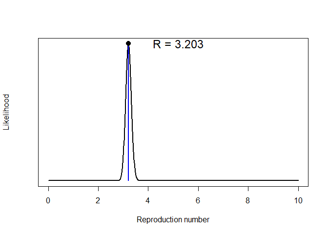
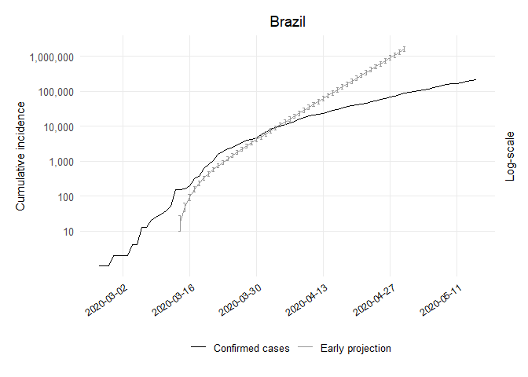

Early Projections Brazil Code
================
[Bastián González-Bustamante](http://users.ox.ac.uk/~shil5311/)

``` r
## Early Projections
res_bra <- get_R(past.i.bra, si_mean = mu, si_sd = sigma)
plot(res_bra)
```

<!-- -->

``` r

## Range
bra_range <- 1:(which(get_dates(i.bra) == third_week) - pred_days)

## Simulation of Future Epicurves
set.seed(20200225)
R_val_bra <- sample_R(res_bra, 1000)
future_i_bra <- project(i.bra[bra_range], R = R_val_bra, n_sim = 1000, 
                        si = res_bra$si, n_days = (pred_days + 41))

## Cumulative conversion
future_i_bra <- cumulate(future_i_bra) 

## Dataframe CI 95%
df_future_i_bra <- as.data.frame(future_i_bra, long = TRUE)

## Lower CI
bra1_lo <- quantile((slice(df_future_i_bra, which(df_future_i_bra$date == "2020-03-14")))
                    $incidence, 0.025)[[1]]
bra2_lo <- quantile((slice(df_future_i_bra, which(df_future_i_bra$date == "2020-03-15")))
                    $incidence, 0.025)[[1]]
bra3_lo <- quantile((slice(df_future_i_bra, which(df_future_i_bra$date == "2020-03-16")))
                    $incidence, 0.025)[[1]]
bra4_lo <- quantile((slice(df_future_i_bra, which(df_future_i_bra$date == "2020-03-17")))
                    $incidence, 0.025)[[1]]
bra5_lo <- quantile((slice(df_future_i_bra, which(df_future_i_bra$date == "2020-03-18")))
                    $incidence, 0.025)[[1]]
bra6_lo <- quantile((slice(df_future_i_bra, which(df_future_i_bra$date == "2020-03-19")))
                    $incidence, 0.025)[[1]]
bra7_lo <- quantile((slice(df_future_i_bra, which(df_future_i_bra$date == "2020-03-20")))
                    $incidence, 0.025)[[1]]
bra8_lo <- quantile((slice(df_future_i_bra, which(df_future_i_bra$date == "2020-03-21")))
                    $incidence, 0.025)[[1]]
bra9_lo <- quantile((slice(df_future_i_bra, which(df_future_i_bra$date == "2020-03-22")))
                    $incidence, 0.025)[[1]]
bra10_lo <- quantile((slice(df_future_i_bra, which(df_future_i_bra$date == "2020-03-23")))
                     $incidence, 0.025)[[1]]
bra11_lo <- quantile((slice(df_future_i_bra, which(df_future_i_bra$date == "2020-03-24")))
                     $incidence, 0.025)[[1]]
bra12_lo <- quantile((slice(df_future_i_bra, which(df_future_i_bra$date == "2020-03-25")))
                     $incidence, 0.025)[[1]]
bra13_lo <- quantile((slice(df_future_i_bra, which(df_future_i_bra$date == "2020-03-26")))
                     $incidence, 0.025)[[1]]
bra14_lo <- quantile((slice(df_future_i_bra, which(df_future_i_bra$date == "2020-03-27")))
                     $incidence, 0.025)[[1]]
bra15_lo <- quantile((slice(df_future_i_bra, which(df_future_i_bra$date == "2020-03-28")))
                     $incidence, 0.025)[[1]]
bra16_lo <- quantile((slice(df_future_i_bra, which(df_future_i_bra$date == "2020-03-29")))
                     $incidence, 0.025)[[1]]
bra17_lo <- quantile((slice(df_future_i_bra, which(df_future_i_bra$date == "2020-03-30")))
                     $incidence, 0.025)[[1]]
bra18_lo <- quantile((slice(df_future_i_bra, which(df_future_i_bra$date == "2020-03-31")))
                     $incidence, 0.025)[[1]]
bra19_lo <- quantile((slice(df_future_i_bra, which(df_future_i_bra$date == "2020-04-01")))
                     $incidence, 0.025)[[1]]
bra20_lo <- quantile((slice(df_future_i_bra, which(df_future_i_bra$date == "2020-04-02")))
                     $incidence, 0.025)[[1]]
bra21_lo <- quantile((slice(df_future_i_bra, which(df_future_i_bra$date == "2020-04-03")))
                     $incidence, 0.025)[[1]]
bra22_lo <- quantile((slice(df_future_i_bra, which(df_future_i_bra$date == "2020-04-04")))
                     $incidence, 0.025)[[1]]
bra23_lo <- quantile((slice(df_future_i_bra, which(df_future_i_bra$date == "2020-04-05")))
                     $incidence, 0.025)[[1]]
bra24_lo <- quantile((slice(df_future_i_bra, which(df_future_i_bra$date == "2020-04-06")))
                     $incidence, 0.025)[[1]]
bra25_lo <- quantile((slice(df_future_i_bra, which(df_future_i_bra$date == "2020-04-07")))
                     $incidence, 0.025)[[1]]
bra26_lo <- quantile((slice(df_future_i_bra, which(df_future_i_bra$date == "2020-04-08")))
                     $incidence, 0.025)[[1]]
bra27_lo <- quantile((slice(df_future_i_bra, which(df_future_i_bra$date == "2020-04-09")))
                     $incidence, 0.025)[[1]]
bra28_lo <- quantile((slice(df_future_i_bra, which(df_future_i_bra$date == "2020-04-10")))
                     $incidence, 0.025)[[1]]
bra29_lo <- quantile((slice(df_future_i_bra, which(df_future_i_bra$date == "2020-04-11")))
                     $incidence, 0.025)[[1]]
bra30_lo <- quantile((slice(df_future_i_bra, which(df_future_i_bra$date == "2020-04-12")))
                     $incidence, 0.025)[[1]]
bra31_lo <- quantile((slice(df_future_i_bra, which(df_future_i_bra$date == "2020-04-13")))
                     $incidence, 0.025)[[1]]
bra32_lo <- quantile((slice(df_future_i_bra, which(df_future_i_bra$date == "2020-04-14")))
                     $incidence, 0.025)[[1]]
bra33_lo <- quantile((slice(df_future_i_bra, which(df_future_i_bra$date == "2020-04-15")))
                     $incidence, 0.025)[[1]]
bra34_lo <- quantile((slice(df_future_i_bra, which(df_future_i_bra$date == "2020-04-16")))
                     $incidence, 0.025)[[1]]
bra35_lo <- quantile((slice(df_future_i_bra, which(df_future_i_bra$date == "2020-04-17")))
                     $incidence, 0.025)[[1]]
bra36_lo <- quantile((slice(df_future_i_bra, which(df_future_i_bra$date == "2020-04-18")))
                     $incidence, 0.025)[[1]]
bra37_lo <- quantile((slice(df_future_i_bra, which(df_future_i_bra$date == "2020-04-19")))
                     $incidence, 0.025)[[1]]
bra38_lo <- quantile((slice(df_future_i_bra, which(df_future_i_bra$date == "2020-04-20")))
                     $incidence, 0.025)[[1]]
bra39_lo <- quantile((slice(df_future_i_bra, which(df_future_i_bra$date == "2020-04-21")))
                     $incidence, 0.025)[[1]]
bra40_lo <- quantile((slice(df_future_i_bra, which(df_future_i_bra$date == "2020-04-22")))
                     $incidence, 0.025)[[1]]
bra41_lo <- quantile((slice(df_future_i_bra, which(df_future_i_bra$date == "2020-04-23")))
                     $incidence, 0.025)[[1]]
bra42_lo <- quantile((slice(df_future_i_bra, which(df_future_i_bra$date == "2020-04-24")))
                     $incidence, 0.025)[[1]]
bra43_lo <- quantile((slice(df_future_i_bra, which(df_future_i_bra$date == "2020-04-25")))
                     $incidence, 0.025)[[1]]
bra44_lo <- quantile((slice(df_future_i_bra, which(df_future_i_bra$date == "2020-04-26")))
                     $incidence, 0.025)[[1]]
bra45_lo <- quantile((slice(df_future_i_bra, which(df_future_i_bra$date == "2020-04-27")))
                     $incidence, 0.025)[[1]]
bra46_lo <- quantile((slice(df_future_i_bra, which(df_future_i_bra$date == "2020-04-28")))
                     $incidence, 0.025)[[1]]
bra47_lo <- quantile((slice(df_future_i_bra, which(df_future_i_bra$date == "2020-04-29")))
                     $incidence, 0.025)[[1]]
bra48_lo <- quantile((slice(df_future_i_bra, which(df_future_i_bra$date == "2020-04-30")))
                     $incidence, 0.025)[[1]]

## Upper CI
bra1_up <- quantile((slice(df_future_i_bra, which(df_future_i_bra$date == "2020-03-14")))
                    $incidence, 0.975)[[1]]
bra2_up <- quantile((slice(df_future_i_bra, which(df_future_i_bra$date == "2020-03-15")))
                    $incidence, 0.975)[[1]]
bra3_up <- quantile((slice(df_future_i_bra, which(df_future_i_bra$date == "2020-03-16")))
                    $incidence, 0.975)[[1]]
bra4_up <- quantile((slice(df_future_i_bra, which(df_future_i_bra$date == "2020-03-17")))
                    $incidence, 0.975)[[1]]
bra5_up <- quantile((slice(df_future_i_bra, which(df_future_i_bra$date == "2020-03-18")))
                    $incidence, 0.975)[[1]]
bra6_up <- quantile((slice(df_future_i_bra, which(df_future_i_bra$date == "2020-03-19")))
                    $incidence, 0.975)[[1]]
bra7_up <- quantile((slice(df_future_i_bra, which(df_future_i_bra$date == "2020-03-20")))
                    $incidence, 0.975)[[1]]
bra8_up <- quantile((slice(df_future_i_bra, which(df_future_i_bra$date == "2020-03-21")))
                    $incidence, 0.975)[[1]]
bra9_up <- quantile((slice(df_future_i_bra, which(df_future_i_bra$date == "2020-03-22")))
                    $incidence, 0.975)[[1]]
bra10_up <- quantile((slice(df_future_i_bra, which(df_future_i_bra$date == "2020-03-23")))
                     $incidence, 0.975)[[1]]
bra11_up <- quantile((slice(df_future_i_bra, which(df_future_i_bra$date == "2020-03-24")))
                     $incidence, 0.975)[[1]]
bra12_up <- quantile((slice(df_future_i_bra, which(df_future_i_bra$date == "2020-03-25")))
                     $incidence, 0.975)[[1]]
bra13_up <- quantile((slice(df_future_i_bra, which(df_future_i_bra$date == "2020-03-26")))
                     $incidence, 0.975)[[1]]
bra14_up <- quantile((slice(df_future_i_bra, which(df_future_i_bra$date == "2020-03-27")))
                     $incidence, 0.975)[[1]]
bra15_up <- quantile((slice(df_future_i_bra, which(df_future_i_bra$date == "2020-03-28")))
                     $incidence, 0.975)[[1]]
bra16_up <- quantile((slice(df_future_i_bra, which(df_future_i_bra$date == "2020-03-29")))
                     $incidence, 0.975)[[1]]
bra17_up <- quantile((slice(df_future_i_bra, which(df_future_i_bra$date == "2020-03-30")))
                     $incidence, 0.975)[[1]]
bra18_up <- quantile((slice(df_future_i_bra, which(df_future_i_bra$date == "2020-03-31")))
                     $incidence, 0.975)[[1]]
bra19_up <- quantile((slice(df_future_i_bra, which(df_future_i_bra$date == "2020-04-01")))
                     $incidence, 0.975)[[1]]
bra20_up <- quantile((slice(df_future_i_bra, which(df_future_i_bra$date == "2020-04-02")))
                     $incidence, 0.975)[[1]]
bra21_up <- quantile((slice(df_future_i_bra, which(df_future_i_bra$date == "2020-04-03")))
                     $incidence, 0.975)[[1]]
bra22_up <- quantile((slice(df_future_i_bra, which(df_future_i_bra$date == "2020-04-04")))
                     $incidence, 0.975)[[1]]
bra23_up <- quantile((slice(df_future_i_bra, which(df_future_i_bra$date == "2020-04-05")))
                     $incidence, 0.975)[[1]]
bra24_up <- quantile((slice(df_future_i_bra, which(df_future_i_bra$date == "2020-04-06")))
                     $incidence, 0.975)[[1]]
bra25_up <- quantile((slice(df_future_i_bra, which(df_future_i_bra$date == "2020-04-07")))
                     $incidence, 0.975)[[1]]
bra26_up <- quantile((slice(df_future_i_bra, which(df_future_i_bra$date == "2020-04-08")))
                     $incidence, 0.975)[[1]]
bra27_up <- quantile((slice(df_future_i_bra, which(df_future_i_bra$date == "2020-04-09")))
                     $incidence, 0.975)[[1]]
bra28_up <- quantile((slice(df_future_i_bra, which(df_future_i_bra$date == "2020-04-10")))
                     $incidence, 0.975)[[1]]
bra29_up <- quantile((slice(df_future_i_bra, which(df_future_i_bra$date == "2020-04-11")))
                     $incidence, 0.975)[[1]]
bra30_up <- quantile((slice(df_future_i_bra, which(df_future_i_bra$date == "2020-04-12")))
                     $incidence, 0.975)[[1]]
bra31_up <- quantile((slice(df_future_i_bra, which(df_future_i_bra$date == "2020-04-13")))
                     $incidence, 0.975)[[1]]
bra32_up <- quantile((slice(df_future_i_bra, which(df_future_i_bra$date == "2020-04-14")))
                     $incidence, 0.975)[[1]]
bra33_up <- quantile((slice(df_future_i_bra, which(df_future_i_bra$date == "2020-04-15")))
                     $incidence, 0.975)[[1]]
bra34_up <- quantile((slice(df_future_i_bra, which(df_future_i_bra$date == "2020-04-16")))
                     $incidence, 0.975)[[1]]
bra35_up <- quantile((slice(df_future_i_bra, which(df_future_i_bra$date == "2020-04-17")))
                     $incidence, 0.975)[[1]]
bra36_up <- quantile((slice(df_future_i_bra, which(df_future_i_bra$date == "2020-04-18")))
                     $incidence, 0.975)[[1]]
bra37_up <- quantile((slice(df_future_i_bra, which(df_future_i_bra$date == "2020-04-19")))
                     $incidence, 0.975)[[1]]
bra38_up <- quantile((slice(df_future_i_bra, which(df_future_i_bra$date == "2020-04-20")))
                     $incidence, 0.975)[[1]]
bra39_up <- quantile((slice(df_future_i_bra, which(df_future_i_bra$date == "2020-04-21")))
                     $incidence, 0.975)[[1]]
bra40_up <- quantile((slice(df_future_i_bra, which(df_future_i_bra$date == "2020-04-22")))
                     $incidence, 0.975)[[1]]
bra41_up <- quantile((slice(df_future_i_bra, which(df_future_i_bra$date == "2020-04-23")))
                     $incidence, 0.975)[[1]]
bra42_up <- quantile((slice(df_future_i_bra, which(df_future_i_bra$date == "2020-04-24")))
                     $incidence, 0.975)[[1]]
bra43_up <- quantile((slice(df_future_i_bra, which(df_future_i_bra$date == "2020-04-25")))
                     $incidence, 0.975)[[1]]
bra44_up <- quantile((slice(df_future_i_bra, which(df_future_i_bra$date == "2020-04-26")))
                     $incidence, 0.975)[[1]]
bra45_up <- quantile((slice(df_future_i_bra, which(df_future_i_bra$date == "2020-04-27")))
                     $incidence, 0.975)[[1]]
bra46_up <- quantile((slice(df_future_i_bra, which(df_future_i_bra$date == "2020-04-28")))
                     $incidence, 0.975)[[1]]
bra47_up <- quantile((slice(df_future_i_bra, which(df_future_i_bra$date == "2020-04-29")))
                     $incidence, 0.975)[[1]]
bra48_up <- quantile((slice(df_future_i_bra, which(df_future_i_bra$date == "2020-04-30")))
                     $incidence, 0.975)[[1]]

## Dataframe
bra_pred_growth_median_counts <- future_i_bra %>% as.data.frame() %>% 
  pivot_longer(-dates, names_to = "simulation", values_to = "incidence") %>% 
  group_by(dates) %>% summarise(incident_cases = as.integer(median(incidence))) %>% 
  mutate(data_type = "Early projection")

## Dataframe
bra_proj <- bra_pred_growth_median_counts %>% 
  bind_rows(tibble(dates = get_dates(i.bra), 
                   incident_cases = cumulate(get_counts(i.bra)), data_type 
                   = "Confirmed cases"))

## Plot of Early Projections
ggplot(bra_proj, aes(x = dates, y = incident_cases, colour = data_type)) + 
  geom_line() + scale_color_manual(values=c("black", "grey60")) +
  geom_errorbar(data = subset(bra_proj, dates == "2020-03-14" & data_type 
                              == "Early projection"), 
                aes(ymin = bra1_lo, ymax = bra1_up), width = .5) +
  geom_errorbar(data = subset(bra_proj, dates == "2020-03-15" & data_type 
                              == "Early projection"), 
                aes(ymin = bra2_lo, ymax = bra2_up), width = .5) +
  geom_errorbar(data = subset(bra_proj, dates == "2020-03-16" & data_type 
                              == "Early projection"), 
                aes(ymin = bra3_lo, ymax = bra3_up), width = .5) +
  geom_errorbar(data = subset(bra_proj, dates == "2020-03-17" & data_type 
                              == "Early projection"), 
                aes(ymin = bra4_lo, ymax = bra4_up), width = .5) +
  geom_errorbar(data = subset(bra_proj, dates == "2020-03-18" & data_type 
                              == "Early projection"), 
                aes(ymin = bra5_lo, ymax = bra5_up), width = .5) +
  geom_errorbar(data = subset(bra_proj, dates == "2020-03-19" & data_type 
                              == "Early projection"), 
                aes(ymin = bra6_lo, ymax = bra6_up), width = .5) +
  geom_errorbar(data = subset(bra_proj, dates == "2020-03-20" & data_type 
                              == "Early projection"), 
                aes(ymin = bra7_lo, ymax = bra7_up), width = .5) +
  geom_errorbar(data = subset(bra_proj, dates == "2020-03-21" & data_type 
                              == "Early projection"), 
                aes(ymin = bra8_lo, ymax = bra8_up), width = .5) +
  geom_errorbar(data = subset(bra_proj, dates == "2020-03-22" & data_type 
                              == "Early projection"), 
                aes(ymin = bra9_lo, ymax = bra9_up), width = .5) +
  geom_errorbar(data = subset(bra_proj, dates == "2020-03-23" & data_type 
                              == "Early projection"), 
                aes(ymin = bra10_lo, ymax = bra10_up), width = .5) +
  geom_errorbar(data = subset(bra_proj, dates == "2020-03-24" & data_type 
                              == "Early projection"), 
                aes(ymin = bra11_lo, ymax = bra11_up), width = .5) +
  geom_errorbar(data = subset(bra_proj, dates == "2020-03-25" & data_type 
                              == "Early projection"), 
                aes(ymin = bra12_lo, ymax = bra12_up), width = .5) +
  geom_errorbar(data = subset(bra_proj, dates == "2020-03-26" & data_type 
                              == "Early projection"), 
                aes(ymin = bra13_lo, ymax = bra13_up), width = .5) +
  geom_errorbar(data = subset(bra_proj, dates == "2020-03-27" & data_type 
                              == "Early projection"), 
                aes(ymin = bra14_lo, ymax = bra14_up), width = .5) +
  geom_errorbar(data = subset(bra_proj, dates == "2020-03-28" & data_type 
                              == "Early projection"), 
                aes(ymin = bra15_lo, ymax = bra15_up), width = .5) +
  geom_errorbar(data = subset(bra_proj, dates == "2020-03-29" & data_type 
                              == "Early projection"), 
                aes(ymin = bra16_lo, ymax = bra16_up), width = .5) +
  geom_errorbar(data = subset(bra_proj, dates == "2020-03-30" & data_type 
                              == "Early projection"), 
                aes(ymin = bra17_lo, ymax = bra17_up), width = .5) +
  geom_errorbar(data = subset(bra_proj, dates == "2020-03-31" & data_type 
                              == "Early projection"), 
                aes(ymin = bra18_lo, ymax = bra18_up), width = .5) +
  geom_errorbar(data = subset(bra_proj, dates == "2020-04-01" & data_type 
                              == "Early projection"), 
                aes(ymin = bra19_lo, ymax = bra19_up), width = .5) +
  geom_errorbar(data = subset(bra_proj, dates == "2020-04-02" & data_type 
                              == "Early projection"), 
                aes(ymin = bra20_lo, ymax = bra20_up), width = .5) +
  geom_errorbar(data = subset(bra_proj, dates == "2020-04-03" & data_type 
                              == "Early projection"), 
                aes(ymin = bra21_lo, ymax = bra21_up), width = .5) +
  geom_errorbar(data = subset(bra_proj, dates == "2020-04-04" & data_type 
                              == "Early projection"), 
                aes(ymin = bra22_lo, ymax = bra22_up), width = .5) +
  geom_errorbar(data = subset(bra_proj, dates == "2020-04-05" & data_type 
                              == "Early projection"), 
                aes(ymin = bra23_lo, ymax = bra23_up), width = .5) +
  geom_errorbar(data = subset(bra_proj, dates == "2020-04-06" & data_type 
                              == "Early projection"), 
                aes(ymin = bra24_lo, ymax = bra24_up), width = .5) +
  geom_errorbar(data = subset(bra_proj, dates == "2020-04-07" & data_type 
                              == "Early projection"), 
                aes(ymin = bra25_lo, ymax = bra25_up), width = .5) +  
  geom_errorbar(data = subset(bra_proj, dates == "2020-04-08" & data_type 
                              == "Early projection"), 
                aes(ymin = bra26_lo, ymax = bra26_up), width = .5) +  
  geom_errorbar(data = subset(bra_proj, dates == "2020-04-09" & data_type 
                              == "Early projection"), 
                aes(ymin = bra27_lo, ymax = bra27_up), width = .5) +  
  geom_errorbar(data = subset(bra_proj, dates == "2020-04-10" & data_type 
                              == "Early projection"), 
                aes(ymin = bra28_lo, ymax = bra28_up), width = .5) +  
  geom_errorbar(data = subset(bra_proj, dates == "2020-04-11" & data_type 
                              == "Early projection"), 
                aes(ymin = bra29_lo, ymax = bra29_up), width = .5) +  
  geom_errorbar(data = subset(bra_proj, dates == "2020-04-12" & data_type 
                              == "Early projection"), 
                aes(ymin = bra30_lo, ymax = bra30_up), width = .5) +  
  geom_errorbar(data = subset(bra_proj, dates == "2020-04-13" & data_type 
                              == "Early projection"), 
                aes(ymin = bra31_lo, ymax = bra31_up), width = .5) +  
  geom_errorbar(data = subset(bra_proj, dates == "2020-04-14" & data_type 
                              == "Early projection"), 
                aes(ymin = bra32_lo, ymax = bra32_up), width = .5) +  
  geom_errorbar(data = subset(bra_proj, dates == "2020-04-15" & data_type 
                              == "Early projection"), 
                aes(ymin = bra33_lo, ymax = bra33_up), width = .5) +  
  geom_errorbar(data = subset(bra_proj, dates == "2020-04-16" & data_type 
                              == "Early projection"), 
                aes(ymin = bra34_lo, ymax = bra34_up), width = .5) +
  geom_errorbar(data = subset(bra_proj, dates == "2020-04-17" & data_type 
                              == "Early projection"), 
                aes(ymin = bra35_lo, ymax = bra35_up), width = .5) +  
  geom_errorbar(data = subset(bra_proj, dates == "2020-04-18" & data_type 
                              == "Early projection"), 
                aes(ymin = bra36_lo, ymax = bra36_up), width = .5) +  
  geom_errorbar(data = subset(bra_proj, dates == "2020-04-19" & data_type 
                              == "Early projection"), 
                aes(ymin = bra37_lo, ymax = bra37_up), width = .5) +  
  geom_errorbar(data = subset(bra_proj, dates == "2020-04-20" & data_type 
                              == "Early projection"), 
                aes(ymin = bra38_lo, ymax = bra38_up), width = .5) +  
  geom_errorbar(data = subset(bra_proj, dates == "2020-04-21" & data_type 
                              == "Early projection"), 
                aes(ymin = bra39_lo, ymax = bra39_up), width = .5) +  
  geom_errorbar(data = subset(bra_proj, dates == "2020-04-22" & data_type 
                              == "Early projection"), 
                aes(ymin = bra40_lo, ymax = bra40_up), width = .5) +  
  geom_errorbar(data = subset(bra_proj, dates == "2020-04-23" & data_type 
                              == "Early projection"), 
                aes(ymin = bra41_lo, ymax = bra41_up), width = .5) +  
  geom_errorbar(data = subset(bra_proj, dates == "2020-04-24" & data_type 
                              == "Early projection"), 
                aes(ymin = bra42_lo, ymax = bra42_up), width = .5) +  
  geom_errorbar(data = subset(bra_proj, dates == "2020-04-25" & data_type 
                              == "Early projection"), 
                aes(ymin = bra43_lo, ymax = bra43_up), width = .5) +  
  geom_errorbar(data = subset(bra_proj, dates == "2020-04-26" & data_type 
                              == "Early projection"), 
                aes(ymin = bra44_lo, ymax = bra44_up), width = .5) +  
  geom_errorbar(data = subset(bra_proj, dates == "2020-04-27" & data_type
                              == "Early projection"), 
                aes(ymin = bra45_lo, ymax = bra45_up), width = .5) +  
  geom_errorbar(data = subset(bra_proj, dates == "2020-04-28" & data_type 
                              == "Early projection"), 
                aes(ymin = bra46_lo, ymax = bra46_up), width = .5) +  
  geom_errorbar(data = subset(bra_proj, dates == "2020-04-29" & data_type 
                              == "Early projection"), 
                aes(ymin = bra47_lo, ymax = bra47_up), width = .5) +  
  geom_errorbar(data = subset(bra_proj, dates == "2020-04-30" & data_type 
                              == "Early projection"), 
                aes(ymin = bra48_lo, ymax = bra48_up), width = .5) + 
  theme_minimal(base_size = 12) + theme(legend.position = "bottom") +
  theme(panel.grid.minor = element_blank()) +
  theme(axis.text.x = element_text(angle = 35, hjust = 1, color = "black",  size = 9)) +
  labs(x = NULL, y = "Cumulative incidence", title = "Brazil", subtitle = NULL, 
       colour = NULL) + 
  theme(plot.margin = unit(c(0.5,0.5,0.5,0.5), "cm")) +
  scale_x_date(date_breaks = "2 weeks", date_minor_breaks = "2 weeks",
               date_labels = "%Y-%m-%d") +
  scale_y_log10(breaks = 10**(1:10), labels = comma(10**(1:10)),
                sec.axis = sec_axis(~ ., labels = NULL, name = "Log-scale")) + 
  theme(axis.title.y.right = element_text(angle = 90, size = 11),
        axis.title.y.left = element_text(size = 11),
        plot.caption = element_text(size = 9),
        plot.title = element_text(hjust = 0.5))
```

<!-- -->
