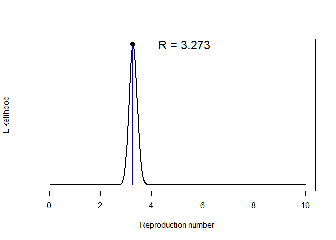
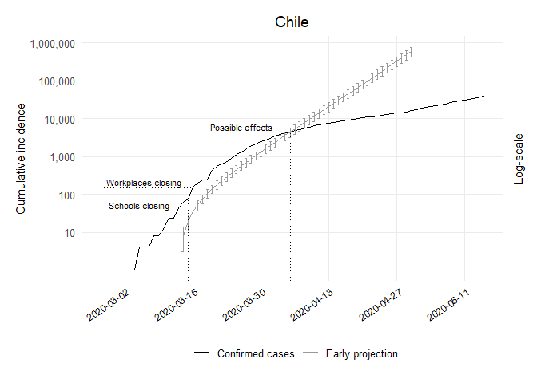

Early Projections Chile Code
================
[Bastián González-Bustamante](http://users.ox.ac.uk/~shil5311/)

``` r
## Early Projections
res_chl <- get_R(past.i.chl, si_mean = mu, si_sd = sigma)
plot(res_chl)
```

<!-- -->

``` r

## Range
chl_range <- 1:(which(get_dates(i.chl) == third_week) - pred_days)

## Simulation of Future Epicurves
set.seed(20200225)
R_val_chl <- sample_R(res_chl, 1000)
future_i_chl <- project(i.chl[chl_range], R = R_val_chl, n_sim = 1000, 
                        si = res_chl$si, n_days = (pred_days + 41))

## Cumulative conversion
future_i_chl <- cumulate(future_i_chl) 

## Dataframe CI 95%
df_future_i_chl <- as.data.frame(future_i_chl, long = TRUE)

## Lower CI
chl1_lo <- quantile((slice(df_future_i_chl, which(df_future_i_chl$date == "2020-03-14")))
                    $incidence, 0.025)[[1]]
chl2_lo <- quantile((slice(df_future_i_chl, which(df_future_i_chl$date == "2020-03-15")))
                    $incidence, 0.025)[[1]]
chl3_lo <- quantile((slice(df_future_i_chl, which(df_future_i_chl$date == "2020-03-16")))
                    $incidence, 0.025)[[1]]
chl4_lo <- quantile((slice(df_future_i_chl, which(df_future_i_chl$date == "2020-03-17")))
                    $incidence, 0.025)[[1]]
chl5_lo <- quantile((slice(df_future_i_chl, which(df_future_i_chl$date == "2020-03-18")))
                    $incidence, 0.025)[[1]]
chl6_lo <- quantile((slice(df_future_i_chl, which(df_future_i_chl$date == "2020-03-19")))
                    $incidence, 0.025)[[1]]
chl7_lo <- quantile((slice(df_future_i_chl, which(df_future_i_chl$date == "2020-03-20")))
                    $incidence, 0.025)[[1]]
chl8_lo <- quantile((slice(df_future_i_chl, which(df_future_i_chl$date == "2020-03-21")))
                    $incidence, 0.025)[[1]]
chl9_lo <- quantile((slice(df_future_i_chl, which(df_future_i_chl$date == "2020-03-22")))
                    $incidence, 0.025)[[1]]
chl10_lo <- quantile((slice(df_future_i_chl, which(df_future_i_chl$date == "2020-03-23")))
                     $incidence, 0.025)[[1]]
chl11_lo <- quantile((slice(df_future_i_chl, which(df_future_i_chl$date == "2020-03-24")))
                     $incidence, 0.025)[[1]]
chl12_lo <- quantile((slice(df_future_i_chl, which(df_future_i_chl$date == "2020-03-25")))
                     $incidence, 0.025)[[1]]
chl13_lo <- quantile((slice(df_future_i_chl, which(df_future_i_chl$date == "2020-03-26")))
                     $incidence, 0.025)[[1]]
chl14_lo <- quantile((slice(df_future_i_chl, which(df_future_i_chl$date == "2020-03-27")))
                     $incidence, 0.025)[[1]]
chl15_lo <- quantile((slice(df_future_i_chl, which(df_future_i_chl$date == "2020-03-28")))
                     $incidence, 0.025)[[1]]
chl16_lo <- quantile((slice(df_future_i_chl, which(df_future_i_chl$date == "2020-03-29")))
                     $incidence, 0.025)[[1]]
chl17_lo <- quantile((slice(df_future_i_chl, which(df_future_i_chl$date == "2020-03-30")))
                     $incidence, 0.025)[[1]]
chl18_lo <- quantile((slice(df_future_i_chl, which(df_future_i_chl$date == "2020-03-31")))
                     $incidence, 0.025)[[1]]
chl19_lo <- quantile((slice(df_future_i_chl, which(df_future_i_chl$date == "2020-04-01")))
                     $incidence, 0.025)[[1]]
chl20_lo <- quantile((slice(df_future_i_chl, which(df_future_i_chl$date == "2020-04-02")))
                     $incidence, 0.025)[[1]]
chl21_lo <- quantile((slice(df_future_i_chl, which(df_future_i_chl$date == "2020-04-03")))
                     $incidence, 0.025)[[1]]
chl22_lo <- quantile((slice(df_future_i_chl, which(df_future_i_chl$date == "2020-04-04")))
                     $incidence, 0.025)[[1]]
chl23_lo <- quantile((slice(df_future_i_chl, which(df_future_i_chl$date == "2020-04-05")))
                     $incidence, 0.025)[[1]]
chl24_lo <- quantile((slice(df_future_i_chl, which(df_future_i_chl$date == "2020-04-06")))
                     $incidence, 0.025)[[1]]
chl25_lo <- quantile((slice(df_future_i_chl, which(df_future_i_chl$date == "2020-04-07")))
                     $incidence, 0.025)[[1]]
chl26_lo <- quantile((slice(df_future_i_chl, which(df_future_i_chl$date == "2020-04-08")))
                     $incidence, 0.025)[[1]]
chl27_lo <- quantile((slice(df_future_i_chl, which(df_future_i_chl$date == "2020-04-09")))
                     $incidence, 0.025)[[1]]
chl28_lo <- quantile((slice(df_future_i_chl, which(df_future_i_chl$date == "2020-04-10")))
                     $incidence, 0.025)[[1]]
chl29_lo <- quantile((slice(df_future_i_chl, which(df_future_i_chl$date == "2020-04-11")))
                     $incidence, 0.025)[[1]]
chl30_lo <- quantile((slice(df_future_i_chl, which(df_future_i_chl$date == "2020-04-12")))
                     $incidence, 0.025)[[1]]
chl31_lo <- quantile((slice(df_future_i_chl, which(df_future_i_chl$date == "2020-04-13")))
                     $incidence, 0.025)[[1]]
chl32_lo <- quantile((slice(df_future_i_chl, which(df_future_i_chl$date == "2020-04-14")))
                     $incidence, 0.025)[[1]]
chl33_lo <- quantile((slice(df_future_i_chl, which(df_future_i_chl$date == "2020-04-15")))
                     $incidence, 0.025)[[1]]
chl34_lo <- quantile((slice(df_future_i_chl, which(df_future_i_chl$date == "2020-04-16")))
                     $incidence, 0.025)[[1]]
chl35_lo <- quantile((slice(df_future_i_chl, which(df_future_i_chl$date == "2020-04-17")))
                     $incidence, 0.025)[[1]]
chl36_lo <- quantile((slice(df_future_i_chl, which(df_future_i_chl$date == "2020-04-18")))
                     $incidence, 0.025)[[1]]
chl37_lo <- quantile((slice(df_future_i_chl, which(df_future_i_chl$date == "2020-04-19")))
                     $incidence, 0.025)[[1]]
chl38_lo <- quantile((slice(df_future_i_chl, which(df_future_i_chl$date == "2020-04-20")))
                     $incidence, 0.025)[[1]]
chl39_lo <- quantile((slice(df_future_i_chl, which(df_future_i_chl$date == "2020-04-21")))
                     $incidence, 0.025)[[1]]
chl40_lo <- quantile((slice(df_future_i_chl, which(df_future_i_chl$date == "2020-04-22")))
                     $incidence, 0.025)[[1]]
chl41_lo <- quantile((slice(df_future_i_chl, which(df_future_i_chl$date == "2020-04-23")))
                     $incidence, 0.025)[[1]]
chl42_lo <- quantile((slice(df_future_i_chl, which(df_future_i_chl$date == "2020-04-24")))
                     $incidence, 0.025)[[1]]
chl43_lo <- quantile((slice(df_future_i_chl, which(df_future_i_chl$date == "2020-04-25")))
                     $incidence, 0.025)[[1]]
chl44_lo <- quantile((slice(df_future_i_chl, which(df_future_i_chl$date == "2020-04-26")))
                     $incidence, 0.025)[[1]]
chl45_lo <- quantile((slice(df_future_i_chl, which(df_future_i_chl$date == "2020-04-27")))
                     $incidence, 0.025)[[1]]
chl46_lo <- quantile((slice(df_future_i_chl, which(df_future_i_chl$date == "2020-04-28")))
                     $incidence, 0.025)[[1]]
chl47_lo <- quantile((slice(df_future_i_chl, which(df_future_i_chl$date == "2020-04-29")))
                     $incidence, 0.025)[[1]]
chl48_lo <- quantile((slice(df_future_i_chl, which(df_future_i_chl$date == "2020-04-30")))
                     $incidence, 0.025)[[1]]

## Upper CI
chl1_up <- quantile((slice(df_future_i_chl, which(df_future_i_chl$date == "2020-03-14")))
                    $incidence, 0.975)[[1]]
chl2_up <- quantile((slice(df_future_i_chl, which(df_future_i_chl$date == "2020-03-15")))
                    $incidence, 0.975)[[1]]
chl3_up <- quantile((slice(df_future_i_chl, which(df_future_i_chl$date == "2020-03-16")))
                    $incidence, 0.975)[[1]]
chl4_up <- quantile((slice(df_future_i_chl, which(df_future_i_chl$date == "2020-03-17")))
                    $incidence, 0.975)[[1]]
chl5_up <- quantile((slice(df_future_i_chl, which(df_future_i_chl$date == "2020-03-18")))
                    $incidence, 0.975)[[1]]
chl6_up <- quantile((slice(df_future_i_chl, which(df_future_i_chl$date == "2020-03-19")))
                    $incidence, 0.975)[[1]]
chl7_up <- quantile((slice(df_future_i_chl, which(df_future_i_chl$date == "2020-03-20")))
                    $incidence, 0.975)[[1]]
chl8_up <- quantile((slice(df_future_i_chl, which(df_future_i_chl$date == "2020-03-21")))
                    $incidence, 0.975)[[1]]
chl9_up <- quantile((slice(df_future_i_chl, which(df_future_i_chl$date == "2020-03-22")))
                    $incidence, 0.975)[[1]]
chl10_up <- quantile((slice(df_future_i_chl, which(df_future_i_chl$date == "2020-03-23")))
                     $incidence, 0.975)[[1]]
chl11_up <- quantile((slice(df_future_i_chl, which(df_future_i_chl$date == "2020-03-24")))
                     $incidence, 0.975)[[1]]
chl12_up <- quantile((slice(df_future_i_chl, which(df_future_i_chl$date == "2020-03-25")))
                     $incidence, 0.975)[[1]]
chl13_up <- quantile((slice(df_future_i_chl, which(df_future_i_chl$date == "2020-03-26")))
                     $incidence, 0.975)[[1]]
chl14_up <- quantile((slice(df_future_i_chl, which(df_future_i_chl$date == "2020-03-27")))
                     $incidence, 0.975)[[1]]
chl15_up <- quantile((slice(df_future_i_chl, which(df_future_i_chl$date == "2020-03-28")))
                     $incidence, 0.975)[[1]]
chl16_up <- quantile((slice(df_future_i_chl, which(df_future_i_chl$date == "2020-03-29")))
                     $incidence, 0.975)[[1]]
chl17_up <- quantile((slice(df_future_i_chl, which(df_future_i_chl$date == "2020-03-30")))
                     $incidence, 0.975)[[1]]
chl18_up <- quantile((slice(df_future_i_chl, which(df_future_i_chl$date == "2020-03-31")))
                     $incidence, 0.975)[[1]]
chl19_up <- quantile((slice(df_future_i_chl, which(df_future_i_chl$date == "2020-04-01")))
                     $incidence, 0.975)[[1]]
chl20_up <- quantile((slice(df_future_i_chl, which(df_future_i_chl$date == "2020-04-02")))
                     $incidence, 0.975)[[1]]
chl21_up <- quantile((slice(df_future_i_chl, which(df_future_i_chl$date == "2020-04-03")))
                     $incidence, 0.975)[[1]]
chl22_up <- quantile((slice(df_future_i_chl, which(df_future_i_chl$date == "2020-04-04")))
                     $incidence, 0.975)[[1]]
chl23_up <- quantile((slice(df_future_i_chl, which(df_future_i_chl$date == "2020-04-05")))
                     $incidence, 0.975)[[1]]
chl24_up <- quantile((slice(df_future_i_chl, which(df_future_i_chl$date == "2020-04-06")))
                     $incidence, 0.975)[[1]]
chl25_up <- quantile((slice(df_future_i_chl, which(df_future_i_chl$date == "2020-04-07")))
                     $incidence, 0.975)[[1]]
chl26_up <- quantile((slice(df_future_i_chl, which(df_future_i_chl$date == "2020-04-08")))
                     $incidence, 0.975)[[1]]
chl27_up <- quantile((slice(df_future_i_chl, which(df_future_i_chl$date == "2020-04-09")))
                     $incidence, 0.975)[[1]]
chl28_up <- quantile((slice(df_future_i_chl, which(df_future_i_chl$date == "2020-04-10")))
                     $incidence, 0.975)[[1]]
chl29_up <- quantile((slice(df_future_i_chl, which(df_future_i_chl$date == "2020-04-11")))
                     $incidence, 0.975)[[1]]
chl30_up <- quantile((slice(df_future_i_chl, which(df_future_i_chl$date == "2020-04-12")))
                     $incidence, 0.975)[[1]]
chl31_up <- quantile((slice(df_future_i_chl, which(df_future_i_chl$date == "2020-04-13")))
                     $incidence, 0.975)[[1]]
chl32_up <- quantile((slice(df_future_i_chl, which(df_future_i_chl$date == "2020-04-14")))
                     $incidence, 0.975)[[1]]
chl33_up <- quantile((slice(df_future_i_chl, which(df_future_i_chl$date == "2020-04-15")))
                     $incidence, 0.975)[[1]]
chl34_up <- quantile((slice(df_future_i_chl, which(df_future_i_chl$date == "2020-04-16")))
                     $incidence, 0.975)[[1]]
chl35_up <- quantile((slice(df_future_i_chl, which(df_future_i_chl$date == "2020-04-17")))
                     $incidence, 0.975)[[1]]
chl36_up <- quantile((slice(df_future_i_chl, which(df_future_i_chl$date == "2020-04-18")))
                     $incidence, 0.975)[[1]]
chl37_up <- quantile((slice(df_future_i_chl, which(df_future_i_chl$date == "2020-04-19")))
                     $incidence, 0.975)[[1]]
chl38_up <- quantile((slice(df_future_i_chl, which(df_future_i_chl$date == "2020-04-20")))
                     $incidence, 0.975)[[1]]
chl39_up <- quantile((slice(df_future_i_chl, which(df_future_i_chl$date == "2020-04-21")))
                     $incidence, 0.975)[[1]]
chl40_up <- quantile((slice(df_future_i_chl, which(df_future_i_chl$date == "2020-04-22")))
                     $incidence, 0.975)[[1]]
chl41_up <- quantile((slice(df_future_i_chl, which(df_future_i_chl$date == "2020-04-23")))
                     $incidence, 0.975)[[1]]
chl42_up <- quantile((slice(df_future_i_chl, which(df_future_i_chl$date == "2020-04-24")))
                     $incidence, 0.975)[[1]]
chl43_up <- quantile((slice(df_future_i_chl, which(df_future_i_chl$date == "2020-04-25")))
                     $incidence, 0.975)[[1]]
chl44_up <- quantile((slice(df_future_i_chl, which(df_future_i_chl$date == "2020-04-26")))
                     $incidence, 0.975)[[1]]
chl45_up <- quantile((slice(df_future_i_chl, which(df_future_i_chl$date == "2020-04-27")))
                     $incidence, 0.975)[[1]]
chl46_up <- quantile((slice(df_future_i_chl, which(df_future_i_chl$date == "2020-04-28")))
                     $incidence, 0.975)[[1]]
chl47_up <- quantile((slice(df_future_i_chl, which(df_future_i_chl$date == "2020-04-29")))
                     $incidence, 0.975)[[1]]
chl48_up <- quantile((slice(df_future_i_chl, which(df_future_i_chl$date == "2020-04-30")))
                     $incidence, 0.975)[[1]]

## Dataframe
chl_pred_growth_median_counts <- future_i_chl %>% as.data.frame() %>% 
  pivot_longer(-dates, names_to = "simulation", values_to = "incidence") %>% 
  group_by(dates) %>% summarise(incident_cases = as.integer(median(incidence))) %>% 
  mutate(data_type = "Early projection")

## Dataframe
chl_proj <- chl_pred_growth_median_counts %>% 
  bind_rows(tibble(dates = get_dates(i.chl), 
                   incident_cases = cumulate(get_counts(i.chl)), data_type 
                   = "Confirmed cases"))

## Plot of Early Projections
ggplot(chl_proj, aes(x = dates, y = incident_cases, colour = data_type)) + 
  geom_line() + scale_color_manual(values=c("black", "grey60")) +
  geom_errorbar(data = subset(chl_proj, dates == "2020-03-14" & data_type 
                              == "Early projection"), 
                aes(ymin = chl1_lo, ymax = chl1_up), width = .5) +
  geom_errorbar(data = subset(chl_proj, dates == "2020-03-15" & data_type 
                              == "Early projection"), 
                aes(ymin = chl2_lo, ymax = chl2_up), width = .5) +
  geom_errorbar(data = subset(chl_proj, dates == "2020-03-16" & data_type 
                              == "Early projection"), 
                aes(ymin = chl3_lo, ymax = chl3_up), width = .5) +
  geom_errorbar(data = subset(chl_proj, dates == "2020-03-17" & data_type 
                              == "Early projection"), 
                aes(ymin = chl4_lo, ymax = chl4_up), width = .5) +
  geom_errorbar(data = subset(chl_proj, dates == "2020-03-18" & data_type 
                              == "Early projection"), 
                aes(ymin = chl5_lo, ymax = chl5_up), width = .5) +
  geom_errorbar(data = subset(chl_proj, dates == "2020-03-19" & data_type 
                              == "Early projection"), 
                aes(ymin = chl6_lo, ymax = chl6_up), width = .5) +
  geom_errorbar(data = subset(chl_proj, dates == "2020-03-20" & data_type 
                              == "Early projection"), 
                aes(ymin = chl7_lo, ymax = chl7_up), width = .5) +
  geom_errorbar(data = subset(chl_proj, dates == "2020-03-21" & data_type 
                              == "Early projection"), 
                aes(ymin = chl8_lo, ymax = chl8_up), width = .5) +
  geom_errorbar(data = subset(chl_proj, dates == "2020-03-22" & data_type 
                              == "Early projection"), 
                aes(ymin = chl9_lo, ymax = chl9_up), width = .5) +
  geom_errorbar(data = subset(chl_proj, dates == "2020-03-23" & data_type 
                              == "Early projection"), 
                aes(ymin = chl10_lo, ymax = chl10_up), width = .5) +
  geom_errorbar(data = subset(chl_proj, dates == "2020-03-24" & data_type 
                              == "Early projection"), 
                aes(ymin = chl11_lo, ymax = chl11_up), width = .5) +
  geom_errorbar(data = subset(chl_proj, dates == "2020-03-25" & data_type 
                              == "Early projection"), 
                aes(ymin = chl12_lo, ymax = chl12_up), width = .5) +
  geom_errorbar(data = subset(chl_proj, dates == "2020-03-26" & data_type 
                              == "Early projection"), 
                aes(ymin = chl13_lo, ymax = chl13_up), width = .5) +
  geom_errorbar(data = subset(chl_proj, dates == "2020-03-27" & data_type 
                              == "Early projection"), 
                aes(ymin = chl14_lo, ymax = chl14_up), width = .5) +
  geom_errorbar(data = subset(chl_proj, dates == "2020-03-28" & data_type 
                              == "Early projection"), 
                aes(ymin = chl15_lo, ymax = chl15_up), width = .5) +
  geom_errorbar(data = subset(chl_proj, dates == "2020-03-29" & data_type 
                              == "Early projection"), 
                aes(ymin = chl16_lo, ymax = chl16_up), width = .5) +
  geom_errorbar(data = subset(chl_proj, dates == "2020-03-30" & data_type 
                              == "Early projection"), 
                aes(ymin = chl17_lo, ymax = chl17_up), width = .5) +
  geom_errorbar(data = subset(chl_proj, dates == "2020-03-31" & data_type 
                              == "Early projection"), 
                aes(ymin = chl18_lo, ymax = chl18_up), width = .5) +
  geom_errorbar(data = subset(chl_proj, dates == "2020-04-01" & data_type 
                              == "Early projection"), 
                aes(ymin = chl19_lo, ymax = chl19_up), width = .5) +
  geom_errorbar(data = subset(chl_proj, dates == "2020-04-02" & data_type 
                              == "Early projection"), 
                aes(ymin = chl20_lo, ymax = chl20_up), width = .5) +
  geom_errorbar(data = subset(chl_proj, dates == "2020-04-03" & data_type 
                              == "Early projection"), 
                aes(ymin = chl21_lo, ymax = chl21_up), width = .5) +
  geom_errorbar(data = subset(chl_proj, dates == "2020-04-04" & data_type 
                              == "Early projection"), 
                aes(ymin = chl22_lo, ymax = chl22_up), width = .5) +
  geom_errorbar(data = subset(chl_proj, dates == "2020-04-05" & data_type 
                              == "Early projection"), 
                aes(ymin = chl23_lo, ymax = chl23_up), width = .5) +
  geom_errorbar(data = subset(chl_proj, dates == "2020-04-06" & data_type 
                              == "Early projection"), 
                aes(ymin = chl24_lo, ymax = chl24_up), width = .5) +
  geom_errorbar(data = subset(chl_proj, dates == "2020-04-07" & data_type 
                              == "Early projection"), 
                aes(ymin = chl25_lo, ymax = chl25_up), width = .5) +  
  geom_errorbar(data = subset(chl_proj, dates == "2020-04-08" & data_type 
                              == "Early projection"), 
                aes(ymin = chl26_lo, ymax = chl26_up), width = .5) +  
  geom_errorbar(data = subset(chl_proj, dates == "2020-04-09" & data_type 
                              == "Early projection"), 
                aes(ymin = chl27_lo, ymax = chl27_up), width = .5) +  
  geom_errorbar(data = subset(chl_proj, dates == "2020-04-10" & data_type 
                              == "Early projection"), 
                aes(ymin = chl28_lo, ymax = chl28_up), width = .5) +  
  geom_errorbar(data = subset(chl_proj, dates == "2020-04-11" & data_type 
                              == "Early projection"), 
                aes(ymin = chl29_lo, ymax = chl29_up), width = .5) +  
  geom_errorbar(data = subset(chl_proj, dates == "2020-04-12" & data_type 
                              == "Early projection"), 
                aes(ymin = chl30_lo, ymax = chl30_up), width = .5) +  
  geom_errorbar(data = subset(chl_proj, dates == "2020-04-13" & data_type 
                              == "Early projection"), 
                aes(ymin = chl31_lo, ymax = chl31_up), width = .5) +  
  geom_errorbar(data = subset(chl_proj, dates == "2020-04-14" & data_type 
                              == "Early projection"), 
                aes(ymin = chl32_lo, ymax = chl32_up), width = .5) +  
  geom_errorbar(data = subset(chl_proj, dates == "2020-04-15" & data_type 
                              == "Early projection"), 
                aes(ymin = chl33_lo, ymax = chl33_up), width = .5) +  
  geom_errorbar(data = subset(chl_proj, dates == "2020-04-16" & data_type 
                              == "Early projection"), 
                aes(ymin = chl34_lo, ymax = chl34_up), width = .5) +
  geom_errorbar(data = subset(chl_proj, dates == "2020-04-17" & data_type 
                              == "Early projection"), 
                aes(ymin = chl35_lo, ymax = chl35_up), width = .5) +  
  geom_errorbar(data = subset(chl_proj, dates == "2020-04-18" & data_type 
                              == "Early projection"), 
                aes(ymin = chl36_lo, ymax = chl36_up), width = .5) +  
  geom_errorbar(data = subset(chl_proj, dates == "2020-04-19" & data_type 
                              == "Early projection"), 
                aes(ymin = chl37_lo, ymax = chl37_up), width = .5) +  
  geom_errorbar(data = subset(chl_proj, dates == "2020-04-20" & data_type 
                              == "Early projection"), 
                aes(ymin = chl38_lo, ymax = chl38_up), width = .5) +  
  geom_errorbar(data = subset(chl_proj, dates == "2020-04-21" & data_type 
                              == "Early projection"), 
                aes(ymin = chl39_lo, ymax = chl39_up), width = .5) +  
  geom_errorbar(data = subset(chl_proj, dates == "2020-04-22" & data_type 
                              == "Early projection"), 
                aes(ymin = chl40_lo, ymax = chl40_up), width = .5) +  
  geom_errorbar(data = subset(chl_proj, dates == "2020-04-23" & data_type 
                              == "Early projection"), 
                aes(ymin = chl41_lo, ymax = chl41_up), width = .5) +  
  geom_errorbar(data = subset(chl_proj, dates == "2020-04-24" & data_type 
                              == "Early projection"), 
                aes(ymin = chl42_lo, ymax = chl42_up), width = .5) +  
  geom_errorbar(data = subset(chl_proj, dates == "2020-04-25" & data_type 
                              == "Early projection"), 
                aes(ymin = chl43_lo, ymax = chl43_up), width = .5) +  
  geom_errorbar(data = subset(chl_proj, dates == "2020-04-26" & data_type 
                              == "Early projection"), 
                aes(ymin = chl44_lo, ymax = chl44_up), width = .5) +  
  geom_errorbar(data = subset(chl_proj, dates == "2020-04-27" & data_type 
                              == "Early projection"), 
                aes(ymin = chl45_lo, ymax = chl45_up), width = .5) +  
  geom_errorbar(data = subset(chl_proj, dates == "2020-04-28" & data_type 
                              == "Early projection"), 
                aes(ymin = chl46_lo, ymax = chl46_up), width = .5) +  
  geom_errorbar(data = subset(chl_proj, dates == "2020-04-29" & data_type 
                              == "Early projection"), 
                aes(ymin = chl47_lo, ymax = chl47_up), width = .5) +  
  geom_errorbar(data = subset(chl_proj, dates == "2020-04-30" & data_type 
                              == "Early projection"), 
                aes(ymin = chl48_lo, ymax = chl48_up), width = .5) + 
  theme_minimal(base_size = 12) + theme(legend.position = "bottom") +
  theme(panel.grid.minor = element_blank()) +
  theme(axis.text.x = element_text(angle = 35, hjust = 1, color = "black",  size = 9)) +
  labs(x = NULL, y = "Cumulative incidence", title = "Chile", subtitle = NULL, 
       colour = NULL) + 
  theme(plot.margin = unit(c(0.5,0.5,0.5,0.5), "cm")) +
  scale_x_date(date_breaks = "2 weeks", date_minor_breaks = "2 weeks",
               date_labels = "%Y-%m-%d") +
  scale_y_log10(breaks = 10**(1:10), labels = comma(10**(1:10)),
                sec.axis = sec_axis(~ ., labels = NULL, name = "Log-scale")) + 
  theme(axis.title.y.right = element_text(angle = 90, size = 11),
        axis.title.y.left = element_text(size = 11),
        plot.caption = element_text(size = 9),
        plot.title = element_text(hjust = 0.5)) +
  ## School Closing
  geom_segment(aes(x = as.Date(chl_resp$dates[which(chl_resp$c1_schoolclosing 
               == 3 & chl_resp$c1_flag == 1, arr.ind = TRUE)[1]]), xend = as.Date
              (chl_resp$dates[which(chl_resp$c1_schoolclosing == 3 & chl_resp
               $c1_flag == 1, arr.ind = TRUE)[1]]), y = 0, yend = chl_proj
               $incident_cases[which(chl_proj$data_type == "Confirmed cases" 
               & chl_proj$dates == as.Date(chl_resp$dates[which(chl_resp
               $c1_schoolclosing == 3 & chl_resp$c1_flag == 1, arr.ind = TRUE)
               [1]]))]), linetype = "dotted") + 
  geom_segment(aes(x = as.Date("2020-02-26"), xend = as.Date(chl_resp$dates
              [which(chl_resp$c1_schoolclosing == 3 & chl_resp$c1_flag == 1, 
               arr.ind = TRUE)[1]]), y = chl_proj$incident_cases[which(chl_proj
               $data_type == "Confirmed cases" & chl_proj$dates == as.Date
               (chl_resp$dates[which(chl_resp$c1_schoolclosing == 3 & chl_resp
               $c1_flag == 1, arr.ind = TRUE)[1]]))], yend = chl_proj$incident_cases
              [which(chl_proj$data_type == "Confirmed cases" & chl_proj$dates 
               == as.Date(chl_resp$dates[which(chl_resp$c1_schoolclosing == 3 
               & chl_resp$c1_flag == 1, arr.ind = TRUE)[1]]))]), linetype = "dotted") +
  annotate("text", y = 0.7 * chl_proj$incident_cases[which(chl_proj$data_type 
           == "Confirmed cases" & chl_proj$dates == as.Date(chl_resp$dates
          [which(chl_resp$c1_schoolclosing == 3 & chl_resp$c1_flag == 1, 
           arr.ind = TRUE)[1]]))], x =  as.Date(chl_resp$dates[which(chl_resp
           $c1_schoolclosing == 3 & chl_resp$c1_flag == 1, arr.ind = TRUE)[1]]) 
           - 10, label = "Schools closing", size = 3) +
  ## Workplace Closing 
  geom_segment(aes(x = as.Date(chl_resp$dates[which(chl_resp$c2_workplaceclosing 
               == 3 & chl_resp$c1_flag == 1, arr.ind = TRUE)[1]]), xend = as.Date
               (chl_resp$dates[which(chl_resp$c2_workplaceclosing == 3 & chl_resp
               $c1_flag == 1, arr.ind = TRUE)[1]]), y = 0, yend = chl_proj
               $incident_cases[which(chl_proj$data_type == "Confirmed cases" 
               & chl_proj$dates == as.Date(chl_resp$dates[which(chl_resp
               $c2_workplaceclosing == 3 & chl_resp$c1_flag == 1, arr.ind = TRUE)
               [1]]))]), linetype = "dotted") + 
  geom_segment(aes(x = as.Date("2020-02-26"), xend = as.Date(chl_resp$dates[which
              (chl_resp$c2_workplaceclosing == 3 & chl_resp$c1_flag == 1, 
               arr.ind = TRUE)[1]]), y = chl_proj$incident_cases[which(chl_proj
               $data_type == "Confirmed cases" & chl_proj$dates == as.Date
              (chl_resp$dates[which(chl_resp$c2_workplaceclosing == 3 & chl_resp
               $c1_flag == 1, arr.ind = TRUE)[1]]))], yend = chl_proj$incident_cases
              [which(chl_proj$data_type == "Confirmed cases" & chl_proj$dates 
               == as.Date(chl_resp$dates[which(chl_resp$c2_workplaceclosing == 3 
               & chl_resp$c1_flag == 1, arr.ind = TRUE)[1]]))]), linetype = "dotted") +
  annotate("text", y = 1.35 * chl_proj$incident_cases[which(chl_proj$data_type 
           == "Confirmed cases" & chl_proj$dates == as.Date(chl_resp$dates[which
          (chl_resp$c2_workplaceclosing == 3 & chl_resp$c1_flag == 1, arr.ind=TRUE)
           [1]]))], x = as.Date(chl_resp$dates[which(chl_resp$c2_workplaceclosing 
           == 3 & chl_resp$c1_flag == 1, arr.ind = TRUE)[1]]) - 10, label 
           = "Workplaces closing", size = 3) +
  ## Effects
  geom_segment(aes(x = 21 + as.Date(chl_resp$dates[which(chl_resp$c1_schoolclosing 
               == 3 & chl_resp$c1_flag == 1, arr.ind = TRUE)[1]]), xend = 21 + as.Date
              (chl_resp$dates[which(chl_resp$c1_schoolclosing == 3 & chl_resp
               $c1_flag == 1, arr.ind = TRUE)[1]]), y = 0, yend = chl_proj
               $incident_cases[which(chl_proj$data_type == "Confirmed cases" 
               & chl_proj$dates == 21 + as.Date(chl_resp$dates[which(chl_resp
               $c1_schoolclosing == 3 & chl_resp$c1_flag == 1, arr.ind = TRUE)[1]]))]), 
               linetype = "dotted") + 
  geom_segment(aes(x = as.Date("2020-02-26"), xend = 21 + as.Date(chl_resp$dates
              [which(chl_resp$c1_schoolclosing == 3 & chl_resp$c1_flag == 1, 
               arr.ind = TRUE)[1]]), y = chl_proj$incident_cases[which(chl_proj
               $data_type == "Confirmed cases" & chl_proj$dates == 21 + as.Date
              (chl_resp$dates[which(chl_resp$c1_schoolclosing == 3 & chl_resp
               $c1_flag == 1, arr.ind = TRUE)[1]]))], yend = chl_proj$incident_cases
              [which(chl_proj$data_type == "Confirmed cases" & chl_proj$dates == 21 
               + as.Date(chl_resp$dates[which(chl_resp$c1_schoolclosing == 3 
               & chl_resp$c1_flag == 1, arr.ind = TRUE)[1]]))]), linetype = "dotted") +
  annotate("text", y = 1.35 * (chl_proj$incident_cases[which(chl_proj$data_type 
           == "Confirmed cases" & chl_proj$dates == 21 + as.Date(chl_resp$dates[which
          (chl_resp$c1_schoolclosing == 3 & chl_resp$c1_flag == 1, arr.ind = TRUE)
          [1]]))]), x =  as.Date(chl_resp$dates[which(chl_resp$c1_schoolclosing == 3 
           & chl_resp$c1_flag == 1, arr.ind = TRUE)[1]]) - 10 + 21, label 
           = "Possible effects", size = 3) 
```

<!-- -->
