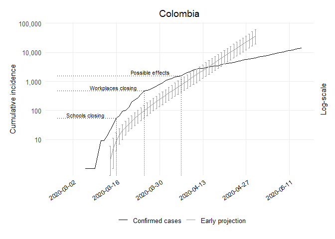

Early Projections Colombia Code
================
[Bastián González-Bustamante](http://users.ox.ac.uk/~shil5311/)

``` r
## Early Projections
res_col <- get_R(past.i.col, si_mean = mu, si_sd = sigma)
plot(res_col)
```

<!-- -->

``` r

## Range
col_range <- 1:(which(get_dates(i.col) == third_week) - pred_days)

## Simulation of 1,000 futures epicurves
set.seed(20200225)
R_val_col <- sample_R(res_col, 1000)
future_i_col <- project(i.col[col_range], R = R_val_col, n_sim = 1000, 
                        si = res_col$si, n_days = (pred_days + 41))

## Cumulative Conversion
future_i_col <- cumulate(future_i_col)

## Dataframe CI 95%
df_future_i_col <- as.data.frame(future_i_col, long = TRUE)

## Lower CI
col1_lo <- quantile((slice(df_future_i_col, which(df_future_i_col$date == "2020-03-14")))
                    $incidence, 0.025)[[1]]
col2_lo <- quantile((slice(df_future_i_col, which(df_future_i_col$date == "2020-03-15")))
                    $incidence, 0.025)[[1]]
col3_lo <- quantile((slice(df_future_i_col, which(df_future_i_col$date == "2020-03-16")))
                    $incidence, 0.025)[[1]]
col4_lo <- quantile((slice(df_future_i_col, which(df_future_i_col$date == "2020-03-17")))
                    $incidence, 0.025)[[1]]
col5_lo <- quantile((slice(df_future_i_col, which(df_future_i_col$date == "2020-03-18")))
                    $incidence, 0.025)[[1]]
col6_lo <- quantile((slice(df_future_i_col, which(df_future_i_col$date == "2020-03-19")))
                    $incidence, 0.025)[[1]]
col7_lo <- quantile((slice(df_future_i_col, which(df_future_i_col$date == "2020-03-20")))
                    $incidence, 0.025)[[1]]
col8_lo <- quantile((slice(df_future_i_col, which(df_future_i_col$date == "2020-03-21")))
                    $incidence, 0.025)[[1]]
col9_lo <- quantile((slice(df_future_i_col, which(df_future_i_col$date == "2020-03-22")))
                    $incidence, 0.025)[[1]]
col10_lo <- quantile((slice(df_future_i_col, which(df_future_i_col$date == "2020-03-23")))
                     $incidence, 0.025)[[1]]
col11_lo <- quantile((slice(df_future_i_col, which(df_future_i_col$date == "2020-03-24")))
                     $incidence, 0.025)[[1]]
col12_lo <- quantile((slice(df_future_i_col, which(df_future_i_col$date == "2020-03-25")))
                     $incidence, 0.025)[[1]]
col13_lo <- quantile((slice(df_future_i_col, which(df_future_i_col$date == "2020-03-26")))
                     $incidence, 0.025)[[1]]
col14_lo <- quantile((slice(df_future_i_col, which(df_future_i_col$date == "2020-03-27")))
                     $incidence, 0.025)[[1]]
col15_lo <- quantile((slice(df_future_i_col, which(df_future_i_col$date == "2020-03-28")))
                     $incidence, 0.025)[[1]]
col16_lo <- quantile((slice(df_future_i_col, which(df_future_i_col$date == "2020-03-29")))
                     $incidence, 0.025)[[1]]
col17_lo <- quantile((slice(df_future_i_col, which(df_future_i_col$date == "2020-03-30")))
                     $incidence, 0.025)[[1]]
col18_lo <- quantile((slice(df_future_i_col, which(df_future_i_col$date == "2020-03-31")))
                     $incidence, 0.025)[[1]]
col19_lo <- quantile((slice(df_future_i_col, which(df_future_i_col$date == "2020-04-01")))
                     $incidence, 0.025)[[1]]
col20_lo <- quantile((slice(df_future_i_col, which(df_future_i_col$date == "2020-04-02")))
                     $incidence, 0.025)[[1]]
col21_lo <- quantile((slice(df_future_i_col, which(df_future_i_col$date == "2020-04-03")))
                     $incidence, 0.025)[[1]]
col22_lo <- quantile((slice(df_future_i_col, which(df_future_i_col$date == "2020-04-04")))
                     $incidence, 0.025)[[1]]
col23_lo <- quantile((slice(df_future_i_col, which(df_future_i_col$date == "2020-04-05")))
                     $incidence, 0.025)[[1]]
col24_lo <- quantile((slice(df_future_i_col, which(df_future_i_col$date == "2020-04-06")))
                     $incidence, 0.025)[[1]]
col25_lo <- quantile((slice(df_future_i_col, which(df_future_i_col$date == "2020-04-07")))
                     $incidence, 0.025)[[1]]
col26_lo <- quantile((slice(df_future_i_col, which(df_future_i_col$date == "2020-04-08")))
                     $incidence, 0.025)[[1]]
col27_lo <- quantile((slice(df_future_i_col, which(df_future_i_col$date == "2020-04-09")))
                     $incidence, 0.025)[[1]]
col28_lo <- quantile((slice(df_future_i_col, which(df_future_i_col$date == "2020-04-10")))
                     $incidence, 0.025)[[1]]
col29_lo <- quantile((slice(df_future_i_col, which(df_future_i_col$date == "2020-04-11")))
                     $incidence, 0.025)[[1]]
col30_lo <- quantile((slice(df_future_i_col, which(df_future_i_col$date == "2020-04-12")))
                     $incidence, 0.025)[[1]]
col31_lo <- quantile((slice(df_future_i_col, which(df_future_i_col$date == "2020-04-13")))
                     $incidence, 0.025)[[1]]
col32_lo <- quantile((slice(df_future_i_col, which(df_future_i_col$date == "2020-04-14")))
                     $incidence, 0.025)[[1]]
col33_lo <- quantile((slice(df_future_i_col, which(df_future_i_col$date == "2020-04-15")))
                     $incidence, 0.025)[[1]]
col34_lo <- quantile((slice(df_future_i_col, which(df_future_i_col$date == "2020-04-16")))
                     $incidence, 0.025)[[1]]
col35_lo <- quantile((slice(df_future_i_col, which(df_future_i_col$date == "2020-04-17")))
                     $incidence, 0.025)[[1]]
col36_lo <- quantile((slice(df_future_i_col, which(df_future_i_col$date == "2020-04-18")))
                     $incidence, 0.025)[[1]]
col37_lo <- quantile((slice(df_future_i_col, which(df_future_i_col$date == "2020-04-19")))
                     $incidence, 0.025)[[1]]
col38_lo <- quantile((slice(df_future_i_col, which(df_future_i_col$date == "2020-04-20")))
                     $incidence, 0.025)[[1]]
col39_lo <- quantile((slice(df_future_i_col, which(df_future_i_col$date == "2020-04-21")))
                     $incidence, 0.025)[[1]]
col40_lo <- quantile((slice(df_future_i_col, which(df_future_i_col$date == "2020-04-22")))
                     $incidence, 0.025)[[1]]
col41_lo <- quantile((slice(df_future_i_col, which(df_future_i_col$date == "2020-04-23")))
                     $incidence, 0.025)[[1]]
col42_lo <- quantile((slice(df_future_i_col, which(df_future_i_col$date == "2020-04-24")))
                     $incidence, 0.025)[[1]]
col43_lo <- quantile((slice(df_future_i_col, which(df_future_i_col$date == "2020-04-25")))
                     $incidence, 0.025)[[1]]
col44_lo <- quantile((slice(df_future_i_col, which(df_future_i_col$date == "2020-04-26")))
                     $incidence, 0.025)[[1]]
col45_lo <- quantile((slice(df_future_i_col, which(df_future_i_col$date == "2020-04-27")))
                     $incidence, 0.025)[[1]]
col46_lo <- quantile((slice(df_future_i_col, which(df_future_i_col$date == "2020-04-28")))
                     $incidence, 0.025)[[1]]
col47_lo <- quantile((slice(df_future_i_col, which(df_future_i_col$date == "2020-04-29")))
                     $incidence, 0.025)[[1]]
col48_lo <- quantile((slice(df_future_i_col, which(df_future_i_col$date == "2020-04-30")))
                     $incidence, 0.025)[[1]]
## Upper CI
col1_up <- quantile((slice(df_future_i_col, which(df_future_i_col$date == "2020-03-14")))
                    $incidence, 0.975)[[1]]
col2_up <- quantile((slice(df_future_i_col, which(df_future_i_col$date == "2020-03-15")))
                    $incidence, 0.975)[[1]]
col3_up <- quantile((slice(df_future_i_col, which(df_future_i_col$date == "2020-03-16")))
                    $incidence, 0.975)[[1]]
col4_up <- quantile((slice(df_future_i_col, which(df_future_i_col$date == "2020-03-17")))
                    $incidence, 0.975)[[1]]
col5_up <- quantile((slice(df_future_i_col, which(df_future_i_col$date == "2020-03-18")))
                    $incidence, 0.975)[[1]]
col6_up <- quantile((slice(df_future_i_col, which(df_future_i_col$date == "2020-03-19")))
                    $incidence, 0.975)[[1]]
col7_up <- quantile((slice(df_future_i_col, which(df_future_i_col$date == "2020-03-20")))
                    $incidence, 0.975)[[1]]
col8_up <- quantile((slice(df_future_i_col, which(df_future_i_col$date == "2020-03-21")))
                    $incidence, 0.975)[[1]]
col9_up <- quantile((slice(df_future_i_col, which(df_future_i_col$date == "2020-03-22")))
                    $incidence, 0.975)[[1]]
col10_up <- quantile((slice(df_future_i_col, which(df_future_i_col$date == "2020-03-23")))
                     $incidence, 0.975)[[1]]
col11_up <- quantile((slice(df_future_i_col, which(df_future_i_col$date == "2020-03-24")))
                     $incidence, 0.975)[[1]]
col12_up <- quantile((slice(df_future_i_col, which(df_future_i_col$date == "2020-03-25")))
                     $incidence, 0.975)[[1]]
col13_up <- quantile((slice(df_future_i_col, which(df_future_i_col$date == "2020-03-26")))
                     $incidence, 0.975)[[1]]
col14_up <- quantile((slice(df_future_i_col, which(df_future_i_col$date == "2020-03-27")))
                     $incidence, 0.975)[[1]]
col15_up <- quantile((slice(df_future_i_col, which(df_future_i_col$date == "2020-03-28")))
                     $incidence, 0.975)[[1]]
col16_up <- quantile((slice(df_future_i_col, which(df_future_i_col$date == "2020-03-29")))
                     $incidence, 0.975)[[1]]
col17_up <- quantile((slice(df_future_i_col, which(df_future_i_col$date == "2020-03-30")))
                     $incidence, 0.975)[[1]]
col18_up <- quantile((slice(df_future_i_col, which(df_future_i_col$date == "2020-03-31")))
                     $incidence, 0.975)[[1]]
col19_up <- quantile((slice(df_future_i_col, which(df_future_i_col$date == "2020-04-01")))
                     $incidence, 0.975)[[1]]
col20_up <- quantile((slice(df_future_i_col, which(df_future_i_col$date == "2020-04-02")))
                     $incidence, 0.975)[[1]]
col21_up <- quantile((slice(df_future_i_col, which(df_future_i_col$date == "2020-04-03")))
                     $incidence, 0.975)[[1]]
col22_up <- quantile((slice(df_future_i_col, which(df_future_i_col$date == "2020-04-04")))
                     $incidence, 0.975)[[1]]
col23_up <- quantile((slice(df_future_i_col, which(df_future_i_col$date == "2020-04-05")))
                     $incidence, 0.975)[[1]]
col24_up <- quantile((slice(df_future_i_col, which(df_future_i_col$date == "2020-04-06")))
                     $incidence, 0.975)[[1]]
col25_up <- quantile((slice(df_future_i_col, which(df_future_i_col$date == "2020-04-07")))
                     $incidence, 0.975)[[1]]
col26_up <- quantile((slice(df_future_i_col, which(df_future_i_col$date == "2020-04-08")))
                     $incidence, 0.975)[[1]]
col27_up <- quantile((slice(df_future_i_col, which(df_future_i_col$date == "2020-04-09")))
                     $incidence, 0.975)[[1]]
col28_up <- quantile((slice(df_future_i_col, which(df_future_i_col$date == "2020-04-10")))
                     $incidence, 0.975)[[1]]
col29_up <- quantile((slice(df_future_i_col, which(df_future_i_col$date == "2020-04-11")))
                     $incidence, 0.975)[[1]]
col30_up <- quantile((slice(df_future_i_col, which(df_future_i_col$date == "2020-04-12")))
                     $incidence, 0.975)[[1]]
col31_up <- quantile((slice(df_future_i_col, which(df_future_i_col$date == "2020-04-13")))
                     $incidence, 0.975)[[1]]
col32_up <- quantile((slice(df_future_i_col, which(df_future_i_col$date == "2020-04-14")))
                     $incidence, 0.975)[[1]]
col33_up <- quantile((slice(df_future_i_col, which(df_future_i_col$date == "2020-04-15")))
                     $incidence, 0.975)[[1]]
col34_up <- quantile((slice(df_future_i_col, which(df_future_i_col$date == "2020-04-16")))
                     $incidence, 0.975)[[1]]
col35_up <- quantile((slice(df_future_i_col, which(df_future_i_col$date == "2020-04-17")))
                     $incidence, 0.975)[[1]]
col36_up <- quantile((slice(df_future_i_col, which(df_future_i_col$date == "2020-04-18")))
                     $incidence, 0.975)[[1]]
col37_up <- quantile((slice(df_future_i_col, which(df_future_i_col$date == "2020-04-19")))
                     $incidence, 0.975)[[1]]
col38_up <- quantile((slice(df_future_i_col, which(df_future_i_col$date == "2020-04-20")))
                     $incidence, 0.975)[[1]]
col39_up <- quantile((slice(df_future_i_col, which(df_future_i_col$date == "2020-04-21")))
                     $incidence, 0.975)[[1]]
col40_up <- quantile((slice(df_future_i_col, which(df_future_i_col$date == "2020-04-22")))
                     $incidence, 0.975)[[1]]
col41_up <- quantile((slice(df_future_i_col, which(df_future_i_col$date == "2020-04-23")))
                     $incidence, 0.975)[[1]]
col42_up <- quantile((slice(df_future_i_col, which(df_future_i_col$date == "2020-04-24")))
                     $incidence, 0.975)[[1]]
col43_up <- quantile((slice(df_future_i_col, which(df_future_i_col$date == "2020-04-25")))
                     $incidence, 0.975)[[1]]
col44_up <- quantile((slice(df_future_i_col, which(df_future_i_col$date == "2020-04-26")))
                     $incidence, 0.975)[[1]]
col45_up <- quantile((slice(df_future_i_col, which(df_future_i_col$date == "2020-04-27")))
                     $incidence, 0.975)[[1]]
col46_up <- quantile((slice(df_future_i_col, which(df_future_i_col$date == "2020-04-28")))
                     $incidence, 0.975)[[1]]
col47_up <- quantile((slice(df_future_i_col, which(df_future_i_col$date == "2020-04-29")))
                     $incidence, 0.975)[[1]]
col48_up <- quantile((slice(df_future_i_col, which(df_future_i_col$date == "2020-04-30")))
                     $incidence, 0.975)[[1]]

## Dataframe
col_pred_growth_median_counts <- future_i_col %>% as.data.frame() %>% 
  pivot_longer(-dates, names_to = "simulation", values_to = "incidence") %>% 
  group_by(dates) %>% summarise(incident_cases = as.integer(median(incidence))) %>% 
  mutate(data_type = "Early projection")

## Dataframe
col_proj <- col_pred_growth_median_counts %>% 
  bind_rows(tibble(dates = get_dates(i.col), 
                   incident_cases = cumulate(get_counts(i.col)), data_type 
                   = "Confirmed cases"))

## Plot of Early Projections
ggplot(col_proj, aes(x = dates, y = incident_cases, colour = data_type)) + 
  geom_line() + scale_color_manual(values=c("black", "grey60")) +
  geom_errorbar(data = subset(col_proj, dates == "2020-03-14" & data_type
                              == "Early projection"), 
                aes(ymin = col1_lo, ymax = col1_up), width = .5) +
  geom_errorbar(data = subset(col_proj, dates == "2020-03-15" & data_type 
                              == "Early projection"), 
                aes(ymin = col2_lo, ymax = col2_up), width = .5) +
  geom_errorbar(data = subset(col_proj, dates == "2020-03-16" & data_type 
                              == "Early projection"), 
                aes(ymin = col3_lo, ymax = col3_up), width = .5) +
  geom_errorbar(data = subset(col_proj, dates == "2020-03-17" & data_type 
                              == "Early projection"), 
                aes(ymin = col4_lo, ymax = col4_up), width = .5) +
  geom_errorbar(data = subset(col_proj, dates == "2020-03-18" & data_type 
                              == "Early projection"), 
                aes(ymin = col5_lo, ymax = col5_up), width = .5) +
  geom_errorbar(data = subset(col_proj, dates == "2020-03-19" & data_type 
                              == "Early projection"), 
                aes(ymin = col6_lo, ymax = col6_up), width = .5) +
  geom_errorbar(data = subset(col_proj, dates == "2020-03-20" & data_type 
                              == "Early projection"), 
                aes(ymin = col7_lo, ymax = col7_up), width = .5) +
  geom_errorbar(data = subset(col_proj, dates == "2020-03-21" & data_type 
                              == "Early projection"), 
                aes(ymin = col8_lo, ymax = col8_up), width = .5) +
  geom_errorbar(data = subset(col_proj, dates == "2020-03-22" & data_type 
                              == "Early projection"), 
                aes(ymin = col9_lo, ymax = col9_up), width = .5) +
  geom_errorbar(data = subset(col_proj, dates == "2020-03-23" & data_type 
                              == "Early projection"), 
                aes(ymin = col10_lo, ymax = col10_up), width = .5) +
  geom_errorbar(data = subset(col_proj, dates == "2020-03-24" & data_type 
                              == "Early projection"), 
                aes(ymin = col11_lo, ymax = col11_up), width = .5) +
  geom_errorbar(data = subset(col_proj, dates == "2020-03-25" & data_type 
                              == "Early projection"), 
                aes(ymin = col12_lo, ymax = col12_up), width = .5) +
  geom_errorbar(data = subset(col_proj, dates == "2020-03-26" & data_type 
                              == "Early projection"), 
                aes(ymin = col13_lo, ymax = col13_up), width = .5) +
  geom_errorbar(data = subset(col_proj, dates == "2020-03-27" & data_type 
                              == "Early projection"), 
                aes(ymin = col14_lo, ymax = col14_up), width = .5) +
  geom_errorbar(data = subset(col_proj, dates == "2020-03-28" & data_type 
                              == "Early projection"), 
                aes(ymin = col15_lo, ymax = col15_up), width = .5) +
  geom_errorbar(data = subset(col_proj, dates == "2020-03-29" & data_type 
                              == "Early projection"), 
                aes(ymin = col16_lo, ymax = col16_up), width = .5) +
  geom_errorbar(data = subset(col_proj, dates == "2020-03-30" & data_type 
                              == "Early projection"), 
                aes(ymin = col17_lo, ymax = col17_up), width = .5) +
  geom_errorbar(data = subset(col_proj, dates == "2020-03-31" & data_type 
                              == "Early projection"), 
                aes(ymin = col18_lo, ymax = col18_up), width = .5) +
  geom_errorbar(data = subset(col_proj, dates == "2020-04-01" & data_type 
                              == "Early projection"), 
                aes(ymin = col19_lo, ymax = col19_up), width = .5) +
  geom_errorbar(data = subset(col_proj, dates == "2020-04-02" & data_type 
                              == "Early projection"), 
                aes(ymin = col20_lo, ymax = col20_up), width = .5) +
  geom_errorbar(data = subset(col_proj, dates == "2020-04-03" & data_type 
                              == "Early projection"), 
                aes(ymin = col21_lo, ymax = col21_up), width = .5) +
  geom_errorbar(data = subset(col_proj, dates == "2020-04-04" & data_type 
                              == "Early projection"), 
                aes(ymin = col22_lo, ymax = col22_up), width = .5) +
  geom_errorbar(data = subset(col_proj, dates == "2020-04-05" & data_type 
                              == "Early projection"), 
                aes(ymin = col23_lo, ymax = col23_up), width = .5) +
  geom_errorbar(data = subset(col_proj, dates == "2020-04-06" & data_type 
                              == "Early projection"), 
                aes(ymin = col24_lo, ymax = col24_up), width = .5) +
  geom_errorbar(data = subset(col_proj, dates == "2020-04-07" & data_type 
                              == "Early projection"), 
                aes(ymin = col25_lo, ymax = col25_up), width = .5) +  
  geom_errorbar(data = subset(col_proj, dates == "2020-04-08" & data_type 
                              == "Early projection"), 
                aes(ymin = col26_lo, ymax = col26_up), width = .5) +  
  geom_errorbar(data = subset(col_proj, dates == "2020-04-09" & data_type 
                              == "Early projection"), 
                aes(ymin = col27_lo, ymax = col27_up), width = .5) +  
  geom_errorbar(data = subset(col_proj, dates == "2020-04-10" & data_type 
                              == "Early projection"), 
                aes(ymin = col28_lo, ymax = col28_up), width = .5) +  
  geom_errorbar(data = subset(col_proj, dates == "2020-04-11" & data_type 
                              == "Early projection"), 
                aes(ymin = col29_lo, ymax = col29_up), width = .5) +  
  geom_errorbar(data = subset(col_proj, dates == "2020-04-12" & data_type 
                              == "Early projection"), 
                aes(ymin = col30_lo, ymax = col30_up), width = .5) +  
  geom_errorbar(data = subset(col_proj, dates == "2020-04-13" & data_type 
                              == "Early projection"), 
                aes(ymin = col31_lo, ymax = col31_up), width = .5) +  
  geom_errorbar(data = subset(col_proj, dates == "2020-04-14" & data_type
                              == "Early projection"), 
                aes(ymin = col32_lo, ymax = col32_up), width = .5) +  
  geom_errorbar(data = subset(col_proj, dates == "2020-04-15" & data_type 
                              == "Early projection"), 
                aes(ymin = col33_lo, ymax = col33_up), width = .5) +  
  geom_errorbar(data = subset(col_proj, dates == "2020-04-16" & data_type 
                              == "Early projection"), 
                aes(ymin = col34_lo, ymax = col34_up), width = .5) +
  geom_errorbar(data = subset(col_proj, dates == "2020-04-17" & data_type 
                              == "Early projection"), 
                aes(ymin = col35_lo, ymax = col35_up), width = .5) +  
  geom_errorbar(data = subset(col_proj, dates == "2020-04-18" & data_type 
                              == "Early projection"), 
                aes(ymin = col36_lo, ymax = col36_up), width = .5) +  
  geom_errorbar(data = subset(col_proj, dates == "2020-04-19" & data_type 
                              == "Early projection"), 
                aes(ymin = col37_lo, ymax = col37_up), width = .5) +  
  geom_errorbar(data = subset(col_proj, dates == "2020-04-20" & data_type 
                              == "Early projection"), 
                aes(ymin = col38_lo, ymax = col38_up), width = .5) +  
  geom_errorbar(data = subset(col_proj, dates == "2020-04-21" & data_type 
                              == "Early projection"), 
                aes(ymin = col39_lo, ymax = col39_up), width = .5) +  
  geom_errorbar(data = subset(col_proj, dates == "2020-04-22" & data_type 
                              == "Early projection"), 
                aes(ymin = col40_lo, ymax = col40_up), width = .5) +  
  geom_errorbar(data = subset(col_proj, dates == "2020-04-23" & data_type 
                              == "Early projection"), 
                aes(ymin = col41_lo, ymax = col41_up), width = .5) +  
  geom_errorbar(data = subset(col_proj, dates == "2020-04-24" & data_type 
                              == "Early projection"), 
                aes(ymin = col42_lo, ymax = col42_up), width = .5) +  
  geom_errorbar(data = subset(col_proj, dates == "2020-04-25" & data_type 
                              == "Early projection"), 
                aes(ymin = col43_lo, ymax = col43_up), width = .5) +  
  geom_errorbar(data = subset(col_proj, dates == "2020-04-26" & data_type 
                              == "Early projection"), 
                aes(ymin = col44_lo, ymax = col44_up), width = .5) +  
  geom_errorbar(data = subset(col_proj, dates == "2020-04-27" & data_type 
                              == "Early projection"), 
                aes(ymin = col45_lo, ymax = col45_up), width = .5) +  
  geom_errorbar(data = subset(col_proj, dates == "2020-04-28" & data_type 
                              == "Early projection"), 
                aes(ymin = col46_lo, ymax = col46_up), width = .5) +  
  geom_errorbar(data = subset(col_proj, dates == "2020-04-29" & data_type 
                              == "Early projection"), 
                aes(ymin = col47_lo, ymax = col47_up), width = .5) +  
  geom_errorbar(data = subset(col_proj, dates == "2020-04-30" & data_type 
                              == "Early projection"), 
                aes(ymin = col48_lo, ymax = col48_up), width = .5) + 
  theme_minimal(base_size = 12) + theme(legend.position = "bottom") +
  theme(panel.grid.minor = element_blank()) +
  theme(axis.text.x = element_text(angle = 35, hjust = 1, color = "black",  size = 9)) +
  labs(x = NULL, y = "Cumulative incidence", title = "Colombia", subtitle = NULL, 
       colour = NULL) + 
  theme(plot.margin = unit(c(0.5,0.5,0.5,0.5), "cm")) +
  scale_x_date(date_breaks = "2 weeks", date_minor_breaks = "2 weeks",
               date_labels = "%Y-%m-%d") +
  scale_y_log10(breaks = 10**(1:10), labels = comma(10**(1:10)),
                sec.axis = sec_axis(~ ., labels = NULL, name = "Log-scale")) + 
  theme(axis.title.y.right = element_text(angle = 90, size = 11),
        axis.title.y.left = element_text(size = 11),
        plot.caption = element_text(size = 9),
        plot.title = element_text(hjust = 0.5)) +
  ## School Closing
  geom_segment(aes(x = as.Date(col_resp$dates[which(col_resp$c1_schoolclosing == 3 
               & col_resp$c1_flag == 1, arr.ind = TRUE)[1]]), xend = as.Date(col_resp
               $dates[which(col_resp$c1_schoolclosing == 3 & col_resp$c1_flag == 1, 
               arr.ind = TRUE)[1]]), y = 0, yend = col_proj$incident_cases[which
              (col_proj$data_type == "Confirmed cases" & col_proj$dates == as.Date
              (col_resp$dates[which(col_resp$c1_schoolclosing == 3 & col_resp$c1_flag 
               == 1, arr.ind = TRUE)[1]]))]), linetype = "dotted") + 
  geom_segment(aes(x = as.Date("2020-02-26"), xend = as.Date(col_resp$dates[which
              (col_resp$c1_schoolclosing == 3 & col_resp$c1_flag == 1, arr.ind = TRUE)
              [1]]), y = col_proj$incident_cases[which(col_proj$data_type 
               == "Confirmed cases" & col_proj$dates == as.Date(col_resp$dates[which
              (col_resp$c1_schoolclosing == 3 & col_resp$c1_flag == 1, arr.ind = TRUE)
              [1]]))], yend = col_proj$incident_cases[which(col_proj$data_type 
               == "Confirmed cases" & col_proj$dates == as.Date(col_resp$dates[which
              (col_resp$c1_schoolclosing == 3 & col_resp$c1_flag == 1, arr.ind = TRUE)
              [1]]))]), linetype = "dotted") +
  annotate("text", y = 1.3 * col_proj$incident_cases[which(col_proj$data_type 
           == "Confirmed cases" & col_proj$dates == as.Date(col_resp$dates[which
          (col_resp$c1_schoolclosing == 3 & col_resp$c1_flag == 1, arr.ind = TRUE)
          [1]]))], x =  as.Date(col_resp$dates[which(col_resp$c1_schoolclosing == 3 
           & col_resp$c1_flag == 1, arr.ind=TRUE)[1]]) - 10, label = "Schools closing", 
           size = 3) +
  ## Workplace Closing 
  geom_segment(aes(x = as.Date(col_resp$dates[which(col_resp$c2_workplaceclosing == 3 
               & col_resp$c1_flag == 1, arr.ind = TRUE)[1]]), xend = as.Date(col_resp
               $dates[which(col_resp$c2_workplaceclosing == 3 & col_resp$c1_flag == 1, 
               arr.ind = TRUE)[1]]), y = 0, yend = col_proj$incident_cases[which(col_proj
               $data_type == "Confirmed cases" & col_proj$dates == as.Date(col_resp$dates
              [which(col_resp$c2_workplaceclosing == 3 & col_resp$c1_flag == 1, arr.ind 
               = TRUE)[1]]))]), linetype = "dotted") + 
  geom_segment(aes(x = as.Date("2020-02-26"), xend = as.Date(col_resp$dates[which(col_resp
               $c2_workplaceclosing == 3 & col_resp$c1_flag == 1, arr.ind = TRUE)[1]]),
               y = col_proj$incident_cases[which(col_proj$data_type == "Confirmed cases" 
               & col_proj$dates == as.Date(col_resp$dates[which(col_resp
               $c2_workplaceclosing == 3 & col_resp$c1_flag == 1, arr.ind = TRUE)[1]]))], 
               yend = col_proj$incident_cases[which(col_proj$data_type 
               == "Confirmed cases" & col_proj$dates == as.Date(col_resp$dates[which
              (col_resp$c2_workplaceclosing == 3 & col_resp$c1_flag == 1, arr.ind 
               = TRUE)[1]]))]), linetype = "dotted") +
  annotate("text", y = 1.3 * col_proj$incident_cases[which(col_proj$data_type 
           == "Confirmed cases" & col_proj$dates == as.Date(col_resp$dates[which(col_resp
           $c2_workplaceclosing == 3 & col_resp$c1_flag == 1, arr.ind=TRUE)[1]]))], x 
           = as.Date(col_resp$dates[which(col_resp$c2_workplaceclosing == 3 & col_resp
           $c1_flag == 1, arr.ind = TRUE)[1]]) - 10, label = "Workplaces closing", 
           size = 3) +
  ## Effects
  geom_segment(aes(x = 21 + as.Date(col_resp$dates[which(col_resp$c1_schoolclosing == 3 
               & col_resp$c1_flag == 1, arr.ind = TRUE)[1]]), xend = 21 + as.Date(col_resp
               $dates[which(col_resp$c1_schoolclosing == 3 & col_resp$c1_flag == 1, 
               arr.ind = TRUE)[1]]), y = 0, yend = col_proj$incident_cases[which(col_proj
               $data_type == "Confirmed cases" & col_proj$dates == 21 + as.Date(col_resp
               $dates[which(col_resp$c1_schoolclosing == 3 & col_resp$c1_flag == 1, 
               arr.ind = TRUE)[1]]))]), linetype = "dotted") + 
  geom_segment(aes(x = as.Date("2020-02-26"), xend = 21 + as.Date(col_resp$dates[which
              (col_resp$c1_schoolclosing == 3 & col_resp$c1_flag == 1, arr.ind=TRUE)[1]]),
               y = col_proj$incident_cases[which(col_proj$data_type == "Confirmed cases" 
               & col_proj$dates == 21 + as.Date(col_resp$dates[which(col_resp
               $c1_schoolclosing == 3 & col_resp$c1_flag == 1, arr.ind=TRUE)[1]]))], 
               yend = col_proj$incident_cases[which(col_proj$data_type 
               == "Confirmed cases" & col_proj$dates == 21 + as.Date(col_resp$dates[which
              (col_resp$c1_schoolclosing == 3 & col_resp$c1_flag == 1, arr.ind=TRUE)
              [1]]))]), linetype = "dotted") +
  annotate("text", y = 1.3 * (col_proj$incident_cases[which(col_proj$data_type 
           == "Confirmed cases" & col_proj$dates == 21 + as.Date(col_resp$dates[which
          (col_resp$c1_schoolclosing == 3 & col_resp$c1_flag == 1, arr.ind=TRUE)[1]]))]), 
           x =  as.Date(col_resp$dates[which(col_resp$c1_schoolclosing == 3 & col_resp
           $c1_flag == 1, arr.ind=TRUE)[1]]) - 10 + 21, label = "Possible effects", 
           size = 3) 
```

<!-- -->
