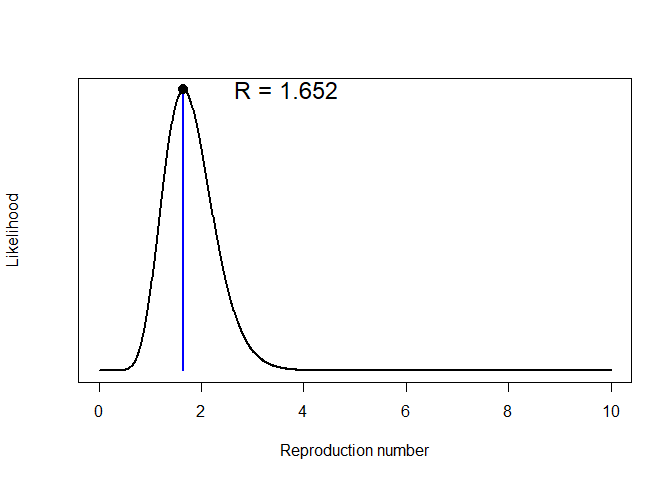
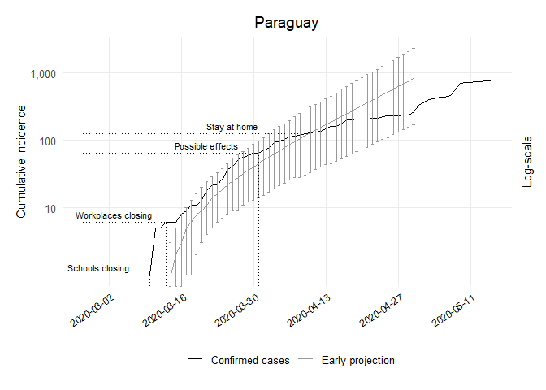

Early Projections Paraguay Code
================
[Bastián González-Bustamante](http://users.ox.ac.uk/~shil5311/)

``` r
## Early Projections
res_pry <- get_R(past.i.pry, si_mean = mu, si_sd = sigma)
plot(res_pry)
```

<!-- -->

``` r

## Range
pry_range <- 1:(which(get_dates(i.pry) == third_week) - pred_days)

## Simulation of Future Epicurves
set.seed(20200225)
R_val_pry <- sample_R(res_pry, 1000)
future_i_pry <- project(i.pry[pry_range], R = R_val_pry, n_sim = 1000, 
                        si = res_pry$si, n_days = (pred_days + 41))

## Cumulative Conversion
future_i_pry <- cumulate(future_i_pry)

## Dataframe CI 95%
df_future_i_pry <- as.data.frame(future_i_pry, long = TRUE)

## Lower CI
pry1_lo <- quantile((slice(df_future_i_pry, which(df_future_i_pry$date == "2020-03-14")))
                    $incidence, 0.025)[[1]]
pry2_lo <- quantile((slice(df_future_i_pry, which(df_future_i_pry$date == "2020-03-15")))
                    $incidence, 0.025)[[1]]
pry3_lo <- quantile((slice(df_future_i_pry, which(df_future_i_pry$date == "2020-03-16")))
                    $incidence, 0.025)[[1]]
pry4_lo <- quantile((slice(df_future_i_pry, which(df_future_i_pry$date == "2020-03-17")))
                    $incidence, 0.025)[[1]]
pry5_lo <- quantile((slice(df_future_i_pry, which(df_future_i_pry$date == "2020-03-18")))
                    $incidence, 0.025)[[1]]
pry6_lo <- quantile((slice(df_future_i_pry, which(df_future_i_pry$date == "2020-03-19")))
                    $incidence, 0.025)[[1]]
pry7_lo <- quantile((slice(df_future_i_pry, which(df_future_i_pry$date == "2020-03-20")))
                    $incidence, 0.025)[[1]]
pry8_lo <- quantile((slice(df_future_i_pry, which(df_future_i_pry$date == "2020-03-21")))
                    $incidence, 0.025)[[1]]
pry9_lo <- quantile((slice(df_future_i_pry, which(df_future_i_pry$date == "2020-03-22")))
                    $incidence, 0.025)[[1]]
pry10_lo <- quantile((slice(df_future_i_pry, which(df_future_i_pry$date == "2020-03-23")))
                     $incidence, 0.025)[[1]]
pry11_lo <- quantile((slice(df_future_i_pry, which(df_future_i_pry$date == "2020-03-24")))
                     $incidence, 0.025)[[1]]
pry12_lo <- quantile((slice(df_future_i_pry, which(df_future_i_pry$date == "2020-03-25")))
                     $incidence, 0.025)[[1]]
pry13_lo <- quantile((slice(df_future_i_pry, which(df_future_i_pry$date == "2020-03-26")))
                     $incidence, 0.025)[[1]]
pry14_lo <- quantile((slice(df_future_i_pry, which(df_future_i_pry$date == "2020-03-27")))
                     $incidence, 0.025)[[1]]
pry15_lo <- quantile((slice(df_future_i_pry, which(df_future_i_pry$date == "2020-03-28")))
                     $incidence, 0.025)[[1]]
pry16_lo <- quantile((slice(df_future_i_pry, which(df_future_i_pry$date == "2020-03-29")))
                     $incidence, 0.025)[[1]]
pry17_lo <- quantile((slice(df_future_i_pry, which(df_future_i_pry$date == "2020-03-30")))
                     $incidence, 0.025)[[1]]
pry18_lo <- quantile((slice(df_future_i_pry, which(df_future_i_pry$date == "2020-03-31")))
                     $incidence, 0.025)[[1]]
pry19_lo <- quantile((slice(df_future_i_pry, which(df_future_i_pry$date == "2020-04-01")))
                     $incidence, 0.025)[[1]]
pry20_lo <- quantile((slice(df_future_i_pry, which(df_future_i_pry$date == "2020-04-02")))
                     $incidence, 0.025)[[1]]
pry21_lo <- quantile((slice(df_future_i_pry, which(df_future_i_pry$date == "2020-04-03")))
                     $incidence, 0.025)[[1]]
pry22_lo <- quantile((slice(df_future_i_pry, which(df_future_i_pry$date == "2020-04-04")))
                     $incidence, 0.025)[[1]]
pry23_lo <- quantile((slice(df_future_i_pry, which(df_future_i_pry$date == "2020-04-05")))
                     $incidence, 0.025)[[1]]
pry24_lo <- quantile((slice(df_future_i_pry, which(df_future_i_pry$date == "2020-04-06")))
                     $incidence, 0.025)[[1]]
pry25_lo <- quantile((slice(df_future_i_pry, which(df_future_i_pry$date == "2020-04-07")))
                     $incidence, 0.025)[[1]]
pry26_lo <- quantile((slice(df_future_i_pry, which(df_future_i_pry$date == "2020-04-08")))
                     $incidence, 0.025)[[1]]
pry27_lo <- quantile((slice(df_future_i_pry, which(df_future_i_pry$date == "2020-04-09")))
                     $incidence, 0.025)[[1]]
pry28_lo <- quantile((slice(df_future_i_pry, which(df_future_i_pry$date == "2020-04-10")))
                     $incidence, 0.025)[[1]]
pry29_lo <- quantile((slice(df_future_i_pry, which(df_future_i_pry$date == "2020-04-11")))
                     $incidence, 0.025)[[1]]
pry30_lo <- quantile((slice(df_future_i_pry, which(df_future_i_pry$date == "2020-04-12")))
                     $incidence, 0.025)[[1]]
pry31_lo <- quantile((slice(df_future_i_pry, which(df_future_i_pry$date == "2020-04-13")))
                     $incidence, 0.025)[[1]]
pry32_lo <- quantile((slice(df_future_i_pry, which(df_future_i_pry$date == "2020-04-14")))
                     $incidence, 0.025)[[1]]
pry33_lo <- quantile((slice(df_future_i_pry, which(df_future_i_pry$date == "2020-04-15")))
                     $incidence, 0.025)[[1]]
pry34_lo <- quantile((slice(df_future_i_pry, which(df_future_i_pry$date == "2020-04-16")))
                     $incidence, 0.025)[[1]]
pry35_lo <- quantile((slice(df_future_i_pry, which(df_future_i_pry$date == "2020-04-17")))
                     $incidence, 0.025)[[1]]
pry36_lo <- quantile((slice(df_future_i_pry, which(df_future_i_pry$date == "2020-04-18")))
                     $incidence, 0.025)[[1]]
pry37_lo <- quantile((slice(df_future_i_pry, which(df_future_i_pry$date == "2020-04-19")))
                     $incidence, 0.025)[[1]]
pry38_lo <- quantile((slice(df_future_i_pry, which(df_future_i_pry$date == "2020-04-20")))
                     $incidence, 0.025)[[1]]
pry39_lo <- quantile((slice(df_future_i_pry, which(df_future_i_pry$date == "2020-04-21")))
                     $incidence, 0.025)[[1]]
pry40_lo <- quantile((slice(df_future_i_pry, which(df_future_i_pry$date == "2020-04-22")))
                     $incidence, 0.025)[[1]]
pry41_lo <- quantile((slice(df_future_i_pry, which(df_future_i_pry$date == "2020-04-23")))
                     $incidence, 0.025)[[1]]
pry42_lo <- quantile((slice(df_future_i_pry, which(df_future_i_pry$date == "2020-04-24")))
                     $incidence, 0.025)[[1]]
pry43_lo <- quantile((slice(df_future_i_pry, which(df_future_i_pry$date == "2020-04-25")))
                     $incidence, 0.025)[[1]]
pry44_lo <- quantile((slice(df_future_i_pry, which(df_future_i_pry$date == "2020-04-26")))
                     $incidence, 0.025)[[1]]
pry45_lo <- quantile((slice(df_future_i_pry, which(df_future_i_pry$date == "2020-04-27")))
                     $incidence, 0.025)[[1]]
pry46_lo <- quantile((slice(df_future_i_pry, which(df_future_i_pry$date == "2020-04-28")))
                     $incidence, 0.025)[[1]]
pry47_lo <- quantile((slice(df_future_i_pry, which(df_future_i_pry$date == "2020-04-29")))
                     $incidence, 0.025)[[1]]
pry48_lo <- quantile((slice(df_future_i_pry, which(df_future_i_pry$date == "2020-04-30")))
                     $incidence, 0.025)[[1]]
## Upper CI
pry1_up <- quantile((slice(df_future_i_pry, which(df_future_i_pry$date == "2020-03-14")))
                    $incidence, 0.975)[[1]]
pry2_up <- quantile((slice(df_future_i_pry, which(df_future_i_pry$date == "2020-03-15")))
                    $incidence, 0.975)[[1]]
pry3_up <- quantile((slice(df_future_i_pry, which(df_future_i_pry$date == "2020-03-16")))
                    $incidence, 0.975)[[1]]
pry4_up <- quantile((slice(df_future_i_pry, which(df_future_i_pry$date == "2020-03-17")))
                    $incidence, 0.975)[[1]]
pry5_up <- quantile((slice(df_future_i_pry, which(df_future_i_pry$date == "2020-03-18")))
                    $incidence, 0.975)[[1]]
pry6_up <- quantile((slice(df_future_i_pry, which(df_future_i_pry$date == "2020-03-19")))
                    $incidence, 0.975)[[1]]
pry7_up <- quantile((slice(df_future_i_pry, which(df_future_i_pry$date == "2020-03-20")))
                    $incidence, 0.975)[[1]]
pry8_up <- quantile((slice(df_future_i_pry, which(df_future_i_pry$date == "2020-03-21")))
                    $incidence, 0.975)[[1]]
pry9_up <- quantile((slice(df_future_i_pry, which(df_future_i_pry$date == "2020-03-22")))
                    $incidence, 0.975)[[1]]
pry10_up <- quantile((slice(df_future_i_pry, which(df_future_i_pry$date == "2020-03-23")))
                     $incidence, 0.975)[[1]]
pry11_up <- quantile((slice(df_future_i_pry, which(df_future_i_pry$date == "2020-03-24")))
                     $incidence, 0.975)[[1]]
pry12_up <- quantile((slice(df_future_i_pry, which(df_future_i_pry$date == "2020-03-25")))
                     $incidence, 0.975)[[1]]
pry13_up <- quantile((slice(df_future_i_pry, which(df_future_i_pry$date == "2020-03-26")))
                     $incidence, 0.975)[[1]]
pry14_up <- quantile((slice(df_future_i_pry, which(df_future_i_pry$date == "2020-03-27")))
                     $incidence, 0.975)[[1]]
pry15_up <- quantile((slice(df_future_i_pry, which(df_future_i_pry$date == "2020-03-28")))
                     $incidence, 0.975)[[1]]
pry16_up <- quantile((slice(df_future_i_pry, which(df_future_i_pry$date == "2020-03-29")))
                     $incidence, 0.975)[[1]]
pry17_up <- quantile((slice(df_future_i_pry, which(df_future_i_pry$date == "2020-03-30")))
                     $incidence, 0.975)[[1]]
pry18_up <- quantile((slice(df_future_i_pry, which(df_future_i_pry$date == "2020-03-31")))
                     $incidence, 0.975)[[1]]
pry19_up <- quantile((slice(df_future_i_pry, which(df_future_i_pry$date == "2020-04-01")))
                     $incidence, 0.975)[[1]]
pry20_up <- quantile((slice(df_future_i_pry, which(df_future_i_pry$date == "2020-04-02")))
                     $incidence, 0.975)[[1]]
pry21_up <- quantile((slice(df_future_i_pry, which(df_future_i_pry$date == "2020-04-03")))
                     $incidence, 0.975)[[1]]
pry22_up <- quantile((slice(df_future_i_pry, which(df_future_i_pry$date == "2020-04-04")))
                     $incidence, 0.975)[[1]]
pry23_up <- quantile((slice(df_future_i_pry, which(df_future_i_pry$date == "2020-04-05")))
                     $incidence, 0.975)[[1]]
pry24_up <- quantile((slice(df_future_i_pry, which(df_future_i_pry$date == "2020-04-06")))
                     $incidence, 0.975)[[1]]
pry25_up <- quantile((slice(df_future_i_pry, which(df_future_i_pry$date == "2020-04-07")))
                     $incidence, 0.975)[[1]]
pry26_up <- quantile((slice(df_future_i_pry, which(df_future_i_pry$date == "2020-04-08")))
                     $incidence, 0.975)[[1]]
pry27_up <- quantile((slice(df_future_i_pry, which(df_future_i_pry$date == "2020-04-09")))
                     $incidence, 0.975)[[1]]
pry28_up <- quantile((slice(df_future_i_pry, which(df_future_i_pry$date == "2020-04-10")))
                     $incidence, 0.975)[[1]]
pry29_up <- quantile((slice(df_future_i_pry, which(df_future_i_pry$date == "2020-04-11")))
                     $incidence, 0.975)[[1]]
pry30_up <- quantile((slice(df_future_i_pry, which(df_future_i_pry$date == "2020-04-12")))
                     $incidence, 0.975)[[1]]
pry31_up <- quantile((slice(df_future_i_pry, which(df_future_i_pry$date == "2020-04-13")))
                     $incidence, 0.975)[[1]]
pry32_up <- quantile((slice(df_future_i_pry, which(df_future_i_pry$date == "2020-04-14")))
                     $incidence, 0.975)[[1]]
pry33_up <- quantile((slice(df_future_i_pry, which(df_future_i_pry$date == "2020-04-15")))
                     $incidence, 0.975)[[1]]
pry34_up <- quantile((slice(df_future_i_pry, which(df_future_i_pry$date == "2020-04-16")))
                     $incidence, 0.975)[[1]]
pry35_up <- quantile((slice(df_future_i_pry, which(df_future_i_pry$date == "2020-04-17")))
                     $incidence, 0.975)[[1]]
pry36_up <- quantile((slice(df_future_i_pry, which(df_future_i_pry$date == "2020-04-18")))
                     $incidence, 0.975)[[1]]
pry37_up <- quantile((slice(df_future_i_pry, which(df_future_i_pry$date == "2020-04-19")))
                     $incidence, 0.975)[[1]]
pry38_up <- quantile((slice(df_future_i_pry, which(df_future_i_pry$date == "2020-04-20")))
                     $incidence, 0.975)[[1]]
pry39_up <- quantile((slice(df_future_i_pry, which(df_future_i_pry$date == "2020-04-21")))
                     $incidence, 0.975)[[1]]
pry40_up <- quantile((slice(df_future_i_pry, which(df_future_i_pry$date == "2020-04-22")))
                     $incidence, 0.975)[[1]]
pry41_up <- quantile((slice(df_future_i_pry, which(df_future_i_pry$date == "2020-04-23")))
                     $incidence, 0.975)[[1]]
pry42_up <- quantile((slice(df_future_i_pry, which(df_future_i_pry$date == "2020-04-24")))
                     $incidence, 0.975)[[1]]
pry43_up <- quantile((slice(df_future_i_pry, which(df_future_i_pry$date == "2020-04-25")))
                     $incidence, 0.975)[[1]]
pry44_up <- quantile((slice(df_future_i_pry, which(df_future_i_pry$date == "2020-04-26")))
                     $incidence, 0.975)[[1]]
pry45_up <- quantile((slice(df_future_i_pry, which(df_future_i_pry$date == "2020-04-27")))
                     $incidence, 0.975)[[1]]
pry46_up <- quantile((slice(df_future_i_pry, which(df_future_i_pry$date == "2020-04-28")))
                     $incidence, 0.975)[[1]]
pry47_up <- quantile((slice(df_future_i_pry, which(df_future_i_pry$date == "2020-04-29")))
                     $incidence, 0.975)[[1]]
pry48_up <- quantile((slice(df_future_i_pry, which(df_future_i_pry$date == "2020-04-30")))
                     $incidence, 0.975)[[1]]

## Dataframe
pry_pred_growth_median_counts <- future_i_pry %>% as.data.frame() %>% 
  pivot_longer(-dates, names_to = "simulation", values_to = "incidence") %>% 
  group_by(dates) %>% summarise(incident_cases = as.integer(median(incidence))) %>% 
  mutate(data_type = "Early projection")

## Dataframe
pry_proj <- pry_pred_growth_median_counts %>% 
  bind_rows(tibble(dates = get_dates(i.pry), 
                   incident_cases = cumulate(get_counts(i.pry)), data_type 
                   = "Confirmed cases"))

## Plot of Early Projections
ggplot(pry_proj, aes(x = dates, y = incident_cases, colour = data_type)) + 
  geom_line() + scale_color_manual(values=c("black", "grey60")) +
  geom_errorbar(data = subset(pry_proj, dates == "2020-03-14" & data_type 
                              == "Early projection"), 
                aes(ymin = pry1_lo, ymax = pry1_up), width = .5) +
  geom_errorbar(data = subset(pry_proj, dates == "2020-03-15" & data_type 
                              == "Early projection"), 
                aes(ymin = pry2_lo, ymax = pry2_up), width = .5) +
  geom_errorbar(data = subset(pry_proj, dates == "2020-03-16" & data_type 
                              == "Early projection"), 
                aes(ymin = pry3_lo, ymax = pry3_up), width = .5) +
  geom_errorbar(data = subset(pry_proj, dates == "2020-03-17" & data_type 
                              == "Early projection"), 
                aes(ymin = pry4_lo, ymax = pry4_up), width = .5) +
  geom_errorbar(data = subset(pry_proj, dates == "2020-03-18" & data_type 
                              == "Early projection"), 
                aes(ymin = pry5_lo, ymax = pry5_up), width = .5) +
  geom_errorbar(data = subset(pry_proj, dates == "2020-03-19" & data_type 
                              == "Early projection"), 
                aes(ymin = pry6_lo, ymax = pry6_up), width = .5) +
  geom_errorbar(data = subset(pry_proj, dates == "2020-03-20" & data_type 
                              == "Early projection"), 
                aes(ymin = pry7_lo, ymax = pry7_up), width = .5) +
  geom_errorbar(data = subset(pry_proj, dates == "2020-03-21" & data_type 
                              == "Early projection"), 
                aes(ymin = pry8_lo, ymax = pry8_up), width = .5) +
  geom_errorbar(data = subset(pry_proj, dates == "2020-03-22" & data_type 
                              == "Early projection"), 
                aes(ymin = pry9_lo, ymax = pry9_up), width = .5) +
  geom_errorbar(data = subset(pry_proj, dates == "2020-03-23" & data_type 
                              == "Early projection"), 
                aes(ymin = pry10_lo, ymax = pry10_up), width = .5) +
  geom_errorbar(data = subset(pry_proj, dates == "2020-03-24" & data_type 
                              == "Early projection"), 
                aes(ymin = pry11_lo, ymax = pry11_up), width = .5) +
  geom_errorbar(data = subset(pry_proj, dates == "2020-03-25" & data_type 
                              == "Early projection"), 
                aes(ymin = pry12_lo, ymax = pry12_up), width = .5) +
  geom_errorbar(data = subset(pry_proj, dates == "2020-03-26" & data_type 
                              == "Early projection"), 
                aes(ymin = pry13_lo, ymax = pry13_up), width = .5) +
  geom_errorbar(data = subset(pry_proj, dates == "2020-03-27" & data_type 
                              == "Early projection"), 
                aes(ymin = pry14_lo, ymax = pry14_up), width = .5) +
  geom_errorbar(data = subset(pry_proj, dates == "2020-03-28" & data_type 
                              == "Early projection"), 
                aes(ymin = pry15_lo, ymax = pry15_up), width = .5) +
  geom_errorbar(data = subset(pry_proj, dates == "2020-03-29" & data_type 
                              == "Early projection"), 
                aes(ymin = pry16_lo, ymax = pry16_up), width = .5) +
  geom_errorbar(data = subset(pry_proj, dates == "2020-03-30" & data_type 
                              == "Early projection"), 
                aes(ymin = pry17_lo, ymax = pry17_up), width = .5) +
  geom_errorbar(data = subset(pry_proj, dates == "2020-03-31" & data_type 
                              == "Early projection"), 
                aes(ymin = pry18_lo, ymax = pry18_up), width = .5) +
  geom_errorbar(data = subset(pry_proj, dates == "2020-04-01" & data_type 
                              == "Early projection"), 
                aes(ymin = pry19_lo, ymax = pry19_up), width = .5) +
  geom_errorbar(data = subset(pry_proj, dates == "2020-04-02" & data_type 
                              == "Early projection"), 
                aes(ymin = pry20_lo, ymax = pry20_up), width = .5) +
  geom_errorbar(data = subset(pry_proj, dates == "2020-04-03" & data_type 
                              == "Early projection"), 
                aes(ymin = pry21_lo, ymax = pry21_up), width = .5) +
  geom_errorbar(data = subset(pry_proj, dates == "2020-04-04" & data_type 
                              == "Early projection"), 
                aes(ymin = pry22_lo, ymax = pry22_up), width = .5) +
  geom_errorbar(data = subset(pry_proj, dates == "2020-04-05" & data_type 
                              == "Early projection"), 
                aes(ymin = pry23_lo, ymax = pry23_up), width = .5) +
  geom_errorbar(data = subset(pry_proj, dates == "2020-04-06" & data_type 
                              == "Early projection"), 
                aes(ymin = pry24_lo, ymax = pry24_up), width = .5) +
  geom_errorbar(data = subset(pry_proj, dates == "2020-04-07" & data_type 
                              == "Early projection"), 
                aes(ymin = pry25_lo, ymax = pry25_up), width = .5) +  
  geom_errorbar(data = subset(pry_proj, dates == "2020-04-08" & data_type 
                              == "Early projection"), 
                aes(ymin = pry26_lo, ymax = pry26_up), width = .5) +  
  geom_errorbar(data = subset(pry_proj, dates == "2020-04-09" & data_type 
                              == "Early projection"), 
                aes(ymin = pry27_lo, ymax = pry27_up), width = .5) +  
  geom_errorbar(data = subset(pry_proj, dates == "2020-04-10" & data_type 
                              == "Early projection"), 
                aes(ymin = pry28_lo, ymax = pry28_up), width = .5) +  
  geom_errorbar(data = subset(pry_proj, dates == "2020-04-11" & data_type 
                              == "Early projection"), 
                aes(ymin = pry29_lo, ymax = pry29_up), width = .5) +  
  geom_errorbar(data = subset(pry_proj, dates == "2020-04-12" & data_type 
                              == "Early projection"), 
                aes(ymin = pry30_lo, ymax = pry30_up), width = .5) +  
  geom_errorbar(data = subset(pry_proj, dates == "2020-04-13" & data_type 
                              == "Early projection"), 
                aes(ymin = pry31_lo, ymax = pry31_up), width = .5) +  
  geom_errorbar(data = subset(pry_proj, dates == "2020-04-14" & data_type 
                              == "Early projection"), 
                aes(ymin = pry32_lo, ymax = pry32_up), width = .5) +  
  geom_errorbar(data = subset(pry_proj, dates == "2020-04-15" & data_type 
                              == "Early projection"), 
                aes(ymin = pry33_lo, ymax = pry33_up), width = .5) +  
  geom_errorbar(data = subset(pry_proj, dates == "2020-04-16" & data_type 
                              == "Early projection"), 
                aes(ymin = pry34_lo, ymax = pry34_up), width = .5) +
  geom_errorbar(data = subset(pry_proj, dates == "2020-04-17" & data_type 
                              == "Early projection"), 
                aes(ymin = pry35_lo, ymax = pry35_up), width = .5) +  
  geom_errorbar(data = subset(pry_proj, dates == "2020-04-18" & data_type 
                              == "Early projection"), 
                aes(ymin = pry36_lo, ymax = pry36_up), width = .5) +  
  geom_errorbar(data = subset(pry_proj, dates == "2020-04-19" & data_type 
                              == "Early projection"), 
                aes(ymin = pry37_lo, ymax = pry37_up), width = .5) +  
  geom_errorbar(data = subset(pry_proj, dates == "2020-04-20" & data_type 
                              == "Early projection"), 
                aes(ymin = pry38_lo, ymax = pry38_up), width = .5) +  
  geom_errorbar(data = subset(pry_proj, dates == "2020-04-21" & data_type 
                              == "Early projection"), 
                aes(ymin = pry39_lo, ymax = pry39_up), width = .5) +  
  geom_errorbar(data = subset(pry_proj, dates == "2020-04-22" & data_type 
                              == "Early projection"), 
                aes(ymin = pry40_lo, ymax = pry40_up), width = .5) +  
  geom_errorbar(data = subset(pry_proj, dates == "2020-04-23" & data_type 
                              == "Early projection"), 
                aes(ymin = pry41_lo, ymax = pry41_up), width = .5) +  
  geom_errorbar(data = subset(pry_proj, dates == "2020-04-24" & data_type 
                              == "Early projection"), 
                aes(ymin = pry42_lo, ymax = pry42_up), width = .5) +  
  geom_errorbar(data = subset(pry_proj, dates == "2020-04-25" & data_type 
                              == "Early projection"), 
                aes(ymin = pry43_lo, ymax = pry43_up), width = .5) +  
  geom_errorbar(data = subset(pry_proj, dates == "2020-04-26" & data_type 
                              == "Early projection"), 
                aes(ymin = pry44_lo, ymax = pry44_up), width = .5) +  
  geom_errorbar(data = subset(pry_proj, dates == "2020-04-27" & data_type 
                              == "Early projection"), 
                aes(ymin = pry45_lo, ymax = pry45_up), width = .5) +  
  geom_errorbar(data = subset(pry_proj, dates == "2020-04-28" & data_type 
                              == "Early projection"), 
                aes(ymin = pry46_lo, ymax = pry46_up), width = .5) +  
  geom_errorbar(data = subset(pry_proj, dates == "2020-04-29" & data_type 
                              == "Early projection"), 
                aes(ymin = pry47_lo, ymax = pry47_up), width = .5) +  
  geom_errorbar(data = subset(pry_proj, dates == "2020-04-30" & data_type 
                              == "Early projection"), 
                aes(ymin = pry48_lo, ymax = pry48_up), width = .5) + 
  theme_minimal(base_size = 12) + theme(legend.position = "bottom") +
  theme(panel.grid.minor = element_blank()) +
  theme(axis.text.x = element_text(angle = 35, hjust = 1, color = "black",  size = 9)) +
  labs(x = NULL, y = "Cumulative incidence", title = "Paraguay", subtitle = NULL, 
       colour = NULL) + 
  theme(plot.margin = unit(c(0.5,0.5,0.5,0.5), "cm")) +
  scale_x_date(date_breaks = "2 weeks", date_minor_breaks = "2 weeks",
               date_labels = "%Y-%m-%d") +
  scale_y_log10(breaks = 10**(1:10), labels = comma(10**(1:10)),
                sec.axis = sec_axis(~ ., labels = NULL, name = "Log-scale")) + 
  theme(axis.title.y.right = element_text(angle = 90, size = 11),
        axis.title.y.left = element_text(size = 11),
        plot.caption = element_text(size = 9),
        plot.title = element_text(hjust = 0.5)) +
  ## School Closing
  geom_segment(aes(x = as.Date(pry_resp$dates[which(pry_resp$c1_schoolclosing == 3 
               & pry_resp$c1_flag == 1, arr.ind = TRUE)[1]]), xend = as.Date(pry_resp$
               dates[which(pry_resp$c1_schoolclosing == 3 & pry_resp$c1_flag == 1, 
               arr.ind = TRUE)[1]]), y = 0, yend = pry_proj$incident_cases[which
              (pry_proj$data_type == "Confirmed cases" & pry_proj$dates == as.Date
              (pry_resp$dates[which(pry_resp$c1_schoolclosing == 3 & pry_resp
               $c1_flag == 1, arr.ind=TRUE)[1]]))]), linetype = "dotted") + 
  geom_segment(aes(x = as.Date("2020-02-26"), xend = as.Date(pry_resp$dates[which
              (pry_resp$c1_schoolclosing == 3 & pry_resp$c1_flag == 1, arr.ind = TRUE)
              [1]]), y = pry_proj$incident_cases[which(pry_proj$data_type 
               == "Confirmed cases" & pry_proj$dates == as.Date(pry_resp$dates[which
              (pry_resp$c1_schoolclosing == 3 & pry_resp$c1_flag == 1, arr.ind = TRUE)
              [1]]))], yend = pry_proj$incident_cases[which(pry_proj$data_type 
               == "Confirmed cases" & pry_proj$dates == as.Date(pry_resp$dates[which
              (pry_resp$c1_schoolclosing == 3 & pry_resp$c1_flag == 1, arr.ind = TRUE)
              [1]]))]), linetype = "dotted") +
  annotate("text", y = 1.3 * pry_proj$incident_cases[which(pry_proj$data_type 
           == "Confirmed cases" & pry_proj$dates == as.Date(pry_resp$dates[which
          (pry_resp$c1_schoolclosing == 3 & pry_resp$c1_flag == 1, arr.ind = TRUE)
          [1]]))], x =  as.Date(pry_resp$dates[which(pry_resp$c1_schoolclosing == 3 
           & pry_resp$c1_flag == 1, arr.ind = TRUE)[1]]) - 10, label 
           = "Schools closing", size = 3) +
  ## Workplace Closing 
  geom_segment(aes(x = as.Date(pry_resp$dates[which(pry_resp$c2_workplaceclosing 
               == 3 & pry_resp$c1_flag == 1, arr.ind = TRUE)[1]]), xend = as.Date
              (pry_resp$dates[which(pry_resp$c2_workplaceclosing == 3 & pry_resp
               $c1_flag == 1, arr.ind = TRUE)[1]]), y = 0, yend = pry_proj
               $incident_cases[which(pry_proj$data_type == "Confirmed cases" 
               & pry_proj$dates == as.Date(pry_resp$dates[which(pry_resp
               $c2_workplaceclosing == 3 & pry_resp$c1_flag == 1, arr.ind = TRUE)
               [1]]))]), linetype = "dotted") + 
  geom_segment(aes(x = as.Date("2020-02-26"), xend = as.Date(pry_resp$dates[which
              (pry_resp$c2_workplaceclosing == 3 & pry_resp$c1_flag == 1, arr.ind
               = TRUE)[1]]), y = pry_proj$incident_cases[which(pry_proj$data_type 
               == "Confirmed cases" & pry_proj$dates == as.Date(pry_resp$dates[which
              (pry_resp$c2_workplaceclosing == 3 & pry_resp$c1_flag == 1, arr.ind
               = TRUE)[1]]))], yend = pry_proj$incident_cases[which(pry_proj
               $data_type == "Confirmed cases" & pry_proj$dates == as.Date(pry_resp
               $dates[which(pry_resp$c2_workplaceclosing == 3 & pry_resp$c1_flag 
               == 1, arr.ind = TRUE)[1]]))]), linetype = "dotted") +
  annotate("text", y = 1.3 * pry_proj$incident_cases[which(pry_proj$data_type 
           == "Confirmed cases" & pry_proj$dates == as.Date(pry_resp$dates[which
          (pry_resp$c2_workplaceclosing == 3 & pry_resp$c1_flag == 1, arr.ind = TRUE)
          [1]]))], x = as.Date(pry_resp$dates[which(pry_resp$c2_workplaceclosing == 3 
           & pry_resp$c1_flag == 1, arr.ind=TRUE)[1]]) - 10, label 
           = "Workplaces closing", size = 3) +
  ## Effects
  geom_segment(aes(x = 21 + as.Date(pry_resp$dates[which(pry_resp$c1_schoolclosing 
               == 3 & pry_resp$c1_flag == 1, arr.ind = TRUE)[1]]), xend = 21 + as.Date
              (pry_resp$dates[which(pry_resp$c1_schoolclosing == 3 & pry_resp
               $c1_flag == 1, arr.ind = TRUE)[1]]), y = 0, yend = pry_proj
               $incident_cases[which(pry_proj$data_type == "Confirmed cases" 
               & pry_proj$dates == 21 + as.Date(pry_resp$dates[which(pry_resp
               $c1_schoolclosing == 3 & pry_resp$c1_flag == 1, arr.ind = TRUE)[1]]))]), 
               linetype = "dotted") + 
  geom_segment(aes(x = as.Date("2020-02-26"), xend = 21 + as.Date(pry_resp$dates[which
              (pry_resp$c1_schoolclosing == 3 & pry_resp$c1_flag == 1, arr.ind = TRUE)
              [1]]), y = pry_proj$incident_cases[which(pry_proj$data_type 
               == "Confirmed cases" & pry_proj$dates == 21 + as.Date(pry_resp$dates
              [which(pry_resp$c1_schoolclosing == 3 & pry_resp$c1_flag == 1, arr.ind 
               = TRUE)[1]]))], yend = pry_proj$incident_cases[which(pry_proj$data_type 
               == "Confirmed cases" & pry_proj$dates == 21 + as.Date(pry_resp$dates
              [which(pry_resp$c1_schoolclosing == 3 & pry_resp$c1_flag == 1, arr.ind 
               = TRUE)[1]]))]), linetype = "dotted") +
  annotate("text", y = 1.3 * (pry_proj$incident_cases[which(pry_proj$data_type 
           == "Confirmed cases" & pry_proj$dates == 21 + as.Date(pry_resp$dates[which
          (pry_resp$c1_schoolclosing == 3 & pry_resp$c1_flag == 1, arr.ind = TRUE)
          [1]]))]), x =  as.Date(pry_resp$dates[which(pry_resp$c1_schoolclosing == 3
           & pry_resp$c1_flag == 1, arr.ind = TRUE)[1]]) - 10 + 21, label 
           = "Possible effects", size = 3) +
  ## Stay at Home
  geom_segment(aes(x = as.Date(pry_resp$dates[which(pry_resp$c6_stayathomerequirements 
               == 3 & pry_resp$c1_flag == 1, arr.ind = TRUE)[1]]), xend = as.Date
              (pry_resp$dates[which(pry_resp$c6_stayathomerequirements == 3 & pry_resp
               $c1_flag == 1, arr.ind = TRUE)[1]]), y = 0, yend = pry_proj$incident_cases
              [which(pry_proj$data_type == "Confirmed cases" & pry_proj$dates == as.Date
              (pry_resp$dates[which(pry_resp$c6_stayathomerequirements == 3 & pry_resp
               $c1_flag == 1, arr.ind=TRUE)[1]]))]), linetype = "dotted") + 
  geom_segment(aes(x = as.Date("2020-02-26"), xend = as.Date(pry_resp$dates[which
              (pry_resp$c6_stayathomerequirements == 3 & pry_resp$c1_flag == 1, arr.ind 
               = TRUE)[1]]), y = pry_proj$incident_cases[which(pry_proj$data_type 
               == "Confirmed cases" & pry_proj$dates == as.Date(pry_resp$dates[which
              (pry_resp$c6_stayathomerequirements == 3 & pry_resp$c1_flag == 1, arr.ind 
               = TRUE)[1]]))], yend = pry_proj$incident_cases[which(pry_proj$data_type 
               == "Confirmed cases" & pry_proj$dates == as.Date(pry_resp$dates[which
              (pry_resp$c6_stayathomerequirements == 3 & pry_resp$c1_flag == 1, arr.ind
               = TRUE)[1]]))]), linetype = "dotted") +
  annotate("text", y = 1.3 * pry_proj$incident_cases[which(pry_proj$data_type 
           == "Confirmed cases" & pry_proj$dates == as.Date(pry_resp$dates[which
          (pry_resp$c6_stayathomerequirements == 3 & pry_resp$c1_flag == 1, arr.ind 
           = TRUE)[1]]))], x = as.Date(pry_resp$dates[which(pry_resp
           $c6_stayathomerequirements == 3 & pry_resp$c1_flag == 1, arr.ind = TRUE)
           [1]]) - 14, label = "Stay at home", size = 3) 
```

<!-- -->
