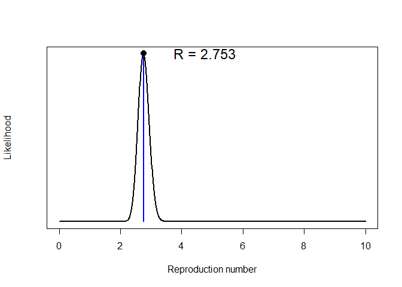
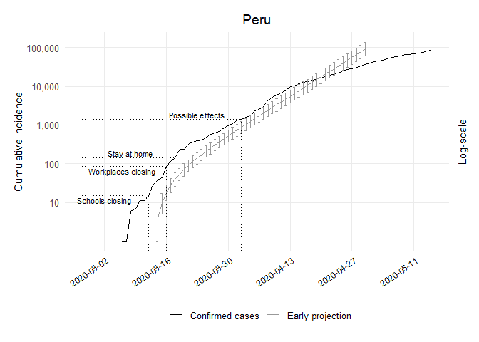

Early Projections Peru Code
================
[Bastián González-Bustamante](http://users.ox.ac.uk/~shil5311/)

``` r
## Early Projections
res_per <- get_R(past.i.per, si_mean = mu, si_sd = sigma)
plot(res_per)
```

<!-- -->

``` r

## Range
per_range <- 1:(which(get_dates(i.per) == third_week) - pred_days)

## Simulation of Future Epicurves
set.seed(20200225)
R_val_per <- sample_R(res_per, 1000)
future_i_per <- project(i.per[per_range], R = R_val_per, n_sim = 1000, 
                        si = res_per$si, n_days = (pred_days + 41))

## Cumulative Conversion
future_i_per <- cumulate(future_i_per)

## Dataframe CI 95%
df_future_i_per <- as.data.frame(future_i_per, long = TRUE)

## Lower CI
per1_lo <- quantile((slice(df_future_i_per, which(df_future_i_per$date == "2020-03-14")))
                    $incidence, 0.025)[[1]]
per2_lo <- quantile((slice(df_future_i_per, which(df_future_i_per$date == "2020-03-15")))
                    $incidence, 0.025)[[1]]
per3_lo <- quantile((slice(df_future_i_per, which(df_future_i_per$date == "2020-03-16")))
                    $incidence, 0.025)[[1]]
per4_lo <- quantile((slice(df_future_i_per, which(df_future_i_per$date == "2020-03-17")))
                    $incidence, 0.025)[[1]]
per5_lo <- quantile((slice(df_future_i_per, which(df_future_i_per$date == "2020-03-18")))
                    $incidence, 0.025)[[1]]
per6_lo <- quantile((slice(df_future_i_per, which(df_future_i_per$date == "2020-03-19")))
                    $incidence, 0.025)[[1]]
per7_lo <- quantile((slice(df_future_i_per, which(df_future_i_per$date == "2020-03-20")))
                    $incidence, 0.025)[[1]]
per8_lo <- quantile((slice(df_future_i_per, which(df_future_i_per$date == "2020-03-21")))
                    $incidence, 0.025)[[1]]
per9_lo <- quantile((slice(df_future_i_per, which(df_future_i_per$date == "2020-03-22")))
                    $incidence, 0.025)[[1]]
per10_lo <- quantile((slice(df_future_i_per, which(df_future_i_per$date == "2020-03-23")))
                     $incidence, 0.025)[[1]]
per11_lo <- quantile((slice(df_future_i_per, which(df_future_i_per$date == "2020-03-24")))
                     $incidence, 0.025)[[1]]
per12_lo <- quantile((slice(df_future_i_per, which(df_future_i_per$date == "2020-03-25")))
                     $incidence, 0.025)[[1]]
per13_lo <- quantile((slice(df_future_i_per, which(df_future_i_per$date == "2020-03-26")))
                     $incidence, 0.025)[[1]]
per14_lo <- quantile((slice(df_future_i_per, which(df_future_i_per$date == "2020-03-27")))
                     $incidence, 0.025)[[1]]
per15_lo <- quantile((slice(df_future_i_per, which(df_future_i_per$date == "2020-03-28")))
                     $incidence, 0.025)[[1]]
per16_lo <- quantile((slice(df_future_i_per, which(df_future_i_per$date == "2020-03-29")))
                     $incidence, 0.025)[[1]]
per17_lo <- quantile((slice(df_future_i_per, which(df_future_i_per$date == "2020-03-30")))
                     $incidence, 0.025)[[1]]
per18_lo <- quantile((slice(df_future_i_per, which(df_future_i_per$date == "2020-03-31")))
                     $incidence, 0.025)[[1]]
per19_lo <- quantile((slice(df_future_i_per, which(df_future_i_per$date == "2020-04-01")))
                     $incidence, 0.025)[[1]]
per20_lo <- quantile((slice(df_future_i_per, which(df_future_i_per$date == "2020-04-02")))
                     $incidence, 0.025)[[1]]
per21_lo <- quantile((slice(df_future_i_per, which(df_future_i_per$date == "2020-04-03")))
                     $incidence, 0.025)[[1]]
per22_lo <- quantile((slice(df_future_i_per, which(df_future_i_per$date == "2020-04-04")))
                     $incidence, 0.025)[[1]]
per23_lo <- quantile((slice(df_future_i_per, which(df_future_i_per$date == "2020-04-05")))
                     $incidence, 0.025)[[1]]
per24_lo <- quantile((slice(df_future_i_per, which(df_future_i_per$date == "2020-04-06")))
                     $incidence, 0.025)[[1]]
per25_lo <- quantile((slice(df_future_i_per, which(df_future_i_per$date == "2020-04-07")))
                     $incidence, 0.025)[[1]]
per26_lo <- quantile((slice(df_future_i_per, which(df_future_i_per$date == "2020-04-08")))
                     $incidence, 0.025)[[1]]
per27_lo <- quantile((slice(df_future_i_per, which(df_future_i_per$date == "2020-04-09")))
                     $incidence, 0.025)[[1]]
per28_lo <- quantile((slice(df_future_i_per, which(df_future_i_per$date == "2020-04-10")))
                     $incidence, 0.025)[[1]]
per29_lo <- quantile((slice(df_future_i_per, which(df_future_i_per$date == "2020-04-11")))
                     $incidence, 0.025)[[1]]
per30_lo <- quantile((slice(df_future_i_per, which(df_future_i_per$date == "2020-04-12")))
                     $incidence, 0.025)[[1]]
per31_lo <- quantile((slice(df_future_i_per, which(df_future_i_per$date == "2020-04-13")))
                     $incidence, 0.025)[[1]]
per32_lo <- quantile((slice(df_future_i_per, which(df_future_i_per$date == "2020-04-14")))
                     $incidence, 0.025)[[1]]
per33_lo <- quantile((slice(df_future_i_per, which(df_future_i_per$date == "2020-04-15")))
                     $incidence, 0.025)[[1]]
per34_lo <- quantile((slice(df_future_i_per, which(df_future_i_per$date == "2020-04-16")))
                     $incidence, 0.025)[[1]]
per35_lo <- quantile((slice(df_future_i_per, which(df_future_i_per$date == "2020-04-17")))
                     $incidence, 0.025)[[1]]
per36_lo <- quantile((slice(df_future_i_per, which(df_future_i_per$date == "2020-04-18")))
                     $incidence, 0.025)[[1]]
per37_lo <- quantile((slice(df_future_i_per, which(df_future_i_per$date == "2020-04-19")))
                     $incidence, 0.025)[[1]]
per38_lo <- quantile((slice(df_future_i_per, which(df_future_i_per$date == "2020-04-20")))
                     $incidence, 0.025)[[1]]
per39_lo <- quantile((slice(df_future_i_per, which(df_future_i_per$date == "2020-04-21")))
                     $incidence, 0.025)[[1]]
per40_lo <- quantile((slice(df_future_i_per, which(df_future_i_per$date == "2020-04-22")))
                     $incidence, 0.025)[[1]]
per41_lo <- quantile((slice(df_future_i_per, which(df_future_i_per$date == "2020-04-23")))
                     $incidence, 0.025)[[1]]
per42_lo <- quantile((slice(df_future_i_per, which(df_future_i_per$date == "2020-04-24")))
                     $incidence, 0.025)[[1]]
per43_lo <- quantile((slice(df_future_i_per, which(df_future_i_per$date == "2020-04-25")))
                     $incidence, 0.025)[[1]]
per44_lo <- quantile((slice(df_future_i_per, which(df_future_i_per$date == "2020-04-26")))
                     $incidence, 0.025)[[1]]
per45_lo <- quantile((slice(df_future_i_per, which(df_future_i_per$date == "2020-04-27")))
                     $incidence, 0.025)[[1]]
per46_lo <- quantile((slice(df_future_i_per, which(df_future_i_per$date == "2020-04-28")))
                     $incidence, 0.025)[[1]]
per47_lo <- quantile((slice(df_future_i_per, which(df_future_i_per$date == "2020-04-29")))
                     $incidence, 0.025)[[1]]
per48_lo <- quantile((slice(df_future_i_per, which(df_future_i_per$date == "2020-04-30")))
                     $incidence, 0.025)[[1]]
## Upper CI
per1_up <- quantile((slice(df_future_i_per, which(df_future_i_per$date == "2020-03-14")))
                    $incidence, 0.975)[[1]]
per2_up <- quantile((slice(df_future_i_per, which(df_future_i_per$date == "2020-03-15")))
                    $incidence, 0.975)[[1]]
per3_up <- quantile((slice(df_future_i_per, which(df_future_i_per$date == "2020-03-16")))
                    $incidence, 0.975)[[1]]
per4_up <- quantile((slice(df_future_i_per, which(df_future_i_per$date == "2020-03-17")))
                    $incidence, 0.975)[[1]]
per5_up <- quantile((slice(df_future_i_per, which(df_future_i_per$date == "2020-03-18")))
                    $incidence, 0.975)[[1]]
per6_up <- quantile((slice(df_future_i_per, which(df_future_i_per$date == "2020-03-19")))
                    $incidence, 0.975)[[1]]
per7_up <- quantile((slice(df_future_i_per, which(df_future_i_per$date == "2020-03-20")))
                    $incidence, 0.975)[[1]]
per8_up <- quantile((slice(df_future_i_per, which(df_future_i_per$date == "2020-03-21")))
                    $incidence, 0.975)[[1]]
per9_up <- quantile((slice(df_future_i_per, which(df_future_i_per$date == "2020-03-22")))
                    $incidence, 0.975)[[1]]
per10_up <- quantile((slice(df_future_i_per, which(df_future_i_per$date == "2020-03-23")))
                     $incidence, 0.975)[[1]]
per11_up <- quantile((slice(df_future_i_per, which(df_future_i_per$date == "2020-03-24")))
                     $incidence, 0.975)[[1]]
per12_up <- quantile((slice(df_future_i_per, which(df_future_i_per$date == "2020-03-25")))
                     $incidence, 0.975)[[1]]
per13_up <- quantile((slice(df_future_i_per, which(df_future_i_per$date == "2020-03-26")))
                     $incidence, 0.975)[[1]]
per14_up <- quantile((slice(df_future_i_per, which(df_future_i_per$date == "2020-03-27")))
                     $incidence, 0.975)[[1]]
per15_up <- quantile((slice(df_future_i_per, which(df_future_i_per$date == "2020-03-28")))
                     $incidence, 0.975)[[1]]
per16_up <- quantile((slice(df_future_i_per, which(df_future_i_per$date == "2020-03-29")))
                     $incidence, 0.975)[[1]]
per17_up <- quantile((slice(df_future_i_per, which(df_future_i_per$date == "2020-03-30")))
                     $incidence, 0.975)[[1]]
per18_up <- quantile((slice(df_future_i_per, which(df_future_i_per$date == "2020-03-31")))
                     $incidence, 0.975)[[1]]
per19_up <- quantile((slice(df_future_i_per, which(df_future_i_per$date == "2020-04-01")))
                     $incidence, 0.975)[[1]]
per20_up <- quantile((slice(df_future_i_per, which(df_future_i_per$date == "2020-04-02")))
                     $incidence, 0.975)[[1]]
per21_up <- quantile((slice(df_future_i_per, which(df_future_i_per$date == "2020-04-03")))
                     $incidence, 0.975)[[1]]
per22_up <- quantile((slice(df_future_i_per, which(df_future_i_per$date == "2020-04-04")))
                     $incidence, 0.975)[[1]]
per23_up <- quantile((slice(df_future_i_per, which(df_future_i_per$date == "2020-04-05")))
                     $incidence, 0.975)[[1]]
per24_up <- quantile((slice(df_future_i_per, which(df_future_i_per$date == "2020-04-06")))
                     $incidence, 0.975)[[1]]
per25_up <- quantile((slice(df_future_i_per, which(df_future_i_per$date == "2020-04-07")))
                     $incidence, 0.975)[[1]]
per26_up <- quantile((slice(df_future_i_per, which(df_future_i_per$date == "2020-04-08")))
                     $incidence, 0.975)[[1]]
per27_up <- quantile((slice(df_future_i_per, which(df_future_i_per$date == "2020-04-09")))
                     $incidence, 0.975)[[1]]
per28_up <- quantile((slice(df_future_i_per, which(df_future_i_per$date == "2020-04-10")))
                     $incidence, 0.975)[[1]]
per29_up <- quantile((slice(df_future_i_per, which(df_future_i_per$date == "2020-04-11")))
                     $incidence, 0.975)[[1]]
per30_up <- quantile((slice(df_future_i_per, which(df_future_i_per$date == "2020-04-12")))
                     $incidence, 0.975)[[1]]
per31_up <- quantile((slice(df_future_i_per, which(df_future_i_per$date == "2020-04-13")))
                     $incidence, 0.975)[[1]]
per32_up <- quantile((slice(df_future_i_per, which(df_future_i_per$date == "2020-04-14")))
                     $incidence, 0.975)[[1]]
per33_up <- quantile((slice(df_future_i_per, which(df_future_i_per$date == "2020-04-15")))
                     $incidence, 0.975)[[1]]
per34_up <- quantile((slice(df_future_i_per, which(df_future_i_per$date == "2020-04-16")))
                     $incidence, 0.975)[[1]]
per35_up <- quantile((slice(df_future_i_per, which(df_future_i_per$date == "2020-04-17")))
                     $incidence, 0.975)[[1]]
per36_up <- quantile((slice(df_future_i_per, which(df_future_i_per$date == "2020-04-18")))
                     $incidence, 0.975)[[1]]
per37_up <- quantile((slice(df_future_i_per, which(df_future_i_per$date == "2020-04-19")))
                     $incidence, 0.975)[[1]]
per38_up <- quantile((slice(df_future_i_per, which(df_future_i_per$date == "2020-04-20")))
                     $incidence, 0.975)[[1]]
per39_up <- quantile((slice(df_future_i_per, which(df_future_i_per$date == "2020-04-21")))
                     $incidence, 0.975)[[1]]
per40_up <- quantile((slice(df_future_i_per, which(df_future_i_per$date == "2020-04-22")))
                     $incidence, 0.975)[[1]]
per41_up <- quantile((slice(df_future_i_per, which(df_future_i_per$date == "2020-04-23")))
                     $incidence, 0.975)[[1]]
per42_up <- quantile((slice(df_future_i_per, which(df_future_i_per$date == "2020-04-24")))
                     $incidence, 0.975)[[1]]
per43_up <- quantile((slice(df_future_i_per, which(df_future_i_per$date == "2020-04-25")))
                     $incidence, 0.975)[[1]]
per44_up <- quantile((slice(df_future_i_per, which(df_future_i_per$date == "2020-04-26")))
                     $incidence, 0.975)[[1]]
per45_up <- quantile((slice(df_future_i_per, which(df_future_i_per$date == "2020-04-27")))
                     $incidence, 0.975)[[1]]
per46_up <- quantile((slice(df_future_i_per, which(df_future_i_per$date == "2020-04-28")))
                     $incidence, 0.975)[[1]]
per47_up <- quantile((slice(df_future_i_per, which(df_future_i_per$date == "2020-04-29")))
                     $incidence, 0.975)[[1]]
per48_up <- quantile((slice(df_future_i_per, which(df_future_i_per$date == "2020-04-30")))
                     $incidence, 0.975)[[1]]

## Dataframe
per_pred_growth_median_counts <- future_i_per %>% as.data.frame() %>% 
  pivot_longer(-dates, names_to = "simulation", values_to = "incidence") %>% 
  group_by(dates) %>% summarise(incident_cases = as.integer(median(incidence))) %>% 
  mutate(data_type = "Early projection")

## Dataframe
per_proj <- per_pred_growth_median_counts %>% 
  bind_rows(tibble(dates = get_dates(i.per), 
                   incident_cases = cumulate(get_counts(i.per)), data_type 
                   = "Confirmed cases"))

## Plot of Early Projections
ggplot(per_proj, aes(x = dates, y = incident_cases, colour = data_type)) + 
  geom_line() + scale_color_manual(values=c("black", "grey60")) +
  geom_errorbar(data = subset(per_proj, dates == "2020-03-14" & data_type 
                              == "Early projection"), 
                aes(ymin = per1_lo, ymax = per1_up), width = .5) +
  geom_errorbar(data = subset(per_proj, dates == "2020-03-15" & data_type 
                              == "Early projection"), 
                aes(ymin = per2_lo, ymax = per2_up), width = .5) +
  geom_errorbar(data = subset(per_proj, dates == "2020-03-16" & data_type 
                              == "Early projection"), 
                aes(ymin = per3_lo, ymax = per3_up), width = .5) +
  geom_errorbar(data = subset(per_proj, dates == "2020-03-17" & data_type 
                              == "Early projection"), 
                aes(ymin = per4_lo, ymax = per4_up), width = .5) +
  geom_errorbar(data = subset(per_proj, dates == "2020-03-18" & data_type 
                              == "Early projection"), 
                aes(ymin = per5_lo, ymax = per5_up), width = .5) +
  geom_errorbar(data = subset(per_proj, dates == "2020-03-19" & data_type
                              == "Early projection"), 
                aes(ymin = per6_lo, ymax = per6_up), width = .5) +
  geom_errorbar(data = subset(per_proj, dates == "2020-03-20" & data_type 
                              == "Early projection"), 
                aes(ymin = per7_lo, ymax = per7_up), width = .5) +
  geom_errorbar(data = subset(per_proj, dates == "2020-03-21" & data_type 
                              == "Early projection"), 
                aes(ymin = per8_lo, ymax = per8_up), width = .5) +
  geom_errorbar(data = subset(per_proj, dates == "2020-03-22" & data_type 
                              == "Early projection"), 
                aes(ymin = per9_lo, ymax = per9_up), width = .5) +
  geom_errorbar(data = subset(per_proj, dates == "2020-03-23" & data_type 
                              == "Early projection"), 
                aes(ymin = per10_lo, ymax = per10_up), width = .5) +
  geom_errorbar(data = subset(per_proj, dates == "2020-03-24" & data_type 
                              == "Early projection"), 
                aes(ymin = per11_lo, ymax = per11_up), width = .5) +
  geom_errorbar(data = subset(per_proj, dates == "2020-03-25" & data_type 
                              == "Early projection"), 
                aes(ymin = per12_lo, ymax = per12_up), width = .5) +
  geom_errorbar(data = subset(per_proj, dates == "2020-03-26" & data_type 
                              == "Early projection"), 
                aes(ymin = per13_lo, ymax = per13_up), width = .5) +
  geom_errorbar(data = subset(per_proj, dates == "2020-03-27" & data_type 
                              == "Early projection"), 
                aes(ymin = per14_lo, ymax = per14_up), width = .5) +
  geom_errorbar(data = subset(per_proj, dates == "2020-03-28" & data_type 
                              == "Early projection"), 
                aes(ymin = per15_lo, ymax = per15_up), width = .5) +
  geom_errorbar(data = subset(per_proj, dates == "2020-03-29" & data_type 
                              == "Early projection"), 
                aes(ymin = per16_lo, ymax = per16_up), width = .5) +
  geom_errorbar(data = subset(per_proj, dates == "2020-03-30" & data_type 
                              == "Early projection"), 
                aes(ymin = per17_lo, ymax = per17_up), width = .5) +
  geom_errorbar(data = subset(per_proj, dates == "2020-03-31" & data_type 
                              == "Early projection"), 
                aes(ymin = per18_lo, ymax = per18_up), width = .5) +
  geom_errorbar(data = subset(per_proj, dates == "2020-04-01" & data_type 
                              == "Early projection"), 
                aes(ymin = per19_lo, ymax = per19_up), width = .5) +
  geom_errorbar(data = subset(per_proj, dates == "2020-04-02" & data_type 
                              == "Early projection"), 
                aes(ymin = per20_lo, ymax = per20_up), width = .5) +
  geom_errorbar(data = subset(per_proj, dates == "2020-04-03" & data_type 
                              == "Early projection"), 
                aes(ymin = per21_lo, ymax = per21_up), width = .5) +
  geom_errorbar(data = subset(per_proj, dates == "2020-04-04" & data_type 
                              == "Early projection"), 
                aes(ymin = per22_lo, ymax = per22_up), width = .5) +
  geom_errorbar(data = subset(per_proj, dates == "2020-04-05" & data_type 
                              == "Early projection"), 
                aes(ymin = per23_lo, ymax = per23_up), width = .5) +
  geom_errorbar(data = subset(per_proj, dates == "2020-04-06" & data_type 
                              == "Early projection"), 
                aes(ymin = per24_lo, ymax = per24_up), width = .5) +
  geom_errorbar(data = subset(per_proj, dates == "2020-04-07" & data_type 
                              == "Early projection"), 
                aes(ymin = per25_lo, ymax = per25_up), width = .5) +  
  geom_errorbar(data = subset(per_proj, dates == "2020-04-08" & data_type 
                              == "Early projection"), 
                aes(ymin = per26_lo, ymax = per26_up), width = .5) +  
  geom_errorbar(data = subset(per_proj, dates == "2020-04-09" & data_type 
                              == "Early projection"), 
                aes(ymin = per27_lo, ymax = per27_up), width = .5) +  
  geom_errorbar(data = subset(per_proj, dates == "2020-04-10" & data_type 
                              == "Early projection"), 
                aes(ymin = per28_lo, ymax = per28_up), width = .5) +  
  geom_errorbar(data = subset(per_proj, dates == "2020-04-11" & data_type 
                              == "Early projection"), 
                aes(ymin = per29_lo, ymax = per29_up), width = .5) +  
  geom_errorbar(data = subset(per_proj, dates == "2020-04-12" & data_type 
                              == "Early projection"), 
                aes(ymin = per30_lo, ymax = per30_up), width = .5) +  
  geom_errorbar(data = subset(per_proj, dates == "2020-04-13" & data_type 
                              == "Early projection"), 
                aes(ymin = per31_lo, ymax = per31_up), width = .5) +  
  geom_errorbar(data = subset(per_proj, dates == "2020-04-14" & data_type 
                              == "Early projection"), 
                aes(ymin = per32_lo, ymax = per32_up), width = .5) +  
  geom_errorbar(data = subset(per_proj, dates == "2020-04-15" & data_type 
                              == "Early projection"), 
                aes(ymin = per33_lo, ymax = per33_up), width = .5) +  
  geom_errorbar(data = subset(per_proj, dates == "2020-04-16" & data_type 
                              == "Early projection"), 
                aes(ymin = per34_lo, ymax = per34_up), width = .5) +
  geom_errorbar(data = subset(per_proj, dates == "2020-04-17" & data_type 
                              == "Early projection"), 
                aes(ymin = per35_lo, ymax = per35_up), width = .5) +  
  geom_errorbar(data = subset(per_proj, dates == "2020-04-18" & data_type
                              == "Early projection"), 
                aes(ymin = per36_lo, ymax = per36_up), width = .5) +  
  geom_errorbar(data = subset(per_proj, dates == "2020-04-19" & data_type 
                              == "Early projection"), 
                aes(ymin = per37_lo, ymax = per37_up), width = .5) +  
  geom_errorbar(data = subset(per_proj, dates == "2020-04-20" & data_type 
                              == "Early projection"), 
                aes(ymin = per38_lo, ymax = per38_up), width = .5) +  
  geom_errorbar(data = subset(per_proj, dates == "2020-04-21" & data_type 
                              == "Early projection"), 
                aes(ymin = per39_lo, ymax = per39_up), width = .5) +  
  geom_errorbar(data = subset(per_proj, dates == "2020-04-22" & data_type 
                              == "Early projection"), 
                aes(ymin = per40_lo, ymax = per40_up), width = .5) +  
  geom_errorbar(data = subset(per_proj, dates == "2020-04-23" & data_type 
                              == "Early projection"), 
                aes(ymin = per41_lo, ymax = per41_up), width = .5) +  
  geom_errorbar(data = subset(per_proj, dates == "2020-04-24" & data_type 
                              == "Early projection"), 
                aes(ymin = per42_lo, ymax = per42_up), width = .5) +  
  geom_errorbar(data = subset(per_proj, dates == "2020-04-25" & data_type 
                              == "Early projection"), 
                aes(ymin = per43_lo, ymax = per43_up), width = .5) +  
  geom_errorbar(data = subset(per_proj, dates == "2020-04-26" & data_type 
                              == "Early projection"), 
                aes(ymin = per44_lo, ymax = per44_up), width = .5) +  
  geom_errorbar(data = subset(per_proj, dates == "2020-04-27" & data_type 
                              == "Early projection"), 
                aes(ymin = per45_lo, ymax = per45_up), width = .5) +  
  geom_errorbar(data = subset(per_proj, dates == "2020-04-28" & data_type 
                              == "Early projection"), 
                aes(ymin = per46_lo, ymax = per46_up), width = .5) +  
  geom_errorbar(data = subset(per_proj, dates == "2020-04-29" & data_type 
                              == "Early projection"), 
                aes(ymin = per47_lo, ymax = per47_up), width = .5) +  
  geom_errorbar(data = subset(per_proj, dates == "2020-04-30" & data_type 
                              == "Early projection"), 
                aes(ymin = per48_lo, ymax = per48_up), width = .5) + 
  theme_minimal(base_size = 12) + theme(legend.position = "bottom") +
  theme(panel.grid.minor = element_blank()) +
  theme(axis.text.x = element_text(angle = 35, hjust = 1, color = "black",  size = 9)) +
  labs(x = NULL, y = "Cumulative incidence", title = "Peru", subtitle = NULL, 
       colour = NULL) + 
  theme(plot.margin = unit(c(0.5,0.5,0.5,0.5), "cm")) +
  scale_x_date(date_breaks = "2 weeks", date_minor_breaks = "2 weeks",
               date_labels = "%Y-%m-%d") +
  scale_y_log10(breaks = 10**(1:10), labels = comma(10**(1:10)),
                sec.axis = sec_axis(~ ., labels = NULL, name = "Log-scale")) + 
  theme(axis.title.y.right = element_text(angle = 90, size = 11),
        axis.title.y.left = element_text(size = 11),
        plot.caption = element_text(size = 9),
        plot.title = element_text(hjust = 0.5)) +
  ## School Closing
  geom_segment(aes(x = as.Date(per_resp$dates[which(per_resp$c1_schoolclosing == 3 
               & per_resp$c1_flag == 1, arr.ind = TRUE)[1]]), xend = as.Date(per_resp
               $dates[which(per_resp$c1_schoolclosing == 3 & per_resp$c1_flag == 1, 
               arr.ind = TRUE)[1]]), y = 0, yend = per_proj$incident_cases[which
              (per_proj$data_type == "Confirmed cases" & per_proj$dates == as.Date
              (per_resp$dates[which(per_resp$c1_schoolclosing == 3 & per_resp$c1_flag 
               == 1, arr.ind = TRUE)[1]]))]), linetype = "dotted") + 
  geom_segment(aes(x = as.Date("2020-02-26"), xend = as.Date(per_resp$dates[which
              (per_resp$c1_schoolclosing == 3 & per_resp$c1_flag == 1, arr.ind 
               = TRUE)[1]]), y = per_proj$incident_cases[which(per_proj$data_type 
               == "Confirmed cases" & per_proj$dates == as.Date(per_resp$dates[which
              (per_resp$c1_schoolclosing == 3 & per_resp$c1_flag == 1, arr.ind 
               = TRUE)[1]]))], yend = per_proj$incident_cases[which(per_proj$data_type 
               == "Confirmed cases" & per_proj$dates == as.Date(per_resp$dates[which
              (per_resp$c1_schoolclosing == 3 & per_resp$c1_flag == 1, arr.ind 
               = TRUE)[1]]))]), linetype = "dotted") +
  annotate("text", y = 0.75 * per_proj$incident_cases[which(per_proj$data_type 
           == "Confirmed cases" & per_proj$dates == as.Date(per_resp$dates[which
          (per_resp$c1_schoolclosing == 3 & per_resp$c1_flag == 1, arr.ind = TRUE)
          [1]]))], x =  as.Date(per_resp$dates[which(per_resp$c1_schoolclosing == 3 
           & per_resp$c1_flag == 1, arr.ind = TRUE)[1]]) - 10, label = "Schools closing", 
           size = 3) +
  ## Workplace Closing 
  geom_segment(aes(x = as.Date(per_resp$dates[which(per_resp$c2_workplaceclosing == 3 
               & per_resp$c1_flag == 1, arr.ind = TRUE)[1]]), xend = as.Date(per_resp
               $dates[which(per_resp$c2_workplaceclosing == 3 & per_resp$c1_flag == 1, 
               arr.ind = TRUE)[1]]), y = 0, yend = per_proj$incident_cases[which
              (per_proj$data_type == "Confirmed cases" & per_proj$dates == as.Date
              (per_resp$dates[which(per_resp$c2_workplaceclosing == 3 & per_resp
               $c1_flag == 1, arr.ind = TRUE)[1]]))]), linetype = "dotted") + 
  geom_segment(aes(x = as.Date("2020-02-26"), xend = as.Date(per_resp$dates[which
              (per_resp$c2_workplaceclosing == 3 & per_resp$c1_flag == 1, arr.ind 
               = TRUE)[1]]), y = per_proj$incident_cases[which(per_proj$data_type 
               == "Confirmed cases" & per_proj$dates == as.Date(per_resp$dates[which
              (per_resp$c2_workplaceclosing == 3 & per_resp$c1_flag == 1, arr.ind 
               = TRUE)[1]]))], yend = per_proj$incident_cases[which(per_proj
               $data_type == "Confirmed cases" & per_proj$dates == as.Date(per_resp
               $dates[which(per_resp$c2_workplaceclosing == 3 & per_resp$c1_flag == 1, 
               arr.ind = TRUE)[1]]))]), linetype = "dotted") +
  annotate("text", y = 0.75 * per_proj$incident_cases[which(per_proj$data_type 
           == "Confirmed cases" & per_proj$dates == as.Date(per_resp$dates[which
          (per_resp$c2_workplaceclosing == 3 & per_resp$c1_flag == 1, arr.ind = TRUE)
          [1]]))], x = as.Date(per_resp$dates[which(per_resp$c2_workplaceclosing == 3 
           & per_resp$c1_flag == 1, arr.ind = TRUE)[1]]) - 10, label 
           = "Workplaces closing", size = 3) +
  ## Stay at Home
  geom_segment(aes(x = as.Date(per_resp$dates[which(per_resp$c6_stayathomerequirements 
               == 3 & per_resp$c1_flag == 1, arr.ind = TRUE)[1]]), xend = as.Date
              (per_resp$dates[which(per_resp$c6_stayathomerequirements == 3 & per_resp
               $c1_flag == 1, arr.ind = TRUE)[1]]), y = 0, yend = per_proj
               $incident_cases[which(per_proj$data_type == "Confirmed cases" & per_proj
               $dates == as.Date(per_resp$dates[which(per_resp$c6_stayathomerequirements 
               == 3 & per_resp$c1_flag == 1, arr.ind = TRUE)[1]]))]), linetype 
               = "dotted") + 
  geom_segment(aes(x = as.Date("2020-02-26"), xend = as.Date(per_resp$dates[which
              (per_resp$c6_stayathomerequirements == 3 & per_resp$c1_flag == 1, arr.ind 
               = TRUE)[1]]), y = per_proj$incident_cases[which(per_proj$data_type 
               == "Confirmed cases" & per_proj$dates == as.Date(per_resp$dates[which
              (per_resp$c6_stayathomerequirements == 3 & per_resp$c1_flag == 1, arr.ind 
               = TRUE)[1]]))], yend = per_proj$incident_cases[which(per_proj$data_type 
               == "Confirmed cases" & per_proj$dates == as.Date(per_resp$dates[which
              (per_resp$c6_stayathomerequirements == 3 & per_resp$c1_flag == 1, arr.ind 
               = TRUE)[1]]))]), linetype = "dotted") +
  annotate("text", y = 1.3 * per_proj$incident_cases[which(per_proj$data_type 
           == "Confirmed cases" & per_proj$dates == as.Date(per_resp$dates[which
          (per_resp$c6_stayathomerequirements == 3 & per_resp$c1_flag == 1, arr.ind 
           = TRUE)[1]]))], x = as.Date(per_resp$dates[which(per_resp
           $c6_stayathomerequirements == 3 & per_resp$c1_flag == 1, arr.ind = TRUE)
           [1]]) - 10, label = "Stay at home", size = 3) +
  ## Effects
  geom_segment(aes(x = 21 + as.Date(per_resp$dates[which(per_resp$c1_schoolclosing == 3 
               & per_resp$c1_flag == 1, arr.ind = TRUE)[1]]), xend = 21 + as.Date
              (per_resp$dates[which(per_resp$c1_schoolclosing == 3 & per_resp$c1_flag 
               == 1, arr.ind = TRUE)[1]]), y = 0, yend = per_proj$incident_cases[which
              (per_proj$data_type == "Confirmed cases" & per_proj$dates == 21 + as.Date
              (per_resp$dates[which(per_resp$c1_schoolclosing == 3 & per_resp$c1_flag 
               == 1, arr.ind = TRUE)[1]]))]), linetype = "dotted") + 
  geom_segment(aes(x = as.Date("2020-02-26"), xend = 21 + as.Date(per_resp$dates[which
              (per_resp$c1_schoolclosing == 3 & per_resp$c1_flag == 1, arr.ind = TRUE)
              [1]]), y = per_proj$incident_cases[which(per_proj$data_type 
               == "Confirmed cases" & per_proj$dates == 21 + as.Date(per_resp$dates[which
              (per_resp$c1_schoolclosing == 3 & per_resp$c1_flag == 1, arr.ind = TRUE)
              [1]]))], yend = per_proj$incident_cases[which(per_proj$data_type 
               == "Confirmed cases" & per_proj$dates == 21 + as.Date(per_resp$dates[which
              (per_resp$c1_schoolclosing == 3 & per_resp$c1_flag == 1, arr.ind = TRUE)
              [1]]))]), linetype = "dotted") +
  annotate("text", y = 1.3 * (per_proj$incident_cases[which(per_proj$data_type 
           == "Confirmed cases" & per_proj$dates == 21 + as.Date(per_resp$dates[which
          (per_resp$c1_schoolclosing == 3 & per_resp$c1_flag == 1, arr.ind = TRUE)
          [1]]))]), x =  as.Date(per_resp$dates[which(per_resp$c1_schoolclosing == 3 
           & per_resp$c1_flag == 1, arr.ind=TRUE)[1]]) - 10 + 21, label 
           = "Possible effects", size = 3) 
```

<!-- -->
