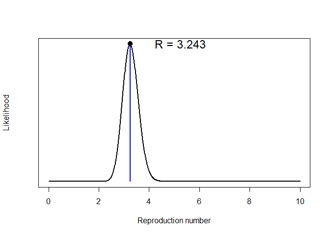
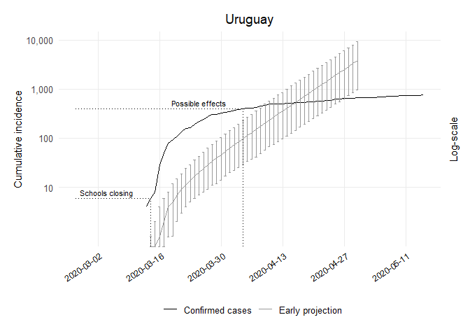

Early Projections Uruguay Code
================
[Bastián González-Bustamante](http://users.ox.ac.uk/~shil5311/)

``` r
## Early Projections
res_ury <- get_R(past.i.ury, si_mean = mu, si_sd = sigma)
plot(res_ury)
```

<!-- -->

``` r

## Range
ury_range <- 1:(which(get_dates(i.ury) == third_week) - pred_days)

## Simulation of Future Epicurves
set.seed(20200225)
R_val_ury <- sample_R(res_ury, 1000)
future_i_ury <- project(i.ury[ury_range], R = min(R_val_ury), n_sim = 1000, 
                        si = res_ury$si, n_days = (pred_days + 41))

## Cumulative Conversion
future_i_ury <- cumulate(future_i_ury)

## Dataframe CI 95%
df_future_i_ury <- as.data.frame(future_i_ury, long = TRUE)

## Lower CI
ury1_lo <- quantile((slice(df_future_i_ury, which(df_future_i_ury$date == "2020-03-14")))
                    $incidence, 0.025)[[1]]
ury2_lo <- quantile((slice(df_future_i_ury, which(df_future_i_ury$date == "2020-03-15")))
                    $incidence, 0.025)[[1]]
ury3_lo <- quantile((slice(df_future_i_ury, which(df_future_i_ury$date == "2020-03-16")))
                    $incidence, 0.025)[[1]]
ury4_lo <- quantile((slice(df_future_i_ury, which(df_future_i_ury$date == "2020-03-17")))
                    $incidence, 0.025)[[1]]
ury5_lo <- quantile((slice(df_future_i_ury, which(df_future_i_ury$date == "2020-03-18")))
                    $incidence, 0.025)[[1]]
ury6_lo <- quantile((slice(df_future_i_ury, which(df_future_i_ury$date == "2020-03-19")))
                    $incidence, 0.025)[[1]]
ury7_lo <- quantile((slice(df_future_i_ury, which(df_future_i_ury$date == "2020-03-20")))
                    $incidence, 0.025)[[1]]
ury8_lo <- quantile((slice(df_future_i_ury, which(df_future_i_ury$date == "2020-03-21")))
                    $incidence, 0.025)[[1]]
ury9_lo <- quantile((slice(df_future_i_ury, which(df_future_i_ury$date == "2020-03-22")))
                    $incidence, 0.025)[[1]]
ury10_lo <- quantile((slice(df_future_i_ury, which(df_future_i_ury$date == "2020-03-23")))
                     $incidence, 0.025)[[1]]
ury11_lo <- quantile((slice(df_future_i_ury, which(df_future_i_ury$date == "2020-03-24")))
                     $incidence, 0.025)[[1]]
ury12_lo <- quantile((slice(df_future_i_ury, which(df_future_i_ury$date == "2020-03-25")))
                     $incidence, 0.025)[[1]]
ury13_lo <- quantile((slice(df_future_i_ury, which(df_future_i_ury$date == "2020-03-26")))
                     $incidence, 0.025)[[1]]
ury14_lo <- quantile((slice(df_future_i_ury, which(df_future_i_ury$date == "2020-03-27")))
                     $incidence, 0.025)[[1]]
ury15_lo <- quantile((slice(df_future_i_ury, which(df_future_i_ury$date == "2020-03-28")))
                     $incidence, 0.025)[[1]]
ury16_lo <- quantile((slice(df_future_i_ury, which(df_future_i_ury$date == "2020-03-29")))
                     $incidence, 0.025)[[1]]
ury17_lo <- quantile((slice(df_future_i_ury, which(df_future_i_ury$date == "2020-03-30")))
                     $incidence, 0.025)[[1]]
ury18_lo <- quantile((slice(df_future_i_ury, which(df_future_i_ury$date == "2020-03-31")))
                     $incidence, 0.025)[[1]]
ury19_lo <- quantile((slice(df_future_i_ury, which(df_future_i_ury$date == "2020-04-01")))
                     $incidence, 0.025)[[1]]
ury20_lo <- quantile((slice(df_future_i_ury, which(df_future_i_ury$date == "2020-04-02")))
                     $incidence, 0.025)[[1]]
ury21_lo <- quantile((slice(df_future_i_ury, which(df_future_i_ury$date == "2020-04-03")))
                     $incidence, 0.025)[[1]]
ury22_lo <- quantile((slice(df_future_i_ury, which(df_future_i_ury$date == "2020-04-04")))
                     $incidence, 0.025)[[1]]
ury23_lo <- quantile((slice(df_future_i_ury, which(df_future_i_ury$date == "2020-04-05")))
                     $incidence, 0.025)[[1]]
ury24_lo <- quantile((slice(df_future_i_ury, which(df_future_i_ury$date == "2020-04-06")))
                     $incidence, 0.025)[[1]]
ury25_lo <- quantile((slice(df_future_i_ury, which(df_future_i_ury$date == "2020-04-07")))
                     $incidence, 0.025)[[1]]
ury26_lo <- quantile((slice(df_future_i_ury, which(df_future_i_ury$date == "2020-04-08")))
                     $incidence, 0.025)[[1]]
ury27_lo <- quantile((slice(df_future_i_ury, which(df_future_i_ury$date == "2020-04-09")))
                     $incidence, 0.025)[[1]]
ury28_lo <- quantile((slice(df_future_i_ury, which(df_future_i_ury$date == "2020-04-10")))
                     $incidence, 0.025)[[1]]
ury29_lo <- quantile((slice(df_future_i_ury, which(df_future_i_ury$date == "2020-04-11")))
                     $incidence, 0.025)[[1]]
ury30_lo <- quantile((slice(df_future_i_ury, which(df_future_i_ury$date == "2020-04-12")))
                     $incidence, 0.025)[[1]]
ury31_lo <- quantile((slice(df_future_i_ury, which(df_future_i_ury$date == "2020-04-13")))
                     $incidence, 0.025)[[1]]
ury32_lo <- quantile((slice(df_future_i_ury, which(df_future_i_ury$date == "2020-04-14")))
                     $incidence, 0.025)[[1]]
ury33_lo <- quantile((slice(df_future_i_ury, which(df_future_i_ury$date == "2020-04-15")))
                     $incidence, 0.025)[[1]]
ury34_lo <- quantile((slice(df_future_i_ury, which(df_future_i_ury$date == "2020-04-16")))
                     $incidence, 0.025)[[1]]
ury35_lo <- quantile((slice(df_future_i_ury, which(df_future_i_ury$date == "2020-04-17")))
                     $incidence, 0.025)[[1]]
ury36_lo <- quantile((slice(df_future_i_ury, which(df_future_i_ury$date == "2020-04-18")))
                     $incidence, 0.025)[[1]]
ury37_lo <- quantile((slice(df_future_i_ury, which(df_future_i_ury$date == "2020-04-19")))
                     $incidence, 0.025)[[1]]
ury38_lo <- quantile((slice(df_future_i_ury, which(df_future_i_ury$date == "2020-04-20")))
                     $incidence, 0.025)[[1]]
ury39_lo <- quantile((slice(df_future_i_ury, which(df_future_i_ury$date == "2020-04-21")))
                     $incidence, 0.025)[[1]]
ury40_lo <- quantile((slice(df_future_i_ury, which(df_future_i_ury$date == "2020-04-22")))
                     $incidence, 0.025)[[1]]
ury41_lo <- quantile((slice(df_future_i_ury, which(df_future_i_ury$date == "2020-04-23")))
                     $incidence, 0.025)[[1]]
ury42_lo <- quantile((slice(df_future_i_ury, which(df_future_i_ury$date == "2020-04-24")))
                     $incidence, 0.025)[[1]]
ury43_lo <- quantile((slice(df_future_i_ury, which(df_future_i_ury$date == "2020-04-25")))
                     $incidence, 0.025)[[1]]
ury44_lo <- quantile((slice(df_future_i_ury, which(df_future_i_ury$date == "2020-04-26")))
                     $incidence, 0.025)[[1]]
ury45_lo <- quantile((slice(df_future_i_ury, which(df_future_i_ury$date == "2020-04-27")))
                     $incidence, 0.025)[[1]]
ury46_lo <- quantile((slice(df_future_i_ury, which(df_future_i_ury$date == "2020-04-28")))
                     $incidence, 0.025)[[1]]
ury47_lo <- quantile((slice(df_future_i_ury, which(df_future_i_ury$date == "2020-04-29")))
                     $incidence, 0.025)[[1]]
ury48_lo <- quantile((slice(df_future_i_ury, which(df_future_i_ury$date == "2020-04-30")))
                     $incidence, 0.025)[[1]]
## Upper CI
ury1_up <- quantile((slice(df_future_i_ury, which(df_future_i_ury$date == "2020-03-14")))
                    $incidence, 0.975)[[1]]
ury2_up <- quantile((slice(df_future_i_ury, which(df_future_i_ury$date == "2020-03-15")))
                    $incidence, 0.975)[[1]]
ury3_up <- quantile((slice(df_future_i_ury, which(df_future_i_ury$date == "2020-03-16")))
                    $incidence, 0.975)[[1]]
ury4_up <- quantile((slice(df_future_i_ury, which(df_future_i_ury$date == "2020-03-17")))
                    $incidence, 0.975)[[1]]
ury5_up <- quantile((slice(df_future_i_ury, which(df_future_i_ury$date == "2020-03-18")))
                    $incidence, 0.975)[[1]]
ury6_up <- quantile((slice(df_future_i_ury, which(df_future_i_ury$date == "2020-03-19")))
                    $incidence, 0.975)[[1]]
ury7_up <- quantile((slice(df_future_i_ury, which(df_future_i_ury$date == "2020-03-20")))
                    $incidence, 0.975)[[1]]
ury8_up <- quantile((slice(df_future_i_ury, which(df_future_i_ury$date == "2020-03-21")))
                    $incidence, 0.975)[[1]]
ury9_up <- quantile((slice(df_future_i_ury, which(df_future_i_ury$date == "2020-03-22")))
                    $incidence, 0.975)[[1]]
ury10_up <- quantile((slice(df_future_i_ury, which(df_future_i_ury$date == "2020-03-23")))
                     $incidence, 0.975)[[1]]
ury11_up <- quantile((slice(df_future_i_ury, which(df_future_i_ury$date == "2020-03-24")))
                     $incidence, 0.975)[[1]]
ury12_up <- quantile((slice(df_future_i_ury, which(df_future_i_ury$date == "2020-03-25")))
                     $incidence, 0.975)[[1]]
ury13_up <- quantile((slice(df_future_i_ury, which(df_future_i_ury$date == "2020-03-26")))
                     $incidence, 0.975)[[1]]
ury14_up <- quantile((slice(df_future_i_ury, which(df_future_i_ury$date == "2020-03-27")))
                     $incidence, 0.975)[[1]]
ury15_up <- quantile((slice(df_future_i_ury, which(df_future_i_ury$date == "2020-03-28")))
                     $incidence, 0.975)[[1]]
ury16_up <- quantile((slice(df_future_i_ury, which(df_future_i_ury$date == "2020-03-29")))
                     $incidence, 0.975)[[1]]
ury17_up <- quantile((slice(df_future_i_ury, which(df_future_i_ury$date == "2020-03-30")))
                     $incidence, 0.975)[[1]]
ury18_up <- quantile((slice(df_future_i_ury, which(df_future_i_ury$date == "2020-03-31")))
                     $incidence, 0.975)[[1]]
ury19_up <- quantile((slice(df_future_i_ury, which(df_future_i_ury$date == "2020-04-01")))
                     $incidence, 0.975)[[1]]
ury20_up <- quantile((slice(df_future_i_ury, which(df_future_i_ury$date == "2020-04-02")))
                     $incidence, 0.975)[[1]]
ury21_up <- quantile((slice(df_future_i_ury, which(df_future_i_ury$date == "2020-04-03")))
                     $incidence, 0.975)[[1]]
ury22_up <- quantile((slice(df_future_i_ury, which(df_future_i_ury$date == "2020-04-04")))
                     $incidence, 0.975)[[1]]
ury23_up <- quantile((slice(df_future_i_ury, which(df_future_i_ury$date == "2020-04-05")))
                     $incidence, 0.975)[[1]]
ury24_up <- quantile((slice(df_future_i_ury, which(df_future_i_ury$date == "2020-04-06")))
                     $incidence, 0.975)[[1]]
ury25_up <- quantile((slice(df_future_i_ury, which(df_future_i_ury$date == "2020-04-07")))
                     $incidence, 0.975)[[1]]
ury26_up <- quantile((slice(df_future_i_ury, which(df_future_i_ury$date == "2020-04-08")))
                     $incidence, 0.975)[[1]]
ury27_up <- quantile((slice(df_future_i_ury, which(df_future_i_ury$date == "2020-04-09")))
                     $incidence, 0.975)[[1]]
ury28_up <- quantile((slice(df_future_i_ury, which(df_future_i_ury$date == "2020-04-10")))
                     $incidence, 0.975)[[1]]
ury29_up <- quantile((slice(df_future_i_ury, which(df_future_i_ury$date == "2020-04-11")))
                     $incidence, 0.975)[[1]]
ury30_up <- quantile((slice(df_future_i_ury, which(df_future_i_ury$date == "2020-04-12")))
                     $incidence, 0.975)[[1]]
ury31_up <- quantile((slice(df_future_i_ury, which(df_future_i_ury$date == "2020-04-13")))
                     $incidence, 0.975)[[1]]
ury32_up <- quantile((slice(df_future_i_ury, which(df_future_i_ury$date == "2020-04-14")))
                     $incidence, 0.975)[[1]]
ury33_up <- quantile((slice(df_future_i_ury, which(df_future_i_ury$date == "2020-04-15")))
                     $incidence, 0.975)[[1]]
ury34_up <- quantile((slice(df_future_i_ury, which(df_future_i_ury$date == "2020-04-16")))
                     $incidence, 0.975)[[1]]
ury35_up <- quantile((slice(df_future_i_ury, which(df_future_i_ury$date == "2020-04-17")))
                     $incidence, 0.975)[[1]]
ury36_up <- quantile((slice(df_future_i_ury, which(df_future_i_ury$date == "2020-04-18")))
                     $incidence, 0.975)[[1]]
ury37_up <- quantile((slice(df_future_i_ury, which(df_future_i_ury$date == "2020-04-19")))
                     $incidence, 0.975)[[1]]
ury38_up <- quantile((slice(df_future_i_ury, which(df_future_i_ury$date == "2020-04-20")))
                     $incidence, 0.975)[[1]]
ury39_up <- quantile((slice(df_future_i_ury, which(df_future_i_ury$date == "2020-04-21")))
                     $incidence, 0.975)[[1]]
ury40_up <- quantile((slice(df_future_i_ury, which(df_future_i_ury$date == "2020-04-22")))
                     $incidence, 0.975)[[1]]
ury41_up <- quantile((slice(df_future_i_ury, which(df_future_i_ury$date == "2020-04-23")))
                     $incidence, 0.975)[[1]]
ury42_up <- quantile((slice(df_future_i_ury, which(df_future_i_ury$date == "2020-04-24")))
                     $incidence, 0.975)[[1]]
ury43_up <- quantile((slice(df_future_i_ury, which(df_future_i_ury$date == "2020-04-25")))
                     $incidence, 0.975)[[1]]
ury44_up <- quantile((slice(df_future_i_ury, which(df_future_i_ury$date == "2020-04-26")))
                     $incidence, 0.975)[[1]]
ury45_up <- quantile((slice(df_future_i_ury, which(df_future_i_ury$date == "2020-04-27")))
                     $incidence, 0.975)[[1]]
ury46_up <- quantile((slice(df_future_i_ury, which(df_future_i_ury$date == "2020-04-28")))
                     $incidence, 0.975)[[1]]
ury47_up <- quantile((slice(df_future_i_ury, which(df_future_i_ury$date == "2020-04-29")))
                     $incidence, 0.975)[[1]]
ury48_up <- quantile((slice(df_future_i_ury, which(df_future_i_ury$date == "2020-04-30")))
                     $incidence, 0.975)[[1]]

## Dataframe
ury_pred_growth_median_counts <- future_i_ury %>% as.data.frame() %>% 
  pivot_longer(-dates, names_to = "simulation", values_to = "incidence") %>% 
  group_by(dates) %>% summarise(incident_cases = as.integer(median(incidence))) %>% 
  mutate(data_type = "Early projection")

## Dataframe
ury_proj <- ury_pred_growth_median_counts %>% 
  bind_rows(tibble(dates = get_dates(i.ury), 
                   incident_cases = cumulate(get_counts(i.ury)), data_type 
                   = "Confirmed cases"))

## Plot of Early Projections
ggplot(ury_proj, aes(x = dates, y = incident_cases, colour = data_type)) + 
  geom_line() + scale_color_manual(values=c("black", "grey60")) +
  geom_errorbar(data = subset(ury_proj, dates == "2020-03-14" & data_type 
                              == "Early projection"), 
                aes(ymin = ury1_lo, ymax = ury1_up), width = .5) +
  geom_errorbar(data = subset(ury_proj, dates == "2020-03-15" & data_type 
                              == "Early projection"), 
                aes(ymin = ury2_lo, ymax = ury2_up), width = .5) +
  geom_errorbar(data = subset(ury_proj, dates == "2020-03-16" & data_type 
                              == "Early projection"), 
                aes(ymin = ury3_lo, ymax = ury3_up), width = .5) +
  geom_errorbar(data = subset(ury_proj, dates == "2020-03-17" & data_type 
                              == "Early projection"), 
                aes(ymin = ury4_lo, ymax = ury4_up), width = .5) +
  geom_errorbar(data = subset(ury_proj, dates == "2020-03-18" & data_type 
                              == "Early projection"), 
                aes(ymin = ury5_lo, ymax = ury5_up), width = .5) +
  geom_errorbar(data = subset(ury_proj, dates == "2020-03-19" & data_type 
                              == "Early projection"), 
                aes(ymin = ury6_lo, ymax = ury6_up), width = .5) +
  geom_errorbar(data = subset(ury_proj, dates == "2020-03-20" & data_type 
                              == "Early projection"), 
                aes(ymin = ury7_lo, ymax = ury7_up), width = .5) +
  geom_errorbar(data = subset(ury_proj, dates == "2020-03-21" & data_type 
                              == "Early projection"), 
                aes(ymin = ury8_lo, ymax = ury8_up), width = .5) +
  geom_errorbar(data = subset(ury_proj, dates == "2020-03-22" & data_type 
                              == "Early projection"), 
                aes(ymin = ury9_lo, ymax = ury9_up), width = .5) +
  geom_errorbar(data = subset(ury_proj, dates == "2020-03-23" & data_type 
                              == "Early projection"), 
                aes(ymin = ury10_lo, ymax = ury10_up), width = .5) +
  geom_errorbar(data = subset(ury_proj, dates == "2020-03-24" & data_type 
                              == "Early projection"), 
                aes(ymin = ury11_lo, ymax = ury11_up), width = .5) +
  geom_errorbar(data = subset(ury_proj, dates == "2020-03-25" & data_type 
                              == "Early projection"), 
                aes(ymin = ury12_lo, ymax = ury12_up), width = .5) +
  geom_errorbar(data = subset(ury_proj, dates == "2020-03-26" & data_type 
                              == "Early projection"), 
                aes(ymin = ury13_lo, ymax = ury13_up), width = .5) +
  geom_errorbar(data = subset(ury_proj, dates == "2020-03-27" & data_type 
                              == "Early projection"), 
                aes(ymin = ury14_lo, ymax = ury14_up), width = .5) +
  geom_errorbar(data = subset(ury_proj, dates == "2020-03-28" & data_type 
                              == "Early projection"), 
                aes(ymin = ury15_lo, ymax = ury15_up), width = .5) +
  geom_errorbar(data = subset(ury_proj, dates == "2020-03-29" & data_type 
                              == "Early projection"), 
                aes(ymin = ury16_lo, ymax = ury16_up), width = .5) +
  geom_errorbar(data = subset(ury_proj, dates == "2020-03-30" & data_type 
                              == "Early projection"), 
                aes(ymin = ury17_lo, ymax = ury17_up), width = .5) +
  geom_errorbar(data = subset(ury_proj, dates == "2020-03-31" & data_type 
                              == "Early projection"), 
                aes(ymin = ury18_lo, ymax = ury18_up), width = .5) +
  geom_errorbar(data = subset(ury_proj, dates == "2020-04-01" & data_type 
                              == "Early projection"), 
                aes(ymin = ury19_lo, ymax = ury19_up), width = .5) +
  geom_errorbar(data = subset(ury_proj, dates == "2020-04-02" & data_type 
                              == "Early projection"), 
                aes(ymin = ury20_lo, ymax = ury20_up), width = .5) +
  geom_errorbar(data = subset(ury_proj, dates == "2020-04-03" & data_type 
                              == "Early projection"), 
                aes(ymin = ury21_lo, ymax = ury21_up), width = .5) +
  geom_errorbar(data = subset(ury_proj, dates == "2020-04-04" & data_type 
                              == "Early projection"), 
                aes(ymin = ury22_lo, ymax = ury22_up), width = .5) +
  geom_errorbar(data = subset(ury_proj, dates == "2020-04-05" & data_type 
                              == "Early projection"), 
                aes(ymin = ury23_lo, ymax = ury23_up), width = .5) +
  geom_errorbar(data = subset(ury_proj, dates == "2020-04-06" & data_type 
                              == "Early projection"), 
                aes(ymin = ury24_lo, ymax = ury24_up), width = .5) +
  geom_errorbar(data = subset(ury_proj, dates == "2020-04-07" & data_type 
                              == "Early projection"), 
                aes(ymin = ury25_lo, ymax = ury25_up), width = .5) +  
  geom_errorbar(data = subset(ury_proj, dates == "2020-04-08" & data_type 
                              == "Early projection"), 
                aes(ymin = ury26_lo, ymax = ury26_up), width = .5) +  
  geom_errorbar(data = subset(ury_proj, dates == "2020-04-09" & data_type 
                              == "Early projection"), 
                aes(ymin = ury27_lo, ymax = ury27_up), width = .5) +  
  geom_errorbar(data = subset(ury_proj, dates == "2020-04-10" & data_type 
                              == "Early projection"), 
                aes(ymin = ury28_lo, ymax = ury28_up), width = .5) +  
  geom_errorbar(data = subset(ury_proj, dates == "2020-04-11" & data_type 
                              == "Early projection"), 
                aes(ymin = ury29_lo, ymax = ury29_up), width = .5) +  
  geom_errorbar(data = subset(ury_proj, dates == "2020-04-12" & data_type 
                              == "Early projection"), 
                aes(ymin = ury30_lo, ymax = ury30_up), width = .5) +  
  geom_errorbar(data = subset(ury_proj, dates == "2020-04-13" & data_type 
                              == "Early projection"), 
                aes(ymin = ury31_lo, ymax = ury31_up), width = .5) +  
  geom_errorbar(data = subset(ury_proj, dates == "2020-04-14" & data_type 
                              == "Early projection"), 
                aes(ymin = ury32_lo, ymax = ury32_up), width = .5) +  
  geom_errorbar(data = subset(ury_proj, dates == "2020-04-15" & data_type 
                              == "Early projection"), 
                aes(ymin = ury33_lo, ymax = ury33_up), width = .5) +  
  geom_errorbar(data = subset(ury_proj, dates == "2020-04-16" & data_type 
                              == "Early projection"), 
                aes(ymin = ury34_lo, ymax = ury34_up), width = .5) +
  geom_errorbar(data = subset(ury_proj, dates == "2020-04-17" & data_type 
                              == "Early projection"), 
                aes(ymin = ury35_lo, ymax = ury35_up), width = .5) +  
  geom_errorbar(data = subset(ury_proj, dates == "2020-04-18" & data_type 
                              == "Early projection"), 
                aes(ymin = ury36_lo, ymax = ury36_up), width = .5) +  
  geom_errorbar(data = subset(ury_proj, dates == "2020-04-19" & data_type 
                              == "Early projection"), 
                aes(ymin = ury37_lo, ymax = ury37_up), width = .5) +  
  geom_errorbar(data = subset(ury_proj, dates == "2020-04-20" & data_type 
                              == "Early projection"), 
                aes(ymin = ury38_lo, ymax = ury38_up), width = .5) +  
  geom_errorbar(data = subset(ury_proj, dates == "2020-04-21" & data_type 
                              == "Early projection"), 
                aes(ymin = ury39_lo, ymax = ury39_up), width = .5) +  
  geom_errorbar(data = subset(ury_proj, dates == "2020-04-22" & data_type 
                              == "Early projection"), 
                aes(ymin = ury40_lo, ymax = ury40_up), width = .5) +  
  geom_errorbar(data = subset(ury_proj, dates == "2020-04-23" & data_type 
                              == "Early projection"), 
                aes(ymin = ury41_lo, ymax = ury41_up), width = .5) +  
  geom_errorbar(data = subset(ury_proj, dates == "2020-04-24" & data_type 
                              == "Early projection"), 
                aes(ymin = ury42_lo, ymax = ury42_up), width = .5) +  
  geom_errorbar(data = subset(ury_proj, dates == "2020-04-25" & data_type 
                              == "Early projection"), 
                aes(ymin = ury43_lo, ymax = ury43_up), width = .5) +  
  geom_errorbar(data = subset(ury_proj, dates == "2020-04-26" & data_type 
                              == "Early projection"), 
                aes(ymin = ury44_lo, ymax = ury44_up), width = .5) +  
  geom_errorbar(data = subset(ury_proj, dates == "2020-04-27" & data_type 
                              == "Early projection"), 
                aes(ymin = ury45_lo, ymax = ury45_up), width = .5) +  
  geom_errorbar(data = subset(ury_proj, dates == "2020-04-28" & data_type 
                              == "Early projection"), 
                aes(ymin = ury46_lo, ymax = ury46_up), width = .5) +  
  geom_errorbar(data = subset(ury_proj, dates == "2020-04-29" & data_type 
                              == "Early projection"), 
                aes(ymin = ury47_lo, ymax = ury47_up), width = .5) +  
  geom_errorbar(data = subset(ury_proj, dates == "2020-04-30" & data_type 
                              == "Early projection"), 
                aes(ymin = ury48_lo, ymax = ury48_up), width = .5) + 
  theme_minimal(base_size = 12) + theme(legend.position = "bottom") +
  theme(panel.grid.minor = element_blank()) +
  theme(axis.text.x = element_text(angle = 35, hjust = 1, color = "black",  size = 9)) +
  labs(x = NULL, y = "Cumulative incidence", title = "Uruguay", subtitle = NULL, 
       colour = NULL) + 
  theme(plot.margin = unit(c(0.5,0.5,0.5,0.5), "cm")) +
  scale_x_date(date_breaks = "2 weeks", date_minor_breaks = "2 weeks",
               date_labels = "%Y-%m-%d") +
  scale_y_log10(breaks = 10**(1:10), labels = comma(10**(1:10)),
                sec.axis = sec_axis(~ ., labels = NULL, name = "Log-scale")) + 
  theme(axis.title.y.right = element_text(angle = 90, size = 11),
        axis.title.y.left = element_text(size = 11),
        plot.caption = element_text(size = 9),
        plot.title = element_text(hjust = 0.5)) +
  ## School Closing
  geom_segment(aes(x = as.Date(ury_resp$dates[which(ury_resp$c1_schoolclosing == 3 
               & ury_resp$c1_flag == 1, arr.ind = TRUE)[1]]), xend = as.Date(ury_resp
               $dates[which(ury_resp$c1_schoolclosing == 3 & ury_resp$c1_flag == 1, 
               arr.ind = TRUE)[1]]), y = 0, yend = ury_proj$incident_cases[which
              (ury_proj$data_type == "Confirmed cases" & ury_proj$dates == as.Date
              (ury_resp$dates[which(ury_resp$c1_schoolclosing == 3 & ury_resp$c1_flag 
               == 1, arr.ind = TRUE)[1]]))]), linetype = "dotted") + 
  geom_segment(aes(x = as.Date("2020-02-26"), xend = as.Date(ury_resp$dates[which
              (ury_resp$c1_schoolclosing == 3 & ury_resp$c1_flag == 1, arr.ind = TRUE)
              [1]]), y = ury_proj$incident_cases[which(ury_proj$data_type 
               == "Confirmed cases" & ury_proj$dates == as.Date(ury_resp$dates[which
              (ury_resp$c1_schoolclosing == 3 & ury_resp$c1_flag == 1, arr.ind = TRUE)
              [1]]))], yend = ury_proj$incident_cases[which(ury_proj$data_type 
              == "Confirmed cases" & ury_proj$dates == as.Date(ury_resp$dates[which
             (ury_resp$c1_schoolclosing == 3 & ury_resp$c1_flag == 1, arr.ind = TRUE)
             [1]]))]), linetype = "dotted") +
  annotate("text", y = 1.3 * ury_proj$incident_cases[which(ury_proj$data_type 
           == "Confirmed cases" & ury_proj$dates == as.Date(ury_resp$dates[which
          (ury_resp$c1_schoolclosing == 3 & ury_resp$c1_flag == 1, arr.ind = TRUE)
          [1]]))], x =  as.Date(ury_resp$dates[which(ury_resp$c1_schoolclosing == 3 
           & ury_resp$c1_flag == 1, arr.ind = TRUE)[1]]) - 10, 
          label = "Schools closing", size = 3) +
  ## Effects
  geom_segment(aes(x = 21 + as.Date(ury_resp$dates[which(ury_resp$c1_schoolclosing == 3 
               & ury_resp$c1_flag == 1, arr.ind = TRUE)[1]]), xend = 21 + as.Date
              (ury_resp$dates[which(ury_resp$c1_schoolclosing == 3 & ury_resp$c1_flag 
               == 1, arr.ind = TRUE)[1]]), y = 0, yend = ury_proj$incident_cases[which
              (ury_proj$data_type == "Confirmed cases" & ury_proj$dates == 21 + as.Date
              (ury_resp$dates[which(ury_resp$c1_schoolclosing == 3 & ury_resp$c1_flag 
               == 1, arr.ind = TRUE)[1]]))]), linetype = "dotted") + 
  geom_segment(aes(x = as.Date("2020-02-26"), xend = 21 + as.Date(ury_resp$dates[which
              (ury_resp$c1_schoolclosing == 3 & ury_resp$c1_flag == 1, arr.ind = TRUE)
              [1]]), y = ury_proj$incident_cases[which(ury_proj$data_type 
               == "Confirmed cases" & ury_proj$dates == 21 + as.Date(ury_resp$dates
              [which(ury_resp$c1_schoolclosing == 3 & ury_resp$c1_flag == 1, arr.ind 
               = TRUE)[1]]))], yend = ury_proj$incident_cases[which(ury_proj$data_type 
               == "Confirmed cases" & ury_proj$dates == 21 + as.Date(ury_resp$dates
              [which(ury_resp$c1_schoolclosing == 3 & ury_resp$c1_flag == 1, arr.ind 
               = TRUE)[1]]))]), linetype = "dotted") +
  annotate("text", y = 1.3 * (ury_proj$incident_cases[which(ury_proj$data_type 
           == "Confirmed cases" & ury_proj$dates == 21 + as.Date(ury_resp$dates[which
          (ury_resp$c1_schoolclosing == 3 & ury_resp$c1_flag == 1, arr.ind = TRUE)
          [1]]))]), x =  as.Date(ury_resp$dates[which(ury_resp$c1_schoolclosing == 3 
           & ury_resp$c1_flag == 1, arr.ind=TRUE)[1]]) - 10 + 21, label 
           = "Possible effects", size = 3) 
```

<!-- -->
