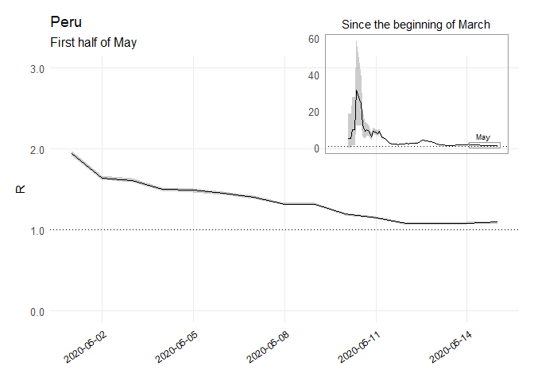

Parametric Re Estimations Peru Code
================
[Bastián González-Bustamante](http://users.ox.ac.uk/~shil5311/)

``` r
## Dataframe
data_per <- select(south_am, dates, PER)
names(data_per)[2] = "I"

## Parametric Re
per_param_si <- estimate_R(data_per, method="parametric_si",
                           config = make_config(list(
                             mean_si = 7.5, std_si = 3.4)))

## Plot 1
per_Re_full <- 
  plot(per_param_si, "R") + theme_minimal(base_size = 12) + 
  theme(legend.position = "none") +
  theme(panel.grid.minor = element_blank(),
        panel.grid.major = element_blank(),
        panel.border = element_rect(color = "grey60", size = 0.5, fill = NA),
        plot.title = element_text(size = 11, hjust = 0.5, vjust = 2.5,
                                  margin = margin(), color = "black")) +
  theme(axis.text.x = element_blank()) +
  labs(x = NULL, y = NULL, title = "Since the beginning of March", 
       subtitle = NULL, caption = NULL) + 
  theme(plot.margin = unit(c(0.5,0.5,0.5,0.5), "cm")) +
  scale_y_continuous(labels = scales::comma) +
  theme(axis.title.y.left = element_text(size = 11)) +
  annotate("rect", xmin = as.Date("2020-05-01"), xmax = as.Date("2020-05-16"), 
           ymin = 0, ymax = 3, alpha = .05, colour = "grey60") +
  annotate(geom = "text", x = as.Date("2020-05-8"), y = 3 * 2.1, 
           label = "May", size = 2.5)

## Plot 2
per_Re_may <- 
  plot(per_param_si, "R") + theme_minimal(base_size = 12) + 
  theme(legend.position = "none") +
  theme(panel.grid.minor = element_blank()) +
  theme(axis.text.x = element_text(angle = 35, hjust = 1, color = "black", 
                                   size = 9)) +
  labs(x = NULL, y = "R", title = "Peru",
       subtitle = "First half of May", caption = NULL) + 
  theme(plot.margin = unit(c(0.5,0.5,0.5,0.5), "cm")) +
  scale_y_continuous(labels = scales::comma, limits = c(0, 3)) +
  scale_x_date(date_breaks = "3 days", date_minor_breaks = "3 days",
               date_labels = "%Y-%m-%d",
               limits = c(as.Date("2020-05-01"), as.Date("2020-05-15"))) +
  theme(axis.title.y.left = element_text(size = 11)) 

## Integration
ggdraw() +
  draw_plot(per_Re_may) +
  draw_plot(per_Re_full, x = 0.55, y = 0.55, width = .43, height = .43)
```

<!-- -->
